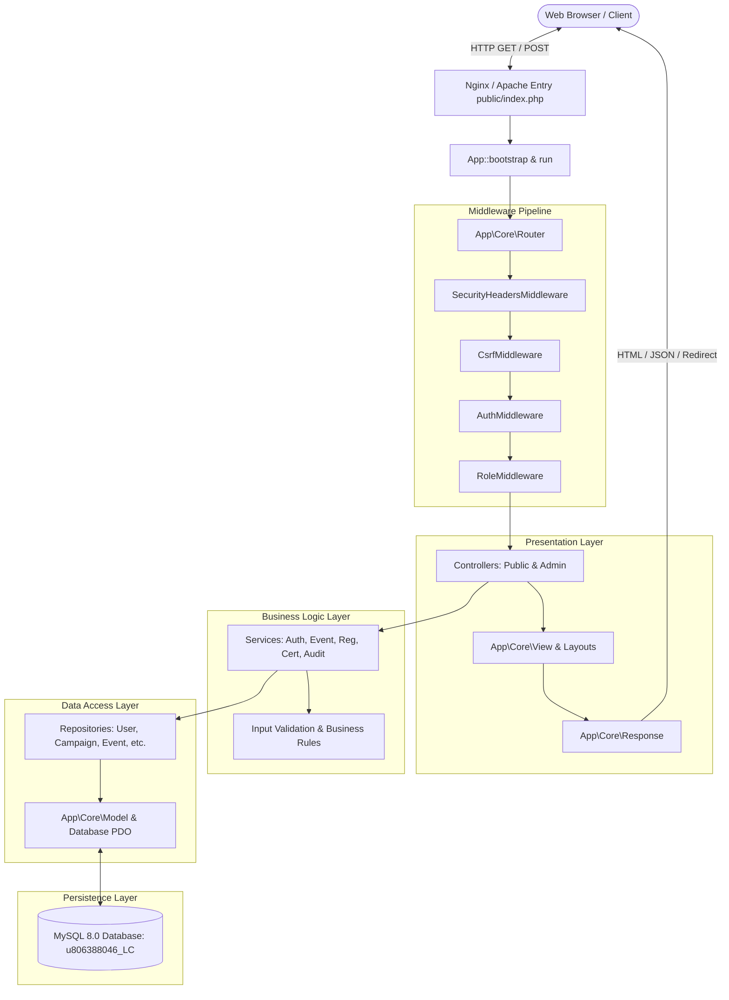
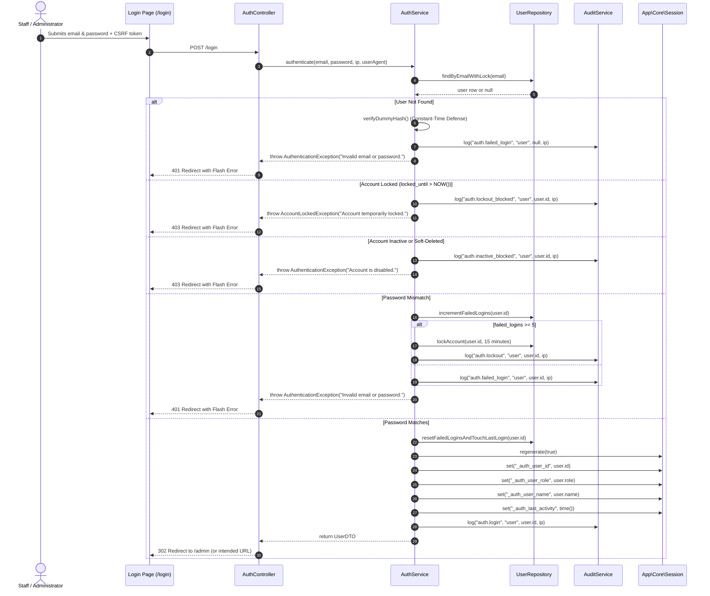
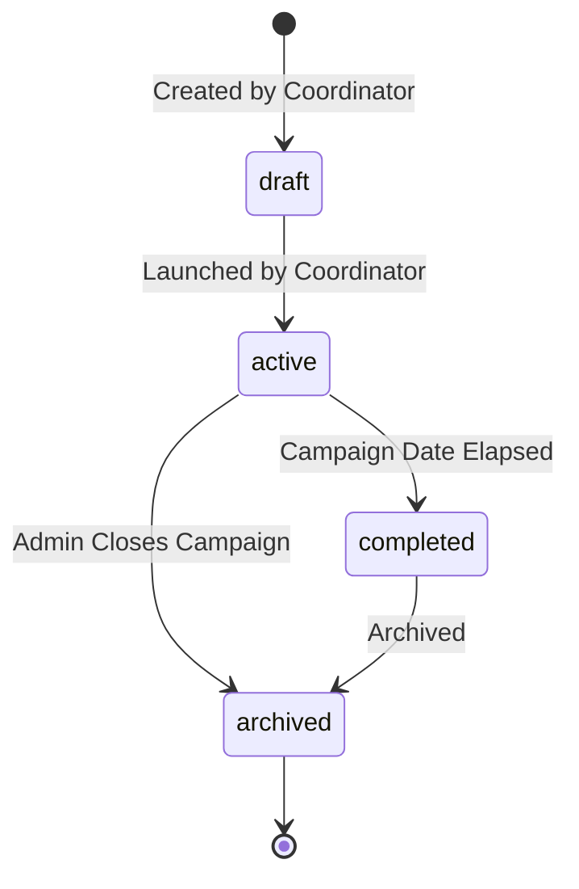
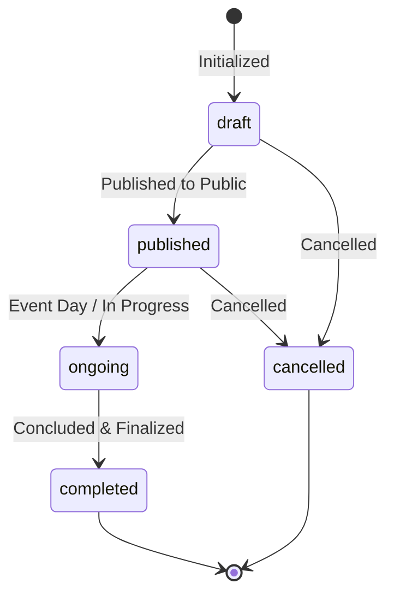
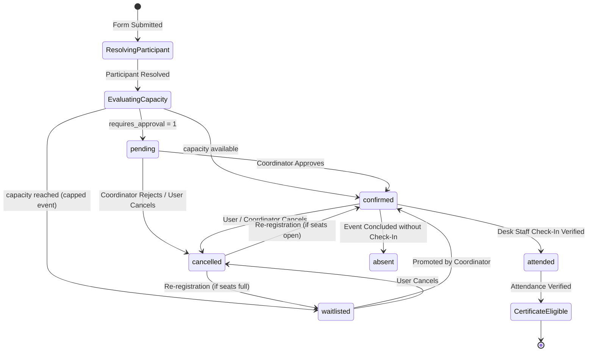
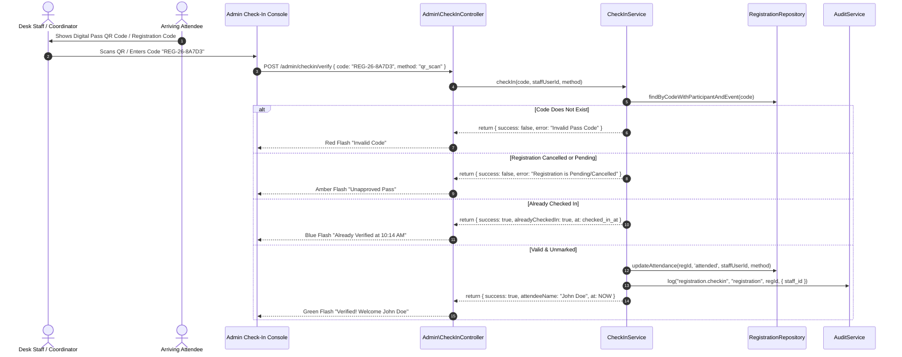
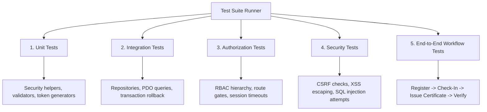

# Phase 1 — Application Architecture & Engineering Specification

**Project**: Listening Community – Suicide Prevention Campaign (LC-SPC)  
**Base URL**: `https://teami.in/LC/` (Production) / `http://localhost:8000/` (Development)  
**Database**: `u806388046_LC` (MySQL 8.0 / MariaDB InnoDB, `utf8mb4_unicode_ci`)  
**Status**: Final Pre-Coding Audit & Architectural Specification  
**Date**: September 2026  

---

## 1. Executive Overview & Architectural Foundations

### 1.1 Purpose & Mission Context
The **Listening Community – Suicide Prevention Campaign (LC-SPC)** is a dedicated mental health awareness, education, and community peer-listening initiative. Following the completion and verification of the Phase 0 infrastructure hardening, production isolation, and the execution of all 7 Phase 1 database migrations, this document defines the authoritative, pre-coding application architecture specification for Phase 1.

The application serves two distinct operational domains:
1. **Public Community Portal**: Allows participants to view awareness campaigns and upcoming events, register for listening circles and workshops with minimal friction, receive digital passes with unique QR codes, and verify issued certificates.
2. **Administrative Management Portal**: Provides tiered administrative access for staff and coordinators to schedule events, manage registrations, execute attendee check-ins, generate authentic digital certificates, inspect audit logs, and monitor campaign reach.

---

### 1.2 Core Architectural Principles & Constraints
To ensure maintainability, long-term stability, security, and exceptional performance on shared/production hosting (Hostinger cPanel environment), the application adheres to strict architectural constraints:

```
+-------------------------------------------------------------------------------+
|                             ARCHITECTURAL PILLARS                             |
+------------------------------------+------------------------------------------+
| 1. Vanilla PHP 8.3 & PSR-4         | Zero heavy frameworks; zero bloated      |
|                                    | dependencies; lightweight PSR-4 autoloader|
+------------------------------------+------------------------------------------+
| 2. Subdirectory Aware              | Uniform resolution locally (/) and in   |
|                                    | production (/LC) via Router normalization|
+------------------------------------+------------------------------------------+
| 3. Service-Repository Separation   | Controllers handle HTTP; Services manage |
|                                    | domain rules; Repositories access PDO    |
+------------------------------------+------------------------------------------+
| 4. Defense-in-Depth Security       | CSRF tokens, strict CSP, Argon2id hashes,|
|                                    | prepared statements, secure session flags|
+------------------------------------+------------------------------------------+
| 5. Strict Data Minimization        | Absolute exclusion of clinical, distress,|
|                                    | psychiatric, or sensitive health data    |
+------------------------------------+------------------------------------------+
| 6. Normalized Schema Integrity     | 7 approved tables; no table additions;   |
|                                    | certificates reference registration_id   |
+------------------------------------+------------------------------------------+
```

* **No Schema Modification**: The application operates strictly against the 7 approved Phase 1 tables (`users`, `campaigns`, `events`, `participants`, `event_registrations`, `certificates`, `audit_logs`). No migrations will be altered, and no additional tables will be introduced during Phase 1.
* **Sole Certificate Relationship**: Certificates are linked strictly to `event_registrations.id` via `registration_id`. Under no circumstances will `event_id` or `participant_id` be added to `certificates`.
* **Zero Clinical/Sensitive Data**: The platform is an educational gatekeeper initiative. Storing medical history, psychiatric diagnoses, psychological evaluations, distress scores, or crisis notes is strictly forbidden.
* **Production Environment Isolation**: All routes, links, assets, and cookies must respect `APP_BASE_PATH=/LC` without hardcoding hostnames.

---

### 1.3 Architectural Pattern: Layered MVC with Service-Repository Separation

The codebase extends the existing `App\Core` foundation into a cohesive layered architecture:



#### Layer Responsibilities:
1. **Presentation Layer (`App\Controllers`)**:
   - Extracts parameters from `App\Core\Request` (`$request->post()`, `$request->query()`, `$request->input()`).
   - Delegates business operations to the appropriate Service.
   - Formats outputs via `App\Core\View` or returns `App\Core\Response` (HTML, JSON, Redirect).
   - Contains zero direct SQL queries and zero complex business decisions.
2. **Business Logic Layer (`App\Services`)**:
   - Encapsulates domain logic, workflow orchestration, validation enforcement, and transaction boundaries.
   - Coordinates multiple repositories (e.g., verifying capacity, creating participant records, enrolling registrations).
   - Manages cryptographic generation (tokens, pass codes, certificate numbers).
   - Dispatches security audit logs via `AuditService`.
3. **Data Access Layer (`App\Repositories`)**:
   - Encapsulates SQL queries and PDO prepared statement execution.
   - Implements soft-delete filtering (`deleted_at IS NULL`) for users, campaigns, and events.
   - Provides safe methods for queries with locks (`SELECT ... FOR UPDATE`).
   - Extends or utilizes `App\Core\Database`.
4. **Core Framework Layer (`App\Core`)**:
   - The established Phase 0 infrastructure: `App`, `Config`, `Database`, `Env`, `Logger`, `Request`, `Response`, `Router`, `Security`, `Session`, `View`, and global helpers (`e()`, `url()`, `asset()`, `csrf_field()`).

---

## 2. Authentication Architecture

### 2.1 Overview & Authentication Lifecycle
Administrative authentication is handled via secure, server-side PHP sessions. Only administrative staff members exist in the `users` table; public event participants do not have login credentials or passwords.



---

### 2.2 Password Hashing & Constant-Time Security
* **Algorithm**: Modern `PASSWORD_DEFAULT` via `Security::hashPassword()`, utilizing **Argon2id** (with automatic fallback to Bcrypt on environments lacking Argon2 libraries).
* **Timing-Attack Prevention**: When a login email does not exist in the database, `AuthService` executes `password_verify('dummy', '$2y$10$abcdefghijklmnopqrstuu...')` with a pre-computed hash. This ensures the response time for valid and non-existent accounts is indistinguishable, preventing username enumeration.
* **Hash Re-hashing**: Upon every successful login, `password_needs_rehash($hash, PASSWORD_DEFAULT)` is evaluated. If algorithmic cost parameters have increased, the password is automatically re-hashed and updated in the database.

---

### 2.3 Session Lifecycle, Security & Hardening
Sessions are managed via `App\Core\Session` with the following hardened parameters:
* **Cookie Attributes**:
  - `Name`: `LCSPC_SESSION`
  - `HttpOnly`: `true` (prevents JavaScript access to session cookie).
  - `SameSite`: `Lax` (mitigates Cross-Site Request Forgery while permitting cross-site navigation to entry points).
  - `Secure`: Auto-enabled on HTTPS (mandatory in production `teami.in/LC/`).
  - `Path`: `/` (or `/LC/` in production).
* **Session Storage**: Dedicated storage directory at `storage/sessions/` with strict directory permissions (`0700`).
* **Session Regeneration**:
  - `Session::regenerate(true)` is executed immediately upon:
    1. Successful authentication (prevents Session Fixation).
    2. Any administrative role or privilege modification.
    3. User logout (wipes session data and issues an expired cookie).
* **Session Expiration Engine**:
  - **Idle Timeout**: 30 minutes (1800 seconds). If `time() - Session::get('_auth_last_activity') > 1800`, the session is terminated, and the user is redirected to `/login` with an idle timeout notification.
  - **Absolute Timeout**: 8 hours (28800 seconds) from initial login.

---

### 2.4 Brute-Force Throttling & Account Lockout
Brute-force protection is enforced directly at the database layer using `users.failed_logins` and `users.locked_until`:
1. **Threshold**: Maximum of **5 consecutive failed login attempts**.
2. **Lockout Duration**: **15 minutes** (`DATE_ADD(NOW(), INTERVAL 15 MINUTE)`).
3. **Reset**: Upon a successful password verification, `failed_logins` is immediately reset to `0` and `locked_until` is cleared to `NULL`.
4. **Lock Expiration**: If `locked_until` is in the past, `AuthService` automatically clears `failed_logins` and allows the login attempt to proceed.

---

### 2.5 Inactive, Suspended & Deleted Account Enforcement
On every authenticated request, `AuthMiddleware` verifies that the logged-in user:
1. Still exists in the database.
2. Has `deleted_at IS NULL` (not soft-deleted).
3. Has `status === 'active'`.
If any of these conditions fail (e.g. an administrator suspends a rogue staff member while they have an active session), `AuthMiddleware` immediately calls `Session::destroy()`, logs `auth.session_revoked`, and redirects to `/login` with an informative error.

---

### 2.6 Initial Super Admin Bootstrap (Zero Default Password Policy)
> [!CRITICAL]
> **NO DEFAULT PASSWORDS**: The codebase, database migrations, and environment configuration contain **ZERO hardcoded or default administrator credentials**. Under no circumstances will a migration or seeder insert a user with a default password like `admin123` or `password`.

#### Secure First-Admin Bootstrap Process:
Initial administrator provisioning is executed strictly through a dedicated, interactive CLI script:
```bash
php bin/create-admin.php
```

#### Bootstrap Workflow & Security Controls:
1. **Execution Environment**: Runs exclusively via CLI (command-line interface). HTTP access to `create-admin.php` is physically blocked.
2. **Interactive Prompts**: Prompts for:
   - Full Name (e.g. `"System Administrator"`)
   - Login Email Address (validated via `FILTER_VALIDATE_EMAIL`)
   - Secure Password (entered via hidden terminal prompt; minimum 12 characters, requiring uppercase, lowercase, numeric, and special characters)
   - Password Confirmation
3. **Pre-existence Check**:
   - Queries `SELECT COUNT(*) FROM users WHERE role = 'super_admin' AND deleted_at IS NULL`.
   - If an active `super_admin` already exists, the script warns the operator and requires explicit confirmation (`--force` flag) to prevent accidental secondary admin proliferation.
4. **Cryptographic Storage**:
   - Computes hash via `Security::hashPassword($plainPassword)` using Argon2id/Bcrypt.
   - Inserts record into `users`:
     ```sql
     INSERT INTO users (name, email, password_hash, role, status, failed_logins, created_at, updated_at)
     VALUES (:name, :email, :hash, 'super_admin', 'active', 0, NOW(), NOW());
     ```
5. **Audit Initialization**:
   - Appends initial record to `audit_logs` with `action = 'user.create'`, `actor_type = 'system'`, `metadata = {"bootstrapped": true, "email": :email}`.
6. **Zero Plaintext Echo**: The entered password is never echoed back, never written to log files, and never committed to version control.

---

## 3. Authorization Architecture (Role-Based Access Control)

### 3.1 Authentication vs. Authorization Distinction
* **Authentication**: Verifies *who the actor is* (identity validation via credentials).
* **Authorization**: Determines *what the authenticated actor is permitted to perform* (permission enforcement via roles).

---

### 3.2 Hierarchical Single-Role Matrix
The system uses the approved hierarchical single-role architecture on `users.role`:
$$\text{super\_admin} \succ \text{coordinator} \succ \text{staff} \succ \text{viewer}$$

```
+-----------------------------------------------------------------------------------+
|                              HIERARCHICAL ROLE RANKS                              |
+-------------------+-------+-------------------------------------------------------+
| Role Slug         | Level | Operational Description                               |
+-------------------+-------+-------------------------------------------------------+
| super_admin       |  40   | Full system control: user provisioning, security audit|
|                   |       | inspection, campaign/event deletion, cert revocations |
+-------------------+-------+-------------------------------------------------------+
| coordinator       |  30   | Program management: create/edit campaigns & events,   |
|                   |       | manage registrations, authorize & issue certificates  |
+-------------------+-------+-------------------------------------------------------+
| staff             |  20   | Venue operations: search rosters, verify registrations|
|                   |       | scan QR codes, record attendee check-in               |
+-------------------+-------+-------------------------------------------------------+
| viewer            |  10   | Read-only auditing: inspect dashboards, view rosters, |
|                   |       | view certificate records (no mutation capabilities)   |
+-------------------+-------+-------------------------------------------------------+
```

Because roles are strictly hierarchical, a `coordinator` inherits all permissions of `staff` and `viewer`. A `super_admin` inherits all permissions across the entire platform.

---

### 3.3 Explicit Operation-Level Permission Matrix
Authorization is enforced **strictly server-side** within controllers and middleware. UI element visibility (such as hiding buttons) is purely cosmetic and is **never** treated as authorization.

| Entity | Operation | super_admin (40) | coordinator (30) | staff (20) | viewer (10) | Public |
| :--- | :--- | :---: | :---: | :---: | :---: | :---: |
| **users** | VIEW | **ALLOW** | DENY | DENY | DENY | DENY |
| | CREATE | **ALLOW** | DENY | DENY | DENY | DENY |
| | EDIT | **ALLOW** | DENY | DENY | DENY | DENY |
| | DELETE/ARCHIVE | **ALLOW** | DENY | DENY | DENY | DENY |
| | APPROVE | N/A | N/A | N/A | N/A | N/A |
| | REVOKE | N/A | N/A | N/A | N/A | N/A |
| | EXPORT | **ALLOW** | DENY | DENY | DENY | DENY |
| **campaigns** | VIEW | **ALLOW** | **ALLOW** | **ALLOW** | **ALLOW** | Published Only |
| | CREATE | **ALLOW** | **ALLOW** | DENY | DENY | DENY |
| | EDIT | **ALLOW** | **ALLOW** | DENY | DENY | DENY |
| | DELETE/ARCHIVE | **ALLOW** | DENY | DENY | DENY | DENY |
| | APPROVE | N/A | N/A | N/A | N/A | N/A |
| | REVOKE | N/A | N/A | N/A | N/A | N/A |
| | EXPORT | **ALLOW** | **ALLOW** | DENY | DENY | DENY |
| **events** | VIEW | **ALLOW** | **ALLOW** | **ALLOW** | **ALLOW** | Published Only |
| | CREATE | **ALLOW** | **ALLOW** | DENY | DENY | DENY |
| | EDIT | **ALLOW** | **ALLOW** | DENY | DENY | DENY |
| | DELETE/ARCHIVE | **ALLOW** | DENY | DENY | DENY | DENY |
| | APPROVE (Publish) | **ALLOW** | **ALLOW** | DENY | DENY | DENY |
| | REVOKE (Cancel) | **ALLOW** | **ALLOW** | DENY | DENY | DENY |
| | EXPORT | **ALLOW** | **ALLOW** | **ALLOW** | DENY | DENY |
| **participants**| VIEW (Full PII) | **ALLOW** | **ALLOW** | Masked | Masked | DENY |
| | CREATE | **ALLOW** | **ALLOW** | DENY | DENY | Self-Register |
| | EDIT | **ALLOW** | **ALLOW** | DENY | DENY | DENY |
| | DELETE/ARCHIVE | **ALLOW** | DENY | DENY | DENY | DENY |
| | APPROVE | N/A | N/A | N/A | N/A | N/A |
| | REVOKE (Block) | **ALLOW** | **ALLOW** | DENY | DENY | DENY |
| | EXPORT | **ALLOW** | **ALLOW** | DENY | DENY | DENY |
| **registrations**| VIEW | **ALLOW** | **ALLOW** | **ALLOW** | **ALLOW** | Own Pass Only |
| | CREATE | **ALLOW** | **ALLOW** | **ALLOW** | DENY | Self-Register |
| | EDIT | **ALLOW** | **ALLOW** | DENY | DENY | DENY |
| | DELETE/CANCEL | **ALLOW** | **ALLOW** | DENY | DENY | Self-Cancel |
| | APPROVE | **ALLOW** | **ALLOW** | DENY | DENY | DENY |
| | REVOKE | **ALLOW** | **ALLOW** | DENY | DENY | DENY |
| | EXPORT | **ALLOW** | **ALLOW** | **ALLOW** | DENY | DENY |
| **attendance** | VIEW | **ALLOW** | **ALLOW** | **ALLOW** | **ALLOW** | DENY |
| | CREATE (CheckIn)| **ALLOW** | **ALLOW** | **ALLOW** | DENY | DENY |
| | EDIT | **ALLOW** | **ALLOW** | **ALLOW** | DENY | DENY |
| | DELETE/RESET | **ALLOW** | **ALLOW** | DENY | DENY | DENY |
| | APPROVE | N/A | N/A | N/A | N/A | N/A |
| | REVOKE | N/A | N/A | N/A | N/A | N/A |
| | EXPORT | **ALLOW** | **ALLOW** | **ALLOW** | **ALLOW** | DENY |
| **certificates**| VIEW | **ALLOW** | **ALLOW** | **ALLOW** | **ALLOW** | Public Verify |
| | CREATE (Issue) | **ALLOW** | **ALLOW** | DENY | DENY | DENY |
| | EDIT | DENY | DENY | DENY | DENY | DENY |
| | DELETE | DENY | DENY | DENY | DENY | DENY |
| | APPROVE | **ALLOW** | **ALLOW** | DENY | DENY | DENY |
| | REVOKE | **ALLOW** | DENY | DENY | DENY | DENY |
| | EXPORT | **ALLOW** | **ALLOW** | DENY | DENY | Public Token |
| **audit logs** | VIEW | **ALLOW** | DENY | DENY | DENY | DENY |
| | CREATE | Append-Only | Append-Only| Append-Only| Append-Only | System/Anon |
| | EDIT | DENY | DENY | DENY | DENY | DENY |
| | DELETE | DENY | DENY | DENY | DENY | DENY |
| | APPROVE | N/A | N/A | N/A | N/A | N/A |
| | REVOKE | N/A | N/A | N/A | N/A | N/A |
| | EXPORT | **ALLOW** | DENY | DENY | DENY | DENY |

*(Note: "Append-Only" indicates automatic system/service audit writes; direct manual creation/mutation is physically denied).*

---

### 3.4 Participant Personal Information Visibility by Role
To prevent contact list harvesting and comply with privacy-by-design standards:
* **`super_admin` & `coordinator`**: Full view of participant contact information (`email`, `phone`, `organization_name`) required for event coordination, emergency communications, and administrative reviews.
* **`staff`**: Operational view for door check-in. Displays `full_name`, `category`, `registration_code`, and **masked** contact information (e.g. `s***@gmail.com`, `+91 *****4567`) sufficient to verify attendee identity without exposing full personal contact databases.
* **`viewer`**: De-identified reporting view. Roster lists display `full_name` and `category`; `email` and `phone` are masked.
* **Public**: Zero participant contact information is ever displayed.

---

## 4. Campaign Management Architecture

### 4.1 Purpose & Domain Model
Campaigns represent high-level organizational umbrella initiatives (e.g., `"Suicide Prevention Campaign 2026"`, `"Campus Listening Tour"`). Events belong to campaigns.

* **Database Entity**: `campaigns` table
* **Lifecycle States**:
  - `draft`: Internal planning; events can be created internally but cannot be published to the public.
  - `active`: Current active campaign; public event registration permitted.
  - `completed`: Historical campaign; past events viewable, no new registrations accepted.
  - `archived`: Read-only historical record hidden from standard public menus.



---

### 4.2 Business Invariants & Operational Rules
1. **Slug Uniqueness**: The `slug` must be unique across all non-deleted campaigns (`uk_campaigns_slug`). Slugs are automatically generated from the title using URL-safe lowercase alphanumeric characters and hyphens.
2. **Date Invariant**: `start_date <= end_date` is strictly validated.
3. **Staff Attribution**: `created_by` references the authenticated user's ID (`users.id`). If the creating user is deleted, `created_by` is set to `NULL` (`ON DELETE SET NULL`) to prevent orphaned records.
4. **Soft-Deletion Safe Guard**: Deleting a campaign sets `deleted_at = NOW()`.
   - **RESTRICT Constraint**: A campaign cannot be deleted if active events exist within it (`fk_events_campaign_id ON DELETE RESTRICT`). The coordinator must explicitly reassign or soft-delete all child events first.

---

## 5. Event Management Architecture

### 5.1 Purpose & Domain Model
Events are concrete workshops, listening circles, training sessions, or seminars organized under a parent campaign.

* **Database Entity**: `events` table
* **Lifecycle States**:
  - `draft`: Program draft; accessible only in the administrative panel.
  - `published`: Visible on public portal; open for registrations (subject to registration deadline and capacity).
  - `ongoing`: Session currently underway; doors open for attendee check-in.
  - `completed`: Session concluded; attendee roster finalized; certificates eligible for generation.
  - `cancelled`: Session called off; registrations flagged; public warning displayed.



---

### 5.2 Specific Field Specifications & Validations
1. **Campaign-Scoped Slug Uniqueness**:
   - Governed by `UNIQUE KEY uk_events_campaign_slug (campaign_id, slug)`.
   - Allows clean semantic URLs: `/events/{campaign-slug}/{event-slug}`.
2. **Category Classification (Phase 1 ENUM)**:
   - Values: `'workshop'`, `'listening_circle'`, `'training'`, `'seminar'`, `'pledge_drive'`.
   - Formats: `'in_person'`, `'online'`, `'hybrid'`.
3. **Date & Schedule Invariants**:
   - `start_time < end_time` (mandatory).
   - If `registration_deadline` is specified, `registration_deadline <= start_time`.
4. **Capacity Controls**:
   - `capacity = 0`: Uncapped / unlimited attendance.
   - `capacity > 0`: Capped capacity. When confirmed registrations reach `capacity`, the system automatically assigns subsequent registrations to the `'waitlisted'` status.
5. **Approval Workflow Gate**:
   - `requires_approval = 1`: Registrations are inserted with `status = 'pending'` and must be reviewed and approved by a coordinator before a confirmed ticket pass is issued.
   - `requires_approval = 0`: Registrations are immediately assigned `status = 'confirmed'`.
6. **Delivery Modality Rules**:
   - If `format` is `'in_person'` or `'hybrid'`, `venue_name` is required.
   - If `format` is `'online'` or `'hybrid'`, `online_meeting_url` is validated as a valid URL. To maintain security, `online_meeting_url` is only revealed to registered, confirmed attendees on their digital pass.

---

## 6. Participant Identity & Management Subsystem

### 6.1 Canonical Identity Principle
The participant subsystem implements the approved **Canonical Identity via `participants.id`** model:
* **Canonical Identity**: `participants.id` (`BIGINT UNSIGNED AUTO_INCREMENT`) is the sole authoritative identity key.
* **Email is Non-Unique & Optional**:
  - The `email` column is nullable and indexed (`idx_participants_email`), but is **NOT UNIQUE**.
  - *Rationale*: Community mental health campaigns must accommodate students without individual email accounts, participants sharing a family device, or elderly participants registered via local community organizers.
* **Profile Fields (Strictly Minimized)**:
  1. `id`: Canonical primary key.
  2. `full_name`: Required for communication and printing on official certificates.
  3. `email`: Optional communication address; indexed for deduplication lookup.
  4. `phone`: Optional contact/WhatsApp number for day-of-event logistics.
  5. `category`: Stakeholder classification (`'student'`, `'professional'`, `'community'`, `'other'`).
  6. `organization_name`: Optional college, school, NGO, or workplace name.
  7. `agreed_guidelines_at`: Timestamp recording affirmative consent to Community Guidelines.
  8. `privacy_consent_at`: Timestamp recording affirmative consent to Privacy Notice.
  9. `status`: Lifecycle state (`'active'`, `'flagged'`, `'blocked'`).

---

### 6.2 Data Minimization & Non-Clinical Boundary
> [!CAUTION]
> **ABSOLUTE PRIVACY SAFEGUARD**: Under NO circumstances shall clinical, psychiatric, distress-level, suicide-risk, medical, psychological assessment, or therapeutic consultation fields be collected, processed, or stored in this system.
> 
> The platform is strictly an educational gatekeeper, community workshop, and peer-listening awareness portal. Collecting sensitive mental-health health data creates catastrophic legal liability and violates participant trust.

---

### 6.3 Safe Deduplication Strategy Without False Merges
To prevent incorrect identity merging while preventing duplicate participant records:

```
                              [Incoming Registration Request]
                                             |
                               Is 'email' provided in form?
                                            / \
                                     YES   /   \   NO
                                          /     \
    [Query: SELECT * FROM participants           [ALWAYS Create NEW participant row]
     WHERE email = :email LIMIT 5]               (NEVER merge on name alone without email)
                  |
     Found candidate matches?
           /             \
     YES  /               \  NO
         /                 \
Match on Full Name      [Create NEW participant row]
or Phone Number?
    /         \
YES/           \NO (e.g. shared family email with different names)
  /             \
[Resolve to     [Create NEW participant row with same email,
Existing ID]     new unique canonical participants.id]
      \                 /                          /
       \               /                          /
        \             /                          /
     [Use Resolved Canonical participant_id for Event Enrollment]
```

1. **Rule 1: If `email` is NULL**:
   - **ALWAYS create a new canonical record in `participants`**.
   - *Why*: Common names (e.g. "Rahul Sharma", "Ananya Roy", "John Smith") are shared by thousands of individuals. Attempting to match records on name alone without email would cause disastrous identity cross-contamination.
2. **Rule 2: If `email` is provided**:
   - Query candidate records:
     ```sql
     SELECT id, full_name, phone, status 
     FROM participants 
     WHERE email = :email AND status != 'blocked' 
     ORDER BY id DESC LIMIT 5;
     ```
   - **Case A (High-Confidence Match)**: If a candidate record has the same email AND either:
     - Identical normalized full name (`trim(strtolower($full_name))` matches), OR
     - Identical contact phone number.
     $\rightarrow$ The system resolves to the existing canonical `participants.id`.
   - **Case B (Distinct Individuals Sharing an Email)**: If the email matches a candidate record, but the full name is completely distinct (e.g. `family@gmail.com` used by "Alice Smith" and "Bob Smith"):
     $\rightarrow$ **DO NOT MERGE**. The system creates a new canonical row in `participants` with its own unique `id` and the shared `email`. Both individuals exist as distinct participants.
3. **Rule 3: Blocked Participants**:
   - If an existing candidate has `status === 'blocked'`, the registration is rejected immediately with a generic message.

---

## 7. Event Registration Workflow

### 7.1 Complete Registration Lifecycle
The registration lifecycle follows a strict state machine:
$$\text{participant creation/resolution} \longrightarrow \text{registration insert} \longrightarrow \begin{cases} \text{confirmed} \\ \text{pending} \\ \text{waitlisted} \end{cases} \longrightarrow \text{cancellation (optional)} \longrightarrow \text{attendance} \longrightarrow \text{certificate eligibility}$$



---

### 7.2 Edge Cases & Operational Rules
1. **Duplicate Registration Behavior**:
   - If an attendee submits the registration form for an event they are **already actively enrolled in** (`confirmed` or `pending`):
     - The service identifies the active registration via `(event_id, participant_id)`.
     - Returns HTTP 200 with a friendly notification: `"You are already registered for this event. Here is your pass."` and redisplays their existing `registration_code` and QR pass.
2. **Event Capacity & Full-Event Behavior**:
   - When `capacity > 0`:
     - Confirmed registrations cannot exceed `capacity`.
     - When confirmed count reaches `capacity`, subsequent registrants are placed on the `waitlist` (`status = 'waitlisted'`).
     - Waitlisted participants receive a confirmation stating they are on the waitlist; no check-in pass is issued.
3. **Cancellation Behavior**:
   - An attendee can cancel their enrollment via a secure cancellation link (`/registration/cancel/{code}`).
   - Administrative coordinators can also cancel a registration from `/admin/registrations/{id}`.
   - Upon cancellation, `status = 'cancelled'` is recorded. This immediately decrements the active confirmed count, freeing up a seat.
4. **Re-Registration Behavior (Handling the Unique Constraint)**:
   - *Database Invariant*: `uk_event_reg_unique_enrollment` enforces `UNIQUE(event_id, participant_id)`.
   - If an attendee who previously `cancelled` attempts to register again for the same event:
     - A standard `INSERT` query would fail with MySQL duplicate key error 1062.
     - **Architectural Solution**: `RegistrationService` queries for existing enrollment including cancelled records:
       ```sql
       SELECT id, status FROM event_registrations 
       WHERE event_id = :event_id AND participant_id = :participant_id FOR UPDATE;
       ```
     - If a cancelled record exists, the service executes an **in-place reactivation update**:
       ```sql
       UPDATE event_registrations 
       SET status = :new_status, attendance_status = 'unmarked', updated_at = NOW() 
       WHERE id = :id;
       ```
     - `:new_status` is evaluated against real-time capacity (reverting to `'confirmed'` if seats remain open, or `'waitlisted'` if seats were taken in the interim).
5. **Waitlist Promotion Workflow**:
   - When confirmed attendees cancel, coordinators can view the waitlist sorted by `created_at ASC` and click `"Promote to Confirmed"`.
   - Promoted attendees transition to `status = 'confirmed'` and receive their active ticket pass code.

---

### 7.3 Registration Pass Code Standard
* **Format**: `REG-{YEAR}-{RANDOM_ALPHANUM_5}` (e.g. `REG-26-8A7D3`).
* **Generation**: Generated using `random_bytes(4)` converted to uppercase Crockford Base32 / hex, strictly omitting ambiguous characters (`0`, `O`, `1`, `I`).
* **Collision Handling**: Enforced by `UNIQUE KEY uk_event_reg_code`. In the astronomical event of a collision, the service catches the duplicate key exception and regenerates a new random code (up to 3 retries).

---

## 8. Attendance & Digital Check-In Workflow

### 8.1 Operational Workflow
On the day of an event, administrative staff or coordinators open the **Check-In Console** (`/admin/checkin`):
1. **QR Scanning Mode**: Uses a browser-based HTML5 camera scanner. Scanning an attendee's digital pass decodes their `registration_code`.
2. **Manual Lookup Mode**: Allows staff to search attendees by name, email, phone number, or registration code.



---

### 8.2 Idempotent Check-In Mutation
To guarantee that accidental double-scans or network retries do not corrupt timestamps or create duplicate audit entries:
```sql
UPDATE event_registrations 
SET 
    attendance_status = 'attended',
    checked_in_at = COALESCE(checked_in_at, NOW()),
    checked_in_by = COALESCE(checked_in_by, :staff_id),
    check_in_method = COALESCE(check_in_method, :method),
    updated_at = NOW()
WHERE id = :registration_id AND attendance_status = 'unmarked';
```
If `rowCount() === 0`, the application inspects the record. If it was already marked as `'attended'`, it returns a non-error notification confirming that the attendee was already checked in at `checked_in_at`.

---

### 8.3 Intentional Exclusion of Check-Out
As validated in the Phase 1 database design, **check-out tracking (`checked_out_at`) is strictly excluded**. Awareness workshops and listening circles run 1 to 3 hours. Requiring attendees to queue up to scan out at exit doors creates extreme operational friction and provides no meaningful business value.

---

## 9. Certificate Generation & Verification Subsystem

### 9.1 Certificate Cardinality & Authoritative Constraint
A certificate represents verified participation, service, or speaking.
* **Authoritative Constraint**:
  ```sql
  UNIQUE KEY uk_cert_reg_type (registration_id, type)
  ```
  **One event registration can receive at most one certificate of each certificate type.**
  - A participant who attended a workshop can receive one `'participation'` certificate.
  - If that same participant also served as an event volunteer, a separate `'volunteer'` certificate can be issued for that same event registration.
  - A duplicate certificate of the *same type* for the *same registration* is physically prevented by the database constraint.
* **Streamlined Normalization**: `certificates` links solely to `registration_id`. Event and recipient identity are derived cleanly via `JOIN event_registrations`. Under no circumstances will `event_id` or `participant_id` be added to `certificates`.

---

### 9.2 Prerequisite Rules for Issuance
> [!IMPORTANT]
> **ATTENDANCE IS MANDATORY**: Under no circumstances can a certificate be generated for an attendee whose `attendance_status !== 'attended'`.
> 
> Unmarked, absent, or excused registrations can NEVER receive a certificate.

A certificate may be issued **only** if:
1. `event_registrations.status === 'confirmed'`.
2. `event_registrations.attendance_status === 'attended'`.
3. No certificate of that `type` has already been issued for that `registration_id`.

---

### 9.3 Identification Tokens & Immutable Snapshot
1. **Certificate Number (`certificate_number`)**:
   - Format: `LC-{YEAR}-{TYPE_CODE}-{SEQUENTIAL_5}` (e.g. `LC-2026-PAR-00142`).
   - Human-readable and printed prominently on the certificate.
2. **Cryptographic Verification Token (`verification_token`)**:
   - 256 bits of CSPRNG entropy generated via `bin2hex(random_bytes(32))`.
   - 64-character lowercase hex string. Non-sequential, unguessable, and resistant to enumeration attacks.
3. **Recipient Legal Name Snapshot (`recipient_name_snapshot`)**:
   - The recipient's legal name is frozen into `recipient_name_snapshot` at the exact moment of issuance. If the participant later modifies their profile name, issued certificates remain historically immutable.

---

### 9.4 Single and Batch Issuance Workflows
Coordinators and super admins can issue certificates via:
* **Single Issuance**: From the registration detail view for an individual attendee.
* **Batch Issuance**: For an entire completed event:
  ```php
  Database::transaction(function() use ($eventId, $type, $adminUserId) {
      // 1. Find all eligible attended registrations without an existing certificate of this type
      $eligible = $regRepo->findEligibleForCertificate($eventId, $type);
      
      $issued = [];
      foreach ($eligible as $reg) {
          $certNumber = $this->generateNextCertificateNumber($type);
          $token = bin2hex(random_bytes(32));
          
          $certId = $certRepo->create([
              'certificate_number'      => $certNumber,
              'verification_token'     => $token,
              'registration_id'         => $reg['id'],
              'recipient_name_snapshot' => $reg['full_name'],
              'type'                    => $type,
              'issue_date'              => date('Y-m-d'),
              'status'                  => 'active',
              'issued_by'               => $adminUserId,
          ]);
          $issued[] = $certId;
      }
      
      $auditService->log('certificate.batch_issue', 'event', $eventId, [
          'type'         => $type,
          'count_issued' => count($issued),
          'issued_by'    => $adminUserId,
      ]);
      
      return count($issued);
  });
  ```

---

### 9.5 Certificate Revocation Workflow
If a certificate was issued in error or must be invalidated:
1. **Permission**: Restricted to `super_admin` role only.
2. **State Transition**:
   - `status = 'revoked'`
   - `revoked_at = NOW()`
   - `revoked_by = super_admin_user_id`
   - `revocation_reason = "Mandatory explanation entered by super admin"`
3. **Audit Trail**: Recorded under `certificate.revoke`.

---

## 10. Audit Logging Architecture

### 10.1 Append-Only Forensic Design
The `audit_logs` table represents an immutable security record:
* **Zero Update / Delete**: No `UPDATE` or `DELETE` SQL queries exist anywhere in the application for `audit_logs`.
* **No Timestamp Updates**: Does not have `updated_at` or `deleted_at` columns.
* **Immutable Database Grants**: In hardened production configurations, the database user can be restricted to `SELECT, INSERT` permissions on `audit_logs`.

---

### 10.2 Actor Identification & Graceful Deletion Preservation
* `actor_id`: Foreign key to `users.id` with `ON DELETE SET NULL`.
* `actor_type`: `'admin'`, `'system'`, or `'anonymous'`.
* **Permanent Attribution Pattern**: When an administrator is deleted, the database sets `actor_id = NULL`. However, `AuditService` always records the actor's email, name, and role inside the `metadata` JSON object at the time of insertion:
  ```json
  {
    "actor_email": "coordinator@teami.in",
    "actor_name": "Sarah Connor",
    "actor_role": "coordinator",
    "details": { ... }
  }
  ```
  Historical forensic attribution remains permanently intact even after staff deprovisioning.

---

### 10.3 Sanitization Rules (Strict Credential Scrubbing)
Before any metadata payload is serialized to JSON and written to `audit_logs`, `AuditService` passes it through a recursive sanitization filter. Any keys matching the following patterns are replaced with `"[REDACTED]"`:
- `password`, `password_hash`, `password_confirmation`
- `_csrf_token`, `csrf_token`, `token`, `secret`
- `session_id`, `cookie`

---

## 11. Complete Route Catalog: Public vs. Authenticated Admin

### 11.1 Public Routes (Unauthenticated)

| HTTP Method | Route URI | Controller Action | Description |
| :--- | :--- | :--- | :--- |
| `GET` | `/` | `Public\HomeController@index` | Portal landing page, active campaigns |
| `GET` | `/health` | `HealthController@index` | Live system & database health check |
| `GET` | `/campaigns` | `Public\CampaignController@index` | Public catalog of active campaigns |
| `GET` | `/campaigns/{slug}` | `Public\CampaignController@show` | Campaign details and listed events |
| `GET` | `/events/{campaignSlug}/{eventSlug}` | `Public\EventController@show` | Event schedule, venue & registration form |
| `POST` | `/events/{campaignSlug}/{eventSlug}/register` | `Public\RegistrationController@store` | Submit attendee registration |
| `GET` | `/registration/pass/{code}` | `Public\RegistrationController@showPass`| View confirmed ticket pass with QR code |
| `POST` | `/registration/cancel/{code}` | `Public\RegistrationController@cancel` | Self-cancellation by attendee |
| `GET` | `/verify/{token}` | `Public\CertificateVerificationController@verify` | Public digital certificate verification |
| `GET` | `/login` | `Admin\AuthController@showLogin` | Administrative login form |
| `POST` | `/login` | `Admin\AuthController@login` | Process administrative login credentials |
| `POST` | `/logout` | `Admin\AuthController@logout` | Terminate administrative session |

---

### 11.2 Authenticated Administrative Routes (`/admin/*`)

| HTTP Method | Route URI | Controller Action | Minimum Role | Description |
| :--- | :--- | :--- | :---: | :--- |
| `GET` | `/admin` | `Admin\DashboardController@index` | `viewer` | Operational metrics & summary dashboard |
| `GET` | `/admin/campaigns` | `Admin\CampaignController@index` | `viewer` | List all campaigns (including drafts) |
| `GET` | `/admin/campaigns/create` | `Admin\CampaignController@create` | `coordinator` | New campaign form |
| `POST` | `/admin/campaigns` | `Admin\CampaignController@store` | `coordinator` | Save new campaign |
| `GET` | `/admin/campaigns/{id}/edit`| `Admin\CampaignController@edit` | `coordinator` | Edit campaign details |
| `POST` | `/admin/campaigns/{id}` | `Admin\CampaignController@update` | `coordinator` | Update campaign details |
| `POST` | `/admin/campaigns/{id}/delete`| `Admin\CampaignController@destroy`| `super_admin` | Soft-delete campaign |
| `GET` | `/admin/events` | `Admin\EventController@index` | `viewer` | List all events across campaigns |
| `GET` | `/admin/events/create` | `Admin\EventController@create` | `coordinator` | New event schedule form |
| `POST` | `/admin/events` | `Admin\EventController@store` | `coordinator` | Save new event schedule |
| `GET` | `/admin/events/{id}` | `Admin\EventController@show` | `viewer` | Event details, roster & check-in stats |
| `GET` | `/admin/events/{id}/edit` | `Admin\EventController@edit` | `coordinator` | Edit event details & capacity |
| `POST` | `/admin/events/{id}` | `Admin\EventController@update` | `coordinator` | Update event details |
| `POST` | `/admin/events/{id}/status` | `Admin\EventController@updateStatus` | `coordinator` | Transition event lifecycle state |
| `POST` | `/admin/events/{id}/delete` | `Admin\EventController@destroy` | `super_admin` | Soft-delete event |
| `GET` | `/admin/registrations` | `Admin\RegistrationController@index`| `viewer` | Search & filter all registrations |
| `GET` | `/admin/registrations/{id}`| `Admin\RegistrationController@show` | `viewer` | View registration detail |
| `POST` | `/admin/registrations/{id}/status` | `Admin\RegistrationController@updateStatus` | `coordinator` | Approve/reject pending registration |
| `POST` | `/admin/registrations/{id}/promote`| `Admin\RegistrationController@promoteWaitlist`| `coordinator` | Promote waitlisted registration |
| `GET` | `/admin/checkin` | `Admin\CheckInController@index` | `staff` | Check-in console (Scanner & manual) |
| `POST` | `/admin/checkin/verify` | `Admin\CheckInController@verify` | `staff` | Process attendee check-in |
| `GET` | `/admin/certificates` | `Admin\CertificateController@index`| `viewer` | Certificate registry & issuance log |
| `POST` | `/admin/certificates/issue`| `Admin\CertificateController@issue`| `coordinator` | Issue single certificate |
| `POST` | `/admin/certificates/batch-issue` | `Admin\CertificateController@batchIssue` | `coordinator` | Issue certificates to all event attendees |
| `POST` | `/admin/certificates/{id}/revoke` | `Admin\CertificateController@revoke` | `super_admin` | Invalidate an issued certificate |
| `GET` | `/admin/users` | `Admin\UserController@index` | `super_admin` | List administrative users |
| `GET` | `/admin/users/create` | `Admin\UserController@create` | `super_admin` | New administrator form |
| `POST` | `/admin/users` | `Admin\UserController@store` | `super_admin` | Provision new user |
| `GET` | `/admin/users/{id}/edit` | `Admin\UserController@edit` | `super_admin` | Edit user & role assignment |
| `POST` | `/admin/users/{id}` | `Admin\UserController@update` | `super_admin` | Update user profile & status |
| `POST` | `/admin/users/{id}/delete` | `Admin\UserController@destroy` | `super_admin` | Soft-delete administrative user |
| `GET` | `/admin/audit-logs` | `Admin\AuditLogController@index` | `super_admin` | Inspect forensic security audit log |

---

## 12. Route-Level Authorization & Middleware Matrix

```mermaid
graph LR
    Req[Incoming Request] --> SecHeaders[SecurityHeadersMiddleware]
    SecHeaders --> RouteMatch{Route Group}
    
    RouteMatch -->|Public Routes| CsrfPublic[CsrfMiddleware (POST only)]
    CsrfPublic --> PublicCtrl[Public Controllers]
    
    RouteMatch -->|Login / Logout| CsrfAuth[CsrfMiddleware]
    CsrfAuth --> AuthCtrl[AuthController]
    
    RouteMatch -->|/admin/* Routes| AuthMid[AuthMiddleware]
    AuthMid --> CsrfAdmin[CsrfMiddleware (POST only)]
    CsrfAdmin --> RoleCheck{Role Check}
    
    RoleCheck -->|Role >= viewer| ViewerCtrl[Dashboard, Index Lists]
    RoleCheck -->|Role >= staff| StaffCtrl[Check-In Console]
    RoleCheck -->|Role >= coordinator| CoordCtrl[Campaign/Event CRUD, Cert Issue]
    RoleCheck -->|Role == super_admin| AdminCtrl[User Mgmt, Revocation, Audits]
```

Every route in the application executes through a deterministic, layered middleware pipeline:

| Route Path | Method | Applied Middleware Pipeline | Required Role |
| :--- | :---: | :--- | :---: |
| `/` | `GET` | `SecurityHeadersMiddleware` | Public |
| `/health` | `GET` | `SecurityHeadersMiddleware` | Public |
| `/events/*` | `GET` | `SecurityHeadersMiddleware` | Public |
| `/events/*/register` | `POST` | `SecurityHeadersMiddleware`, `CsrfMiddleware` | Public |
| `/registration/pass/*`| `GET` | `SecurityHeadersMiddleware` | Public |
| `/registration/cancel/*`| `POST`| `SecurityHeadersMiddleware`, `CsrfMiddleware` | Public |
| `/verify/*` | `GET` | `SecurityHeadersMiddleware` | Public |
| `/login` | `GET` | `SecurityHeadersMiddleware`, `GuestMiddleware` | Guest |
| `/login` | `POST` | `SecurityHeadersMiddleware`, `GuestMiddleware`, `CsrfMiddleware` | Guest |
| `/logout` | `POST` | `SecurityHeadersMiddleware`, `AuthMiddleware`, `CsrfMiddleware` | Authenticated |
| `/admin` | `GET` | `SecurityHeadersMiddleware`, `AuthMiddleware`, `RoleMiddleware:viewer` | `viewer` |
| `/admin/campaigns` | `GET` | `SecurityHeadersMiddleware`, `AuthMiddleware`, `RoleMiddleware:viewer` | `viewer` |
| `/admin/campaigns/create`| `GET`| `SecurityHeadersMiddleware`, `AuthMiddleware`, `RoleMiddleware:coordinator` | `coordinator` |
| `/admin/campaigns` | `POST`| `SecurityHeadersMiddleware`, `AuthMiddleware`, `RoleMiddleware:coordinator`, `CsrfMiddleware` | `coordinator` |
| `/admin/campaigns/*/delete`| `POST`| `SecurityHeadersMiddleware`, `AuthMiddleware`, `RoleMiddleware:super_admin`, `CsrfMiddleware` | `super_admin` |
| `/admin/events` | `GET` | `SecurityHeadersMiddleware`, `AuthMiddleware`, `RoleMiddleware:viewer` | `viewer` |
| `/admin/events/create` | `GET` | `SecurityHeadersMiddleware`, `AuthMiddleware`, `RoleMiddleware:coordinator` | `coordinator` |
| `/admin/events` | `POST`| `SecurityHeadersMiddleware`, `AuthMiddleware`, `RoleMiddleware:coordinator`, `CsrfMiddleware` | `coordinator` |
| `/admin/events/*/status`| `POST`| `SecurityHeadersMiddleware`, `AuthMiddleware`, `RoleMiddleware:coordinator`, `CsrfMiddleware` | `coordinator` |
| `/admin/checkin` | `GET` | `SecurityHeadersMiddleware`, `AuthMiddleware`, `RoleMiddleware:staff` | `staff` |
| `/admin/checkin/verify`| `POST`| `SecurityHeadersMiddleware`, `AuthMiddleware`, `RoleMiddleware:staff`, `CsrfMiddleware` | `staff` |
| `/admin/certificates` | `GET` | `SecurityHeadersMiddleware`, `AuthMiddleware`, `RoleMiddleware:viewer` | `viewer` |
| `/admin/certificates/batch-issue` | `POST` | `SecurityHeadersMiddleware`, `AuthMiddleware`, `RoleMiddleware:coordinator`, `CsrfMiddleware` | `coordinator` |
| `/admin/certificates/*/revoke` | `POST` | `SecurityHeadersMiddleware`, `AuthMiddleware`, `RoleMiddleware:super_admin`, `CsrfMiddleware` | `super_admin` |
| `/admin/users*` | ALL | `SecurityHeadersMiddleware`, `AuthMiddleware`, `RoleMiddleware:super_admin`, `CsrfMiddleware (POST)` | `super_admin` |
| `/admin/audit-logs` | `GET` | `SecurityHeadersMiddleware`, `AuthMiddleware`, `RoleMiddleware:super_admin` | `super_admin` |

---

## 13. Comprehensive Validation Rules & Schemas

### 13.1 Administrative Login
* `email`: `required|email|max:191`
* `password`: `required|string|min:8|max:72` (Bcrypt 72-byte safe limit)

---

### 13.2 Campaign Creation & Update
* `title`: `required|string|min:3|max:191`
* `theme`: `optional|string|max:255`
* `description`: `optional|string|max:5000`
* `start_date`: `required|date|date_format:Y-m-d`
* `end_date`: `required|date|date_format:Y-m-d|after_or_equal:start_date`
* `status`: `required|in:draft,active,completed,archived`

---

### 13.3 Event Creation & Update
* `campaign_id`: `required|integer|exists:campaigns,id`
* `coordinator_id`: `optional|integer|exists:users,id`
* `title`: `required|string|min:3|max:191`
* `category`: `required|in:workshop,listening_circle,training,seminar,pledge_drive`
* `description`: `optional|string|max:10000`
* `format`: `required|in:in_person,online,hybrid`
* `venue_name`: `required_if:format,in_person,hybrid|string|max:255`
* `venue_address`: `optional|string|max:2000`
* `online_meeting_url`: `required_if:format,online|url|max:255`
* `start_time`: `required|date|date_format:Y-m-d H:i:s`
* `end_time`: `required|date|date_format:Y-m-d H:i:s|after:start_time`
* `capacity`: `required|integer|min:0` (`0` = uncapped)
* `registration_deadline`: `optional|date|before_or_equal:start_time`
* `requires_approval`: `required|in:0,1`
* `status`: `required|in:draft,published,ongoing,completed,cancelled`

---

### 13.4 Public Participant Event Registration
* `full_name`: `required|string|min:2|max:150|regex:/^[\p{L}\s\.\'\-]+$/u` (Alphabetic, dots, apostrophes, hyphens)
* `email`: `optional|email|max:191`
* `phone`: `optional|string|min:7|max:25|regex:/^[0-9\+\-\s\(\)]+$/`
* `category`: `required|in:student,professional,community,other`
* `organization_name`: `optional|string|max:191`
* `agreed_guidelines`: `required|accepted` (Must be checked/affirmative)
* `privacy_consent`: `required|accepted` (Must be checked/affirmative)
* **Contact Invariant**: At least ONE of `email` or `phone` must be provided so the organizers have an operational communication channel.

---

### 13.5 Attendee Check-In Verification
* `registration_code`: `required|string|regex:/^REG-[0-9]{2}-[A-Z0-9]{4,8}$/`
* `check_in_method`: `required|in:admin_manual,qr_scan,self_verified`

---

### 13.6 Certificate Issuance & Revocation
* **Single Issuance**:
  - `registration_id`: `required|integer|exists:event_registrations,id`
  - `type`: `required|in:participation,volunteer,speaker,appreciation`
* **Batch Issuance**:
  - `event_id`: `required|integer|exists:events,id`
  - `type`: `required|in:participation,volunteer,speaker,appreciation`
* **Revocation**:
  - `revocation_reason`: `required|string|min:5|max:255`

---

## 14. Security Controls & Defensive Engineering

```
+-------------------------------------------------------------------------------+
|                        SECURITY CONTROLS & MITIGATIONS                        |
+-------------------+-----------------------------------------------------------+
| Threat Vector     | Architectural Mitigation                                  |
+-------------------+-----------------------------------------------------------+
| CSRF              | Per-session 256-bit token; timing-safe hash_equals();    |
|                   | validated on all POST/PUT/DELETE requests via middleware  |
+-------------------+-----------------------------------------------------------+
| XSS               | HTML entity escaping (ENT_QUOTES | ENT_SUBSTITUTE) via    |
|                   | Security::escape() / e(); strict Content-Security-Policy  |
+-------------------+-----------------------------------------------------------+
| SQL Injection     | Exclusively PDO prepared statements with bound parameters;|
|                   | zero string interpolation; zero dynamic raw SQL queries   |
+-------------------+-----------------------------------------------------------+
| Session Hijacking | HttpOnly, SameSite=Lax, Secure flags; strict cookie paths;|
| & Fixation        | Session::regenerate(true) on login and privilege change   |
+-------------------+-----------------------------------------------------------+
| Brute-Force       | 5-attempt threshold; 15-minute temporary lockout;         |
|                   | constant-time verification for non-existent users         |
+-------------------+-----------------------------------------------------------+
| Data Exposure     | Verification responses return strictly public certificate |
|                   | data; participant emails/phones redacted by design        |
+-------------------+-----------------------------------------------------------+
```

### 14.1 Cross-Site Request Forgery (CSRF) Prevention
* Implemented via `App\Core\Middleware\CsrfMiddleware` and `App\Core\Security`.
* Every mutation request (`POST`, `PUT`, `DELETE`) requires a matching `_csrf_token`.
* Tokens are generated using CSPRNG (`random_bytes(32)`) and stored in the session.
* Comparison uses timing-safe `hash_equals()`.
* Blade/PHP views utilize the `csrf_field()` helper inside all `<form>` elements.

---

### 14.2 Cross-Site Scripting (XSS) Prevention & Content Security Policy
* All dynamic variables rendered in views MUST pass through `e()` (`Security::escape()`).
* Global `SecurityHeadersMiddleware` injects strict HTTP headers:
  - `Content-Security-Policy`: Restricts scripts, styles, and frame-ancestors.
  - `X-Frame-Options`: `DENY` (prevents Clickjacking).
  - `X-Content-Type-Options`: `nosniff`.
  - `Referrer-Policy`: `strict-origin-when-cross-origin`.
  - `Permissions-Policy`: `geolocation=(), camera=(self), microphone=()`.

---

### 14.3 SQL Injection Prevention
* Every query across all Repositories and Services MUST utilize PDO prepared statements with parameter binding:
  ```php
  Database::fetch("SELECT * FROM users WHERE email = :email LIMIT 1", [':email' => $email]);
  ```
* Dynamic table and column identifiers are strictly hardcoded inside Repository classes and never accepted from user input.

---

## 15. Privacy & Data Minimization Architecture

### 15.1 Privacy-by-Design Principles
The LC-SPC platform strictly implements the European GDPR and Indian Digital Personal Data Protection (DPDP) data minimization standards:
1. **Purpose Limitation**: Participant data is collected solely for event capacity management, day-of-event check-in, and certificate issuance.
2. **Minimal Data Footprint**: No demographic profiling (no race, religion, address, marital status, income).
3. **Explicit Consent Capture**:
   - `agreed_guidelines_at`: Records the exact UTC/IST timestamp when the participant checked the Community Guidelines agreement.
   - `privacy_consent_at`: Records the exact timestamp when the participant agreed to the privacy statement.
4. **Public Verification Masking**:
   - When a QR code or public verification link (`/verify/{token}`) is scanned, the response returns **only**:
     - Certificate Number
     - Recipient Name Snapshot
     - Event Title & Date
     - Campaign Name
     - Certificate Status (Active or Revoked)
   - *Participant email, phone number, and database IDs are NEVER exposed to the public.*

---

## 16. Error Handling & Production-Safe Responses

### 16.1 Environment-Aware Error Handling
Global error handling is registered in `App::registerErrorHandlers()`:
* **Development (`APP_DEBUG=true`)**:
  - Detailed exception messages, file paths, and line numbers are logged and displayed for debugging.
* **Production (`APP_DEBUG=false`)**:
  - `display_errors` is disabled (`0`).
  - Unhandled exceptions trigger a sanitized, branded `500 Server Error` view.
  - No database credentials, server paths, or stack traces are ever leaked to the browser.
  - Full stack traces are written exclusively to `storage/logs/app-YYYY-MM-DD.log`.

---

### 16.2 Explicit Production Response Matrix (HTML vs. JSON)

| HTTP Code | Error Condition | HTML Presentation (Browser) | JSON Presentation (API/Fetch) |
| :---: | :--- | :--- | :--- |
| **400** | Bad Request / Malformed input | Renders `errors/400.php` with error message | `{"success": false, "error": "Bad Request", "code": 400}` |
| **401** | Unauthenticated user accessing admin | 302 Redirect to `/login` with flash error | `{"success": false, "error": "Unauthenticated", "code": 401}` |
| **403** | Unauthorized role access / account suspended | Renders `errors/403.php` with permission notice | `{"success": false, "error": "Forbidden", "code": 403}` |
| **404** | Route or resource not found | Renders `errors/404.php` with navigation link | `{"success": false, "error": "Resource Not Found", "code": 404}` |
| **405** | HTTP method not allowed | Renders `errors/405.php` with allowed methods | `{"success": false, "error": "Method Not Allowed", "allowed": [...]}` |
| **419** | CSRF token missing or invalid | Renders `errors/419.php` ("Page Expired, please reload") | `{"success": false, "error": "CSRF token mismatch", "code": 419}` |
| **422** | Form validation failure | Re-renders form with field error highlights & old input | `{"success": false, "errors": {...}, "code": 422}` |
| **500** | Database error / Unhandled exception | Renders `errors/500.php` ("Something went wrong") | `{"success": false, "error": "Internal Server Error", "code": 500}` |

---

## 17. Database Transaction Boundaries

All multi-step state mutations are wrapped in atomic database transactions via `Database::transaction()`:

```mermaid
graph TD
    subgraph Transaction 1: Event Registration
        T1A[Lock Event Row FOR UPDATE] --> T1B[Check Capacity & Deadline]
        T1B --> T1C[Resolve/Create Participant]
        T1C --> T1D[Generate Unique Code]
        T1D --> T1E[Insert event_registrations]
        T1E --> T1F[Insert audit_logs]
    end
    
    subgraph Transaction 2: Batch Certificate Issuance
        T2A[Query Eligible Attended Registrations] --> T2B[Loop Registrations]
        T2B --> T2C[Generate Cert Number & 256-bit Token]
        T2C --> T2D[Insert certificates]
        T2D --> T2E[Insert audit_logs]
    end
    
    subgraph Transaction 3: Certificate Revocation
        T3A[Lock Certificate Row FOR UPDATE] --> T3B[Verify Status is Active]
        T3B --> T3C[Update status=revoked & reason]
        T3C --> T3D[Insert audit_logs]
    end
```



### Atomic Operation Inventory:
1. **Participant Registration**:
   - Boundary: Event capacity check $\rightarrow$ Participant deduplication $\rightarrow$ Registration creation $\rightarrow$ Audit log insert.
2. **Attendance Check-In**:
   - Boundary: Attendance update $\rightarrow$ Audit log insert.
3. **Single / Batch Certificate Issuance**:
   - Boundary: Eligibility check $\rightarrow$ Token generation $\rightarrow$ Certificate creation $\rightarrow$ Audit log insert.
4. **Certificate Revocation**:
   - Boundary: Certificate status mutation $\rightarrow$ Audit log insert.
5. **Campaign / Event Deletion**:
   - Boundary: Relational constraint check $\rightarrow$ Soft-delete update $\rightarrow$ Audit log insert.

---

## 18. Concurrency & Race-Condition Engineering

### 18.1 Concurrency Failure Scenarios & Defenses

| High-Concurrency Scenario | Potential Failure | Concrete Architectural Defense |
| :--- | :--- | :--- |
| **Event Capacity Limit** | 50 seats remaining; 200 users click Register simultaneously; event oversold. | **Pessimistic Row Locking (`SELECT ... FOR UPDATE`)**: The event row is locked inside `Database::transaction()`. Registrations are serialized. Once count reaches capacity, remaining transactions are automatically diverted to `'waitlisted'`. |
| **Duplicate Event Registration** | User double-clicks "Register" or submits on two tabs at the same time. | **Database Constraint (`uk_event_reg_unique_enrollment`)**: The composite unique key `(event_id, participant_id)` physically prevents duplicate rows. The second insert fails cleanly and returns the existing pass code. |
| **Simultaneous Approval** | Two coordinators click "Approve" on the same pending registration simultaneously. | **Atomic Idempotent Update**: `UPDATE event_registrations SET status = 'confirmed' WHERE id = :id AND status = 'pending'`. The first coordinator's action succeeds (`rowCount() === 1`); the second updates 0 rows and returns gracefully. |
| **Simultaneous Cancellation** | User and coordinator cancel registration at the exact same instant. | **Atomic Idempotent Update**: `UPDATE event_registrations SET status = 'cancelled' WHERE id = :id AND status != 'cancelled'`. Only the first mutation triggers seat reallocation. |
| **Certificate Duplication** | Coordinator clicks "Issue" twice rapidly; two certificates generated for one person. | **Database Constraint (`uk_cert_reg_type`)**: Unique constraint on `(registration_id, type)` guarantees at most one certificate per type per registration. |
| **Rapid QR Check-In** | Attendee scans pass twice on different volunteer phones simultaneously. | **Atomic Idempotent Update**: Query updates `WHERE attendance_status = 'unmarked'`. Second scan updates 0 rows and returns "Already Checked In" with initial timestamp. |

---

## 19. Forensic Audit Event Catalog

Every security-sensitive or administrative action writes an append-only entry to `audit_logs`:

| Action Slug | Actor Type | Target Entity | Triggering Event / Conditions | Metadata Payload |
| :--- | :---: | :---: | :--- | :--- |
| `auth.login` | `admin` | `user` | Successful administrative login | `{"ip": "...", "user_agent": "..."}` |
| `auth.logout` | `admin` | `user` | Administrative logout | `{"session_duration": 1420}` |
| `auth.failed_login` | `anonymous` | `user` | Failed password attempt | `{"attempted_email": "admin@teami.in"}` |
| `auth.lockout` | `system` | `user` | 5 failed logins reached | `{"locked_until": "2026-09-09 22:30:00"}` |
| `campaign.create` | `admin` | `campaign`| New campaign saved | `{"title": "SPC 2026", "slug": "spc-2026"}` |
| `campaign.update` | `admin` | `campaign`| Campaign details modified | `{"changed_fields": ["end_date", "theme"]}` |
| `campaign.status_change`| `admin`| `campaign`| Campaign lifecycle transitioned | `{"from": "draft", "to": "active"}` |
| `campaign.delete` | `admin` | `campaign`| Campaign soft-deleted | `{"deleted_at": "..."}` |
| `event.create` | `admin` | `event` | New event schedule saved | `{"title": "Listening Circle #1", "capacity": 30}` |
| `event.publish` | `admin` | `event` | Status transitioned to published | `{"published_at": "..."}` |
| `event.status_change`| `admin` | `event` | Status changed (ongoing/completed) | `{"from": "published", "to": "completed"}`|
| `event.delete` | `admin` | `event` | Event soft-deleted | `{"deleted_at": "..."}` |
| `participant.create`| `anonymous` | `participant`| New canonical participant registered | `{"category": "student"}` |
| `participant.update`| `admin` | `participant`| Participant profile edited | `{"updated_fields": ["phone"]}` |
| `registration.create`| `anonymous` | `registration`| Attendee registers on portal | `{"event_id": 4, "status": "confirmed"}` |
| `registration.approve`| `admin` | `registration`| Coordinator approves pending pass | `{"approved_by": 2}` |
| `registration.cancel` | `anonymous`| `registration`| Registration cancelled by user/admin| `{"cancelled_by": "user"}` |
| `registration.waitlist_promote`| `admin`| `registration`| Coordinator promotes waitlisted pass | `{"promoted_by": 2}` |
| `registration.checkin`| `admin` | `registration`| Attendee verified at door | `{"method": "qr_scan", "staff_id": 3}` |
| `certificate.issue` | `admin` | `certificate` | Single certificate issued | `{"cert_number": "LC-2026-PAR-0001", "type": "participation"}` |
| `certificate.batch_issue`| `admin`| `event` | Batch certificates generated | `{"count": 48, "type": "participation"}` |
| `certificate.revoke`| `admin` | `certificate` | Certificate invalidated | `{"reason": "Issued in error", "revoked_by": 1}` |
| `user.create` | `admin` | `user` | New staff user provisioned | `{"email": "...", "role": "coordinator"}` |
| `user.update` | `admin` | `user` | User profile or role edited | `{"role_updated_to": "coordinator"}` |
| `user.status_change`| `admin` | `user` | User status changed | `{"from": "active", "to": "suspended"}` |
| `user.delete` | `admin` | `user` | Staff user soft-deleted | `{"deleted_at": "..."}` |

---

## 20. Public Certificate Verification Architecture

### 20.1 Route & Access Specification
* **Public URL**: `https://teami.in/LC/verify/{token}`
* **Token Format**: 64-character hexadecimal string (`/^[a-f0-9]{64}$/`).
* **Authentication**: None required. Fully open to employers, academic institutions, and participants.

---

### 20.2 Data Exposure & Privacy Boundary
The verification query retrieves and displays **only** public, non-sensitive credential attributes:

```sql
SELECT 
    c.certificate_number,
    c.recipient_name_snapshot,
    c.type AS certificate_type,
    c.issue_date,
    c.status AS certificate_status,
    c.revoked_at,
    c.revocation_reason,
    e.title AS event_title,
    e.start_time AS event_start_time,
    e.end_time AS event_end_time,
    e.format AS event_format,
    camp.title AS campaign_title
FROM certificates c
INNER JOIN event_registrations er ON c.registration_id = er.id
INNER JOIN events e ON er.event_id = e.id
INNER JOIN campaigns camp ON e.campaign_id = camp.id
WHERE c.verification_token = :token
LIMIT 1;
```

---

### 20.3 Verification Card Presentation States
1. **Valid & Active State**:
   - Displays a prominent green verification badge: `"Officially Verified by Listening Community"`.
   - Shows recipient's legal name snapshot, event title, campaign, issue date, and certificate number.
   - Includes issuing organization credentials and digital seal.
2. **Revoked State**:
   - Displays an amber/red warning badge: `"Certificate Invalidated / Revoked"`.
   - Explains that the certificate was invalidated by the issuing authority on `revoked_at`.
   - Displays the official recorded `revocation_reason`.
3. **Invalid Token (404 Not Found)**:
   - Displays a secure `"Certificate Not Found"` notice without revealing whether similar tokens exist.

---

## 21. UI & Navigation Architecture

### 21.1 Administrative Portal Navigation Structure
The administrative portal uses the existing `app/Views/layouts/admin.php` layout, featuring a responsive sidebar, header with breadcrumb navigation, and user menu:

```
[Admin Sidebar]
  ├── [Dashboard]              (/admin)
  ├── [Campaigns]              (/admin/campaigns)
  │     ├── List All Campaigns
  │     └── New Campaign (Coordinator+)
  ├── [Events]                 (/admin/events)
  │     ├── All Events Schedule
  │     └── Schedule Event (Coordinator+)
  ├── [Registrations]          (/admin/registrations)
  │     ├── Attendee Roster
  │     └── Pending Approvals (Coordinator+)
  ├── [Check-In Console]       (/admin/checkin) [Staff+]
  │     ├── Camera QR Scanner
  │     └── Manual Roster Search
  ├── [Certificates]           (/admin/certificates)
  │     ├── Issued Registry
  │     └── Batch Issuance (Coordinator+)
  ├── [Staff & Users]          (/admin/users) [Super Admin Only]
  │     ├── User Provisioning
  │     └── Role Governance
  └── [Audit Logs]             (/admin/audit-logs) [Super Admin Only]
        └── Forensic Timeline
```

---

### 21.2 Public Community Experience
Public pages utilize the `app/Views/layouts/public.php` layout:
* **Landing Page (`/`)**: Highlighting the Listening Community mission, suicide prevention awareness pillars, and active campaigns.
* **Campaign & Event Detail (`/events/{campaign}/{event}`)**: Clear event scheduling, format, speakers, and the streamlined registration form.
* **Registration Pass Card (`/registration/pass/{code}`)**: Clean printable pass displaying attendee name, event details, venue/online link, and high-contrast check-in QR code.
* **Certificate Verification (`/verify/{token}`)**: Official verification card optimized for mobile viewing when scanned from printed certificates.

---

### 21.3 Design System & Accessibility Compliance
* **Typography**: Google Sans Flex variable font (`300` to `700` weight).
* **Color System**: Curated HSL tokens in `public/assets/css/app.css` (primary brand blues/teals, dark charcoal text, accessible alert hues).
* **Accessibility (a11y)**:
  - Skip-to-main-content link on every page (`<a href="#admin-main-content" class="skip-link">`).
  - Semantic HTML5 structure (`<header>`, `<nav>`, `<main>`, `<aside>`, `<footer>`).
  - ARIA attributes (`aria-label`, `aria-expanded`, `role="status"`).
  - WCAG 2.1 AA compliant color contrast across all UI states.

---

## 22. Concrete Application Directory & File Structure

The project implements the following PSR-4 directory structure extending the existing codebase:

```text
d:\Incubation\Website\2026 (11 Years)\LC-SPC\
├── app/
│   ├── Controllers/
│   │   ├── Admin/
│   │   │   ├── AuthController.php
│   │   │   ├── DashboardController.php
│   │   │   ├── CampaignController.php
│   │   │   ├── EventController.php
│   │   │   ├── RegistrationController.php
│   │   │   ├── CheckInController.php
│   │   │   ├── CertificateController.php
│   │   │   ├── UserController.php
│   │   │   └── AuditLogController.php
│   │   ├── Public/
│   │   │   ├── HomeController.php
│   │   │   ├── CampaignController.php
│   │   │   ├── EventController.php
│   │   │   ├── RegistrationController.php
│   │   │   └── CertificateVerificationController.php
│   │   └── HealthController.php
│   │
│   ├── Services/
│   │   ├── AuthService.php
│   │   ├── CampaignService.php
│   │   ├── EventService.php
│   │   ├── ParticipantService.php
│   │   ├── RegistrationService.php
│   │   ├── CheckInService.php
│   │   ├── CertificateService.php
│   │   └── AuditService.php
│   │
│   ├── Repositories/
│   │   ├── UserRepository.php
│   │   ├── CampaignRepository.php
│   │   ├── EventRepository.php
│   │   ├── ParticipantRepository.php
│   │   ├── EventRegistrationRepository.php
│   │   ├── CertificateRepository.php
│   │   └── AuditLogRepository.php
│   │
│   ├── Core/                          (Existing Phase 0 Classes)
│   │   ├── App.php
│   │   ├── Config.php
│   │   ├── Controller.php
│   │   ├── Database.php
│   │   ├── Env.php
│   │   ├── Logger.php
│   │   ├── Model.php
│   │   ├── Request.php
│   │   ├── Response.php
│   │   ├── Router.php
│   │   ├── Security.php
│   │   ├── Session.php
│   │   ├── View.php
│   │   ├── helpers.php
│   │   └── Middleware/
│   │       ├── MiddlewareInterface.php
│   │       ├── SecurityHeadersMiddleware.php
│   │       ├── CsrfMiddleware.php
│   │       ├── AuthMiddleware.php     [New]
│   │       ├── RoleMiddleware.php     [New]
│   │       └── GuestMiddleware.php    [New]
│   │
│   ├── Views/
│   │   ├── admin/
│   │   │   ├── dashboard/
│   │   │   ├── campaigns/
│   │   │   ├── events/
│   │   │   ├── registrations/
│   │   │   ├── checkin/
│   │   │   ├── certificates/
│   │   │   ├── users/
│   │   │   └── audit_logs/
│   │   ├── public/
│   │   │   ├── home/
│   │   │   ├── campaigns/
│   │   │   ├── events/
│   │   │   ├── registration/
│   │   │   └── verify/
│   │   ├── errors/
│   │   └── layouts/
│   │
│   └── routes.php                     (Centralized Route Registry)
│
├── bin/
│   ├── migrate.php                    (Existing Migration Runner)
│   └── create-admin.php               (Secure First-Admin Bootstrap CLI)
│
├── config/                            (Existing Configuration Files)
│   ├── app.php
│   ├── database.php
│   └── security.php
│
├── database/
│   └── migrations/                    (7 Approved Phase 1 Migrations)
│
├── docs/
│   ├── PHASE-1-DATABASE-DESIGN.md
│   └── PHASE-1-APPLICATION-ARCHITECTURE.md (This Document)
│
├── public/
│   ├── index.php
│   └── assets/
│       ├── css/app.css
│       ├── js/app.js
│       └── images/
│
└── storage/
    ├── logs/
    └── sessions/
```

---

## 23. Testing Architecture & Quality Assurance

A multi-tiered testing strategy ensures high code quality, security compliance, and zero regression across the application.



### 23.1 Unit Testing Plan
* **Scope**: Isolated logic without database dependencies.
* **Targets**:
  - `Security::hashPassword()` and `verifyPassword()`.
  - `Security::escape()` covering Unicode, HTML entities, and script injection strings.
  - `Router::compilePattern()` and URL normalization under `/` and `/LC/`.
  - Input validator helper rules (required, email, dates, capacity).
  - Alphanumeric code generation randomness and entropy.

---

### 23.2 Integration & Database Transaction Testing Plan
* **Scope**: Repositories and Services executing real queries within transactions.
* **Test Isolation**: Each test starts `Database::beginTransaction()` and executes `Database::rollback()` in teardown. Zero test data is permanently written.
* **Targets**:
  - Participant deduplication: inserting existing email resolves to same ID.
  - Capacity limit enforcement: concurrent registrations trigger waitlisting.
  - Unique enrollment constraint: duplicate `(event_id, participant_id)` raises exception.
  - Unique certificate type constraint: `(registration_id, type)` prevents duplicates.

---

### 23.3 Authorization & Role Hierarchy Testing Plan
* **Scope**: Middleware pipeline validation.
* **Test Scenarios**:
  - Unauthenticated access to `/admin` redirects to `/login`.
  - `viewer` user accessing `/admin/checkin` returns `403 Forbidden`.
  - `staff` user accessing `/admin/events/create` returns `403 Forbidden`.
  - `coordinator` user issuing certificates succeeds (`200 OK`).
  - `coordinator` user accessing `/admin/users` returns `403 Forbidden`.
  - `super_admin` accessing any admin route succeeds (`200 OK`).

---

### 23.4 Security & Penetration Testing Plan
* **CSRF Testing**: Attempting `POST /login` or `POST /events/.../register` without `_csrf_token` returns `419 Page Expired`.
* **SQL Injection Testing**: Injecting `' OR 1=1 --` into login email, event slug, search query, or registration fields. Verify parameters are safely escaped via prepared statements.
* **Timing-Attack Testing**: Comparing execution times for existing vs. non-existent login emails.
* **XSS Testing**: Submitting `<script>alert(1)</script>` in `full_name`. Verify public pass view renders `&lt;script&gt;` with zero script execution.

---

### 23.5 End-to-End Workflow Testing Plan
* **Workflow 1: Complete Attendee Journey**:
  1. Visitor accesses `/events/spc-2026/workshop-1`.
  2. Submits registration.
  3. Receives confirmed ticket code `REG-26-XXXXX`.
  4. Staff searches code on `/admin/checkin` and clicks Verify.
  5. Attendance status transitions from `unmarked` to `attended`.
  6. Coordinator navigates to `/admin/certificates` and triggers batch issue.
  7. Certificate record generated with 256-bit token.
  8. Public visitor scans `/verify/{token}` and verifies active certificate.

---

## 24. Phase 1 Scope Boundaries & Exclusions

To ensure on-time delivery and adhere to the approved project roadmap, the following capabilities are **explicitly categorized**:

### 24.1 Strictly Included in Phase 1 (Core Scope)
1. Administrative authentication, session management, and brute-force throttling (`users`).
2. Hierarchical single-role RBAC (`super_admin`, `coordinator`, `staff`, `viewer`).
3. First-admin secure bootstrap CLI (`bin/create-admin.php`).
4. Campaign management CRUD and lifecycle transitions (`campaigns`).
5. Event scheduling, capacity controls, and approval gating (`events`).
6. Participant registration with non-clinical data minimization and consent logging (`participants`).
7. Event registration pass generation with unique code (`event_registrations`).
8. Attendee desk/QR check-in with staff attribution (`check_in_method`).
9. Digital certificate generation with 256-bit tokens, frozen name snapshot, and revocation (`certificates`).
10. Public certificate verification page with masked participant data (`/verify/{token}`).
11. Append-only forensic security audit logging (`audit_logs`).
12. Responsive UI using existing Google Sans Flex and design system tokens.

---

### 24.2 Explicitly Excluded from Phase 1 (Deferred or Not Recommended)

| Excluded Feature | Scope Categorization | Architectural Justification |
| :--- | :--- | :--- |
| **Payment Gateways & Paid Ticketing** | Excluded | All Phase 1 community awareness sessions, circles, and workshops are free. |
| **External Email/SMS SMTP Gateways** | Deferred (Phase 2) | Digital passes and QR codes are displayed on-screen and printable. Automated SMTP/SMS dispatch is deferred to Phase 2 to eliminate third-party API dependencies in Phase 1. |
| **Dynamic Form / Survey Builder** | Excluded | Registration profile fields are standardized to strictly enforce data minimization. |
| **Clinical, Distress, or Psychiatric Intake** | **PERMANENTLY EXCLUDED** | Absolute non-clinical boundary. Major legal and ethical liability. |
| **Dynamic Multi-Role Junction Tables** | Deferred (Phase 2) | Tiered `users.role` ENUM cleanly serves administrative teams of <10 persons without junction table overhead. |
| **Automated Waitlist Promotion Workers** | Deferred (Phase 2) | Cancellations open seats; coordinators manually review and promote waitlisted attendees in Phase 1. |
| **Multi-Tenant Database Partitioning** | Excluded | LC-SPC operates exclusively in dedicated database `u806388046_LC`. |
| **Attendee Check-Out Scanning** | Excluded | Counter-productive bottleneck for short community awareness sessions. |
| **Mobile Native Push Notifications** | Excluded | Platform is a responsive web application. |

---

## 25. Architecture Approval & Implementation Sign-Off

This document constitutes the authoritative engineering specification for **Phase 1 Application Development**.

* **Schema Conformance**: 100% compliant with the 7 approved Phase 1 migrations (`m0001` through `m0007`).
* **Codebase Alignment**: Directly extends existing `App\Core` foundation classes (`Router`, `Controller`, `Database`, `Session`, `Security`).
* **Implementation Status**: **Zero application code has been written.**

*(Awaiting formal review and approval before proceeding to implementation).*
