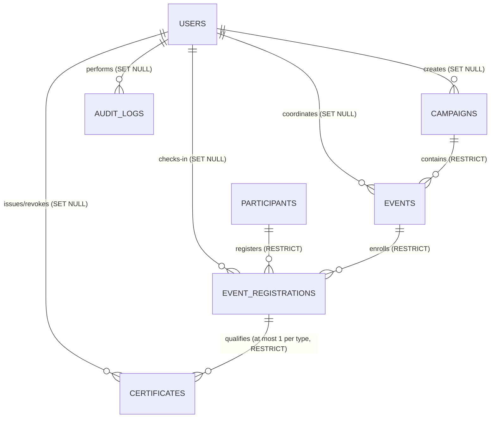

# Phase 1 — Database Architecture & Design Specification
**Project**: Listening Community – Suicide Prevention Campaign (LC-SPC)  
**Database**: `u806388046_LC` (MySQL 8.0 / MariaDB InnoDB, `utf8mb4_unicode_ci`)  
**Status**: Final Design Specification (Zero Schema Changes Executed)  
**Date**: September 2026  

---

## 1. Executive Summary & Scope

### 1.1 Purpose
The **Listening Community – Suicide Prevention Campaign (LC-SPC)** is a dedicated mental health initiative and community awareness portal hosted at `https://teami.in/LC/`. Following the architectural hardening and production isolation achieved in Phase 0, Phase 1 establishes the complete relational data architecture required to power:
- Secure administrative authentication and tiered administrative governance.
- Multi-campaign and event/workshop scheduling, capacity, and lifecycle management.
- Participant registration, demographic categorisation, and guidelines consent.
- Event attendance, digital check-in tracking, and staff attribution.
- Tamper-proof digital certificate issuance, revocation, and public QR verification.
- Security-first, append-only administrative audit logging.
- Real-time reporting derived directly through indexed relational queries without denormalized summary tables.

### 1.2 Boundary & Safety Constraints
* **Dedicated Database**: Operates exclusively in `u806388046_LC` with database user `u806388046_LC_SPC`. Zero data sharing with sibling applications (`gratitudeletter/`, `ISPD/`, `listening-community/`).
* **Design Philosophy**: High 3NF normalization, strict foreign-key integrity, zero clinical/sensitive data collection, privacy-by-design for campaign participants, and chronological migration management via `bin/migrate.php`.
* **Current State**: Only the baseline `migrations` table exists. The database is clean and ready for Phase 1 migrations upon approval.

---

## 2. Existing Phase 0 Database State

Phase 0 validated database connectivity, environment isolation, and the migration execution engine. The current database catalog contains exclusively:

```sql
CREATE TABLE IF NOT EXISTS `migrations` (
    `id` INT UNSIGNED AUTO_INCREMENT PRIMARY KEY,
    `migration` VARCHAR(255) NOT NULL UNIQUE,
    `batch` INT UNSIGNED NOT NULL,
    `executed_at` TIMESTAMP DEFAULT CURRENT_TIMESTAMP
) ENGINE=InnoDB DEFAULT CHARSET=utf8mb4 COLLATE=utf8mb4_unicode_ci;
```

* Active Migrations in `database/migrations/`: `0` (clean `.gitkeep` placeholder).
* Domain Tables Existing: `0`.

---

## 3. Entity Relationship Overview

The finalized Phase 1 MVP architecture comprises **7 core entities**:



---

## 4. In-Depth Architectural Dimensions & Design Decisions

### 4.1 Dimension 1: Users & Role Architecture

#### Options Evaluated:
1. **Option A: Hierarchical Single-Role on `users` (`role` ENUM)**
   - Single column `role ENUM('super_admin', 'coordinator', 'staff', 'viewer')` on the `users` table.
   - Permissions are inherited hierarchically:
     - `super_admin`: Full system configuration, user provisioning, audit inspection, campaign/event management, certificate issuance/revocation.
     - `coordinator`: Campaign and event management, registration review, certificate issuance.
     - `staff`: Attendee check-in scanning and registration verification.
     - `viewer`: Read-only access to dashboards, event rosters, and attendance reports.
2. **Option B: Relational Multi-Role Junction (`roles` + `user_roles` tables)**
   - Requires two additional tables: `roles` (`id`, `name`, `slug`) and `user_roles` (`user_id`, `role_id`).
   - Adds unnecessary JOIN overhead, schema complexity, and session management code for a team of <10 administrative users.
3. **Option C: Role-Set / JSON Array (`roles JSON`)**
   - Stores roles as `["coordinator", "staff"]` inside a JSON column.
   - Violates 1NF, prevents relational integrity, and complicates queries.

#### Approved Decision: **Option A (Hierarchical Single-Role)**
* **Justification**: For the LC-SPC Phase 1 MVP, administrative staff operate under a natural command hierarchy rather than disjoint, orthogonal roles. A `coordinator` inherently requires check-in permissions; a `super_admin` inherently requires all coordinator capabilities.
* **Overhead Elimination**: Option A avoids 2 additional tables, eliminates JOINs on every authenticated request, and simplifies role checks in PHP middleware:
  ```php
  Auth::hasRole('coordinator'); // Returns true for coordinator and super_admin
  ```
* **Extensibility**: If fine-grained orthogonal permissions are mandated in Phase 2, `users.role` can be migrated cleanly to a `user_roles` junction without breaking foreign keys.

---

### 4.2 Dimension 2: Participant Identity, Deduplication & Privacy

#### Canonical Identity vs. Email:
* **Canonical Identity**: `participants.id` (`BIGINT UNSIGNED AUTO_INCREMENT`) is the **authoritative, canonical identity key** for all participants across the platform.
* **Email is NOT the Absolute Identity Key**:
  - `email` is **nullable** and **indexed** (`idx_participants_email`), but is **NOT unique**.
  - In community-level mental health awareness campaigns, participants may include school students without email addresses, elderly community members registering with offline help, or family members sharing a household email. Treating email as an absolute unique key would lock out valid attendees.
* **Application-Level Identity Resolution & Deduplication**:
  - When an attendee registers for an event:
    1. If an `email` is provided, the application performs a lookup:
       ```sql
       SELECT id, full_name, phone FROM participants WHERE email = :email LIMIT 5;
       ```
    2. If a single match with an identical or compatible name/phone is found, the system resolves to the existing canonical `participants.id`.
    3. If no email is provided, or if the registrant clearly represents a distinct individual (e.g. a different student sharing a school computer or teacher's email), a new canonical row in `participants` is created.
    4. The event enrollment is then inserted into `event_registrations` referencing the resolved `participant_id`.
* **Registration Deduplication Constraint**:
  - Regardless of identity resolution strategy, a participant cannot be registered twice for the same event:
    ```sql
    UNIQUE KEY `uk_event_reg_unique_enrollment` (`event_id`, `participant_id`)
    ```

#### Data Minimization & Field Inventory:
To ensure maximum user trust, reduce registration friction, and comply with data minimization principles, unnecessary demographic fields (`city`, `state`) are excluded. The profile fields are strictly minimized to:
1. `id` (`BIGINT UNSIGNED` AUTO_INCREMENT): Canonical identity key.
2. `full_name` (`VARCHAR(150)` NOT NULL): Required for communication and printing on official certificates.
3. `email` (`VARCHAR(191)` NULL): Optional communication point; indexed for deduplication lookup.
4. `phone` (`VARCHAR(25)` NULL): Optional WhatsApp/SMS contact for event day coordination.
5. `category` (`ENUM('student', 'professional', 'community', 'other')` NOT NULL DEFAULT `'community'`): High-level category for campaign impact metrics.
6. `organization_name` (`VARCHAR(191)` NULL): Optional college, university, NGO, or company name.
7. `agreed_guidelines_at` (`DATETIME` NOT NULL): Timestamp recording explicit consent to Community Guidelines.
8. `privacy_consent_at` (`DATETIME` NOT NULL): Timestamp recording explicit privacy consent.
9. `status` (`ENUM('active', 'flagged', 'blocked')` NOT NULL DEFAULT `'active'`): Administrative state to block spam bots.

#### Ethical & Non-Clinical Boundary:
* **Absolute Exclusion**: The LC-SPC platform is strictly an educational, awareness, and peer listening community portal.
* **Schema Safeguard**: Under no circumstances will the database store medical histories, psychiatric diagnostics, clinical assessments, distress scores, questionnaire answers, or counseling logs.

---

### 4.3 Dimension 3: Event Registration Integrity & Check-In Model

#### Relationship & Duplicate Prevention:
* **Relationship**: Many-to-Many between `events` and `participants`, resolved through `event_registrations`.
* **Database-Level Duplicate Prevention**:
  ```sql
  UNIQUE KEY `uk_event_reg_unique_enrollment` (`event_id`, `participant_id`)
  ```
  A participant cannot register twice for the same event. If they re-submit the registration form, the system identifies the existing registration and re-displays their confirmed ticket code.
* **Voucher Code**:
  ```sql
  UNIQUE KEY `uk_event_reg_code` (`registration_code`)
  ```
  A cryptographically randomized, human-readable alphanumeric code (e.g., `REG-26-8F4A2`) generated at enrollment. Used on digital tickets and QR codes for door check-in.

#### Status Workflow:
* **`status`** (`ENUM('pending', 'confirmed', 'waitlisted', 'cancelled')` NOT NULL DEFAULT `'confirmed'`):
  - `'confirmed'`: Standard active registration.
  - `'pending'`: Awaiting manual approval (when `events.requires_approval = 1`).
  - `'waitlisted'`: Assigned when event reaches maximum capacity (`capacity > 0`).
  - `'cancelled'`: Participant withdrew or admin cancelled enrollment.
* **`attendance_status`** (`ENUM('unmarked', 'attended', 'absent', 'excused')` NOT NULL DEFAULT `'unmarked'`):
  - Completely decoupled from enrollment status.
  - Updated upon physical or virtual event arrival.

#### Check-In Model vs. Check-Out Review:
* **Check-In**: Handled via `checked_in_at DATETIME NULL` and `check_in_method ENUM('admin_manual', 'qr_scan', 'self_verified')`.
* **Check-Out Omission**: A separate `checked_out_at` field is **intentionally omitted**. Awareness sessions and listening circles run 1 to 3 hours. Requiring attendees to scan out at the exit creates severe bottleneck logistics for volunteers and yields negligible operational value for an awareness campaign.
* **Staff Attribution**:
  - `checked_in_by INT UNSIGNED NULL REFERENCES users(id) ON DELETE SET NULL`.
  - Captures the exact staff member who scanned the pass or verified the attendee at the venue.

---

### 4.4 Dimension 4: Certificate Architecture & Lifecycle

#### Qualifying Relationship to Registrations:
* A certificate represents official recognition of event participation, service, or speaking.
* **Pre-condition**: A certificate can **only** be issued if:
  1. An active record exists in `event_registrations`.
  2. `event_registrations.attendance_status = 'attended'`.
  3. `event_registrations.status = 'confirmed'`.
* **Cardinality & Authoritative Constraint**:
  - One event registration can have **at most one certificate of each certificate type**.
  - Therefore, the relationship between `event_registrations` and `certificates` is **1:N (constrained per type)**, governed by:
    ```sql
    UNIQUE KEY `uk_cert_reg_type` (`registration_id`, `type`)
    ```
  - This constraint guarantees that a single registration cannot receive duplicate certificates of the same type (e.g. two "participation" certificates for the same workshop), while allowing a participant who served as both attendee and volunteer to hold one `participation` certificate and one `volunteer` certificate for that event.
  - **Relational Normalization**: The `certificates` table references `registration_id` as its sole relational parent to event participation. Redundant `event_id` and `participant_id` columns are strictly excluded, eliminating cross-table synchronization anomalies. Event details and recipient identity are derived cleanly via `JOIN event_registrations`.

#### Identification & Verification Tokens:
1. **Display Identifier**:
   - `certificate_number VARCHAR(50) NOT NULL UNIQUE` (e.g., `LC-2026-SPC-00142`).
   - Clean, sequential, and human-readable. Printed on the physical certificate.
2. **Cryptographic Verification Token**:
   - `verification_token VARCHAR(64) NOT NULL UNIQUE`.
   - Generated using 256 bits of CSPRNG entropy (`bin2hex(random_bytes(32))`).
   - Unpredictable, non-sequential, and tamper-proof.

#### Public Verification Requirements:
* Public URL: `https://teami.in/LC/verify/{token}` (encoded into the certificate's QR code).
* **Unauthenticated Access**: Anyone (employers, universities, participants) can scan the QR code without logging in.
* **Privacy by Design**: The public lookup returns **only**:
  - Certificate Number
  - Recipient Name Snapshot
  - Event Title & Date
  - Campaign Name
  - Certificate Type & Status (Valid / Revoked)
  - Issuing Authority (`Listening Community SPC`)
  *(Participant email, phone number, and internal IDs are strictly excluded from public verification responses).*
* **Name Immutability Snapshot**:
  - `recipient_name_snapshot VARCHAR(150) NOT NULL` freezes the recipient's legal name at the precise moment of issuance. If the participant later updates their profile name, historical certificates remain immutable.

#### Lifecycle & Invalidation:
* `status ENUM('active', 'revoked') NOT NULL DEFAULT 'active'`.
* Invalidation is supported via:
  - `revoked_at DATETIME NULL`
  - `revoked_by INT UNSIGNED NULL REFERENCES users(id) ON DELETE SET NULL`
  - `revocation_reason VARCHAR(255) NULL`
* If a revoked certificate is scanned publicly, the portal clearly reports that the certificate was invalidated by the issuing authority on `revoked_at` with the recorded justification.

---

### 4.5 Dimension 5: Audit Logging Architecture

#### Append-Only Strategy:
* The `audit_logs` table represents an immutable forensic timeline.
* **Strict Constraints**:
  - No `updated_at` column.
  - No `deleted_at` column.
  - Application code contains zero `UPDATE` or `DELETE` queries on `audit_logs`.
  - All entries are strictly `INSERT`-only.

#### Actor Identification & Graceful Deletion:
* `actor_id INT UNSIGNED NULL REFERENCES users(id) ON DELETE SET NULL`.
* `actor_type ENUM('admin', 'system', 'anonymous') NOT NULL DEFAULT 'admin'`.
* **Preservation Pattern**: If an administrative user account is removed, the database sets `actor_id = NULL`, but `metadata` retains `{ "actor_email": "admin@teami.in", "actor_name": "John Doe" }` so historical audit attribution remains permanently intact.

#### Entity Identification & Action Taxonomy:
* Polymorphic reference:
  - `entity_type VARCHAR(50) NOT NULL` (`'user'`, `'campaign'`, `'event'`, `'participant'`, `'registration'`, `'certificate'`).
  - `entity_id BIGINT UNSIGNED NULL` (Primary key of affected entity).
* Action Slugs (Dot-Notated):
  - Authentication: `auth.login`, `auth.logout`, `auth.failed_login`, `auth.lockout`
  - Campaigns: `campaign.create`, `campaign.update`, `campaign.status_change`, `campaign.delete`
  - Events: `event.create`, `event.update`, `event.publish`, `event.cancel`
  - Participants: `participant.create`, `participant.update`, `participant.flag`
  - Registrations: `registration.create`, `registration.checkin`, `registration.cancel`
  - Certificates: `certificate.issue`, `certificate.batch_issue`, `certificate.revoke`
  - System: `system.migration`, `system.config_change`

#### Privacy, Metadata & Indexing:
* **IP & Device Tracking**:
  - `ip_address VARCHAR(45) NOT NULL` (supports IPv4 and IPv6).
  - `user_agent VARCHAR(255) NULL` (client browser/device user agent).
* **Metadata Sanitization**:
  - `metadata JSON NULL`.
  - **CRITICAL**: Passwords, password hashes, plain tokens, and session cookies are strictly stripped before writing to `metadata`.
* **Performance Indexing**:
  - `idx_audit_actor_created (actor_id, created_at)`
  - `idx_audit_entity (entity_type, entity_id)`
  - `idx_audit_action_created (action, created_at)`

---

### 4.6 Dimension 6: Database Integrity, Foreign Keys & Cascading Strategy

#### Cascading Strategy & Business Safety Rules:
* **Rule 1: RESTRICT on Domain Records (`ON DELETE RESTRICT`)**
  - An event cannot be deleted if registrations or certificates exist.
  - A participant cannot be deleted if registrations or certificates exist.
  - A campaign cannot be deleted if events exist.
  - *Why*: `CASCADE DELETE` poses an unacceptable risk of accidental mass data loss. Using `RESTRICT` forces intentional administrative workflows.
* **Rule 2: SET NULL on Staff Attribution (`ON DELETE SET NULL`)**
  - Fields such as `events.coordinator_id`, `event_registrations.checked_in_by`, `certificates.issued_by`, and `audit_logs.actor_id` utilize `ON DELETE SET NULL`.
  - *Why*: Deleting or deactivating a staff user must never delete the events they organized, the attendees they checked in, or the certificates they generated.

#### Soft Deletes Scope:
* Soft deletion (`deleted_at DATETIME NULL`) is applied **only** to primary management entities:
  - `users`
  - `campaigns`
  - `events`
* Transactional, junction, and compliance records (`participants`, `event_registrations`, `certificates`, `audit_logs`) **do not use soft deletes**. They maintain their integrity through explicit state machines (`status = 'cancelled'`, `status = 'revoked'`) or are append-only.

---

## 5. Final Proposed Phase 1 MVP Table Specifications

### 5.1 Table: `users`
* **Purpose**: Administrative and staff credentials, role tiering, brute-force protection, and login audits.

| Column | Data Type | Nullable | Default | Description |
| :--- | :--- | :--- | :--- | :--- |
| `id` | `INT UNSIGNED` | NO | AUTO_INCREMENT | Primary key. |
| `name` | `VARCHAR(100)` | NO | None | Full legal/display name of administrator. |
| `email` | `VARCHAR(191)` | NO | None | Unique login email address. |
| `password_hash` | `VARCHAR(255)` | NO | None | Secure Argon2id/Bcrypt hash via `Security::hashPassword()`. |
| `role` | `ENUM('super_admin', 'coordinator', 'staff', 'viewer')` | NO | `'staff'` | Tiered administrative role. |
| `phone` | `VARCHAR(25)` | YES | NULL | Optional contact number. |
| `status` | `ENUM('active', 'inactive', 'suspended')` | NO | `'active'` | Account lifecycle state. |
| `failed_logins` | `TINYINT UNSIGNED` | NO | `0` | Consecutive failed authentication attempts. |
| `locked_until` | `DATETIME` | YES | NULL | Temporary account lockout expiration timestamp. |
| `last_login_at` | `DATETIME` | YES | NULL | Timestamp of last successful session. |
| `created_at` | `DATETIME` | NO | `CURRENT_TIMESTAMP` | Account creation timestamp. |
| `updated_at` | `DATETIME` | NO | `CURRENT_TIMESTAMP ON UPDATE` | Last modification timestamp. |
| `deleted_at` | `DATETIME` | YES | NULL | Soft-delete timestamp for audit retention. |

* **Primary Key**: `id`
* **Unique Constraints**:
  * `uk_users_email` (`email`)
* **Indexes**:
  * `idx_users_role_status` (`role`, `status`)
  * `idx_users_deleted_at` (`deleted_at`)

---

### 5.2 Table: `campaigns`
* **Purpose**: Multi-year campaign initiative groupings (e.g., "SPC 2026", "Campus Awareness Tour").

| Column | Data Type | Nullable | Default | Description |
| :--- | :--- | :--- | :--- | :--- |
| `id` | `INT UNSIGNED` | NO | AUTO_INCREMENT | Primary key. |
| `title` | `VARCHAR(191)` | NO | None | Campaign title. |
| `slug` | `VARCHAR(191)` | NO | None | URL-safe slug (e.g. `spc-2026`). |
| `theme` | `VARCHAR(255)` | YES | NULL | Campaign theme or slogan (e.g., "Words and Beyond"). |
| `description` | `TEXT` | YES | NULL | Campaign overview and objectives. |
| `start_date` | `DATE` | NO | None | Official kick-off date. |
| `end_date` | `DATE` | NO | None | Official conclusion date. |
| `status` | `ENUM('draft', 'active', 'completed', 'archived')` | NO | `'draft'` | Campaign lifecycle status. |
| `created_by` | `INT UNSIGNED` | YES | NULL | User who initialized the campaign. |
| `created_at` | `DATETIME` | NO | `CURRENT_TIMESTAMP` | Creation timestamp. |
| `updated_at` | `DATETIME` | NO | `CURRENT_TIMESTAMP ON UPDATE` | Modification timestamp. |
| `deleted_at` | `DATETIME` | YES | NULL | Soft-delete timestamp. |

* **Primary Key**: `id`
* **Foreign Keys**:
  * `fk_campaigns_created_by` (`created_by`) &rarr; `users(id)` `ON DELETE SET NULL`
* **Unique Constraints**:
  * `uk_campaigns_slug` (`slug`)
* **Indexes**:
  * `idx_campaigns_status_dates` (`status`, `start_date`, `end_date`)

---

### 5.3 Table: `events`
* **Purpose**: Concrete sessions, workshops, circles, and training programs. Handles venues, URLs, and capacity.
* **Category Design**: Uses `events.category` ENUM as an **intentional Phase 1 MVP simplification**. A dynamic `event_categories` lookup table may be introduced in a future phase if custom, user-defined categories become necessary.

| Column | Data Type | Nullable | Default | Description |
| :--- | :--- | :--- | :--- | :--- |
| `id` | `INT UNSIGNED` | NO | AUTO_INCREMENT | Primary key. |
| `campaign_id` | `INT UNSIGNED` | NO | None | Parent campaign reference. |
| `coordinator_id` | `INT UNSIGNED` | YES | NULL | Assigned staff coordinator. |
| `title` | `VARCHAR(191)` | NO | None | Event title. |
| `slug` | `VARCHAR(191)` | NO | None | URL-safe slug unique within campaign. |
| `category` | `ENUM('workshop', 'listening_circle', 'training', 'seminar', 'pledge_drive')` | NO | `'workshop'` | Program classification (MVP ENUM). |
| `description` | `TEXT` | YES | NULL | Agenda, speakers, and event details. |
| `format` | `ENUM('in_person', 'online', 'hybrid')` | NO | `'in_person'` | Delivery modality. |
| `venue_name` | `VARCHAR(255)` | YES | NULL | Hall/campus or platform name. |
| `venue_address` | `TEXT` | YES | NULL | Physical address details. |
| `online_meeting_url`| `VARCHAR(255)` | YES | NULL | Secure link for virtual sessions. |
| `start_time` | `DATETIME` | NO | None | Event start datetime (Asia/Kolkata). |
| `end_time` | `DATETIME` | NO | None | Event conclusion datetime (Asia/Kolkata). |
| `capacity` | `INT UNSIGNED` | NO | `0` | Max attendee limit (`0` = uncapped). |
| `registration_deadline` | `DATETIME` | YES | NULL | Registration closing datetime. |
| `requires_approval`| `TINYINT(1)` | NO | `0` | Flag: whether registration requires manual review. |
| `status` | `ENUM('draft', 'published', 'ongoing', 'completed', 'cancelled')` | NO | `'draft'` | Program status. |
| `created_at` | `DATETIME` | NO | `CURRENT_TIMESTAMP` | Creation timestamp. |
| `updated_at` | `DATETIME` | NO | `CURRENT_TIMESTAMP ON UPDATE` | Modification timestamp. |
| `deleted_at` | `DATETIME` | YES | NULL | Soft-delete timestamp. |

* **Primary Key**: `id`
* **Foreign Keys**:
  * `fk_events_campaign_id` (`campaign_id`) &rarr; `campaigns(id)` `ON DELETE RESTRICT`
  * `fk_events_coordinator_id` (`coordinator_id`) &rarr; `users(id)` `ON DELETE SET NULL`
* **Unique Constraints**:
  * `uk_events_campaign_slug` (`campaign_id`, `slug`)
* **Indexes**:
  * `idx_events_status_schedule` (`status`, `start_time`, `end_time`)
  * `idx_events_category` (`category`)
  * `idx_events_coordinator` (`coordinator_id`)

---

### 5.4 Table: `participants`
* **Purpose**: Canonical participant identity across all campaign events. Non-sensitive contact identity with optional email.

| Column | Data Type | Nullable | Default | Description |
| :--- | :--- | :--- | :--- | :--- |
| `id` | `BIGINT UNSIGNED` | NO | AUTO_INCREMENT | **Canonical participant identity key**. |
| `full_name` | `VARCHAR(150)` | NO | None | Full legal name for certificates. |
| `email` | `VARCHAR(191)` | YES | NULL | Optional communication email; indexed for deduplication. |
| `phone` | `VARCHAR(25)` | YES | NULL | Optional contact/WhatsApp number. |
| `category` | `ENUM('student', 'professional', 'community', 'other')` | NO | `'community'` | Stakeholder category for reporting. |
| `organization_name` | `VARCHAR(191)` | YES | NULL | Optional college, NGO, or workplace. |
| `agreed_guidelines_at` | `DATETIME` | NO | None | Explicit consent to Community Guidelines. |
| `privacy_consent_at` | `DATETIME` | NO | None | Explicit privacy consent timestamp. |
| `status` | `ENUM('active', 'flagged', 'blocked')` | NO | `'active'` | Participant status. |
| `created_at` | `DATETIME` | NO | `CURRENT_TIMESTAMP` | First registration timestamp. |
| `updated_at` | `DATETIME` | NO | `CURRENT_TIMESTAMP ON UPDATE` | Last profile update timestamp. |

* **Primary Key**: `id`
* **Unique Constraints**: None (email is intentionally non-unique).
* **Indexes**:
  * `idx_participants_email` (`email`)
  * `idx_participants_category` (`category`)
  * `idx_participants_name` (`full_name`)

---

### 5.5 Table: `event_registrations`
* **Purpose**: Participant-to-event enrollment junction, unique pass code, attendance status, and check-in tracking.

| Column | Data Type | Nullable | Default | Description |
| :--- | :--- | :--- | :--- | :--- |
| `id` | `BIGINT UNSIGNED` | NO | AUTO_INCREMENT | Primary key. |
| `registration_code` | `VARCHAR(40)` | NO | None | Unique alphanumeric pass code (e.g. `REG-26-8A3F9`). |
| `event_id` | `INT UNSIGNED` | NO | None | Referenced event. |
| `participant_id` | `BIGINT UNSIGNED` | NO | None | Referenced canonical participant. |
| `status` | `ENUM('pending', 'confirmed', 'waitlisted', 'cancelled')` | NO | `'confirmed'` | Enrollment status. |
| `attendance_status` | `ENUM('unmarked', 'attended', 'absent', 'excused')` | NO | `'unmarked'` | Verified presence state. |
| `checked_in_at` | `DATETIME` | YES | NULL | Check-in timestamp upon arrival. |
| `checked_in_by` | `INT UNSIGNED` | YES | NULL | Staff member who verified check-in. |
| `check_in_method` | `ENUM('admin_manual', 'qr_scan', 'self_verified')`| YES | NULL | Verification modality. |
| `admin_notes` | `VARCHAR(255)` | YES | NULL | Internal non-sensitive notes. |
| `created_at` | `DATETIME` | NO | `CURRENT_TIMESTAMP` | Registration timestamp. |
| `updated_at` | `DATETIME` | NO | `CURRENT_TIMESTAMP ON UPDATE` | Modification timestamp. |

* **Primary Key**: `id`
* **Foreign Keys**:
  * `fk_event_reg_event` (`event_id`) &rarr; `events(id)` `ON DELETE RESTRICT`
  * `fk_event_reg_participant` (`participant_id`) &rarr; `participants(id)` `ON DELETE RESTRICT`
  * `fk_event_reg_staff` (`checked_in_by`) &rarr; `users(id)` `ON DELETE SET NULL`
* **Unique Constraints**:
  * `uk_event_reg_code` (`registration_code`)
  * `uk_event_reg_unique_enrollment` (`event_id`, `participant_id`)
* **Indexes**:
  * `idx_event_reg_attendance` (`event_id`, `attendance_status`)
  * `idx_event_reg_participant` (`participant_id`)

---

### 5.6 Table: `certificates`
* **Purpose**: Digital certificates awarded for verified attendance or service, featuring public QR tokens.
* **Cardinality**: 1:N with `event_registrations` (at most one certificate of each certificate type per registration, enforced via `uk_cert_reg_type`).

| Column | Data Type | Nullable | Default | Description |
| :--- | :--- | :--- | :--- | :--- |
| `id` | `BIGINT UNSIGNED` | NO | AUTO_INCREMENT | Primary key. |
| `certificate_number`| `VARCHAR(50)` | NO | None | Display code (e.g. `LC-2026-SPC-00104`). |
| `verification_token`| `VARCHAR(64)` | NO | None | 256-bit secure hex token for public verification URL. |
| `registration_id` | `BIGINT UNSIGNED` | NO | None | Referenced qualifying registration. |
| `recipient_name_snapshot` | `VARCHAR(150)` | NO | None | Frozen legal name as printed on certificate. |
| `type` | `ENUM('participation', 'volunteer', 'speaker', 'appreciation')` | NO | `'participation'` | Certificate category. |
| `issue_date` | `DATE` | NO | None | Official issuance date. |
| `status` | `ENUM('active', 'revoked')` | NO | `'active'` | Validity state. |
| `issued_by` | `INT UNSIGNED` | YES | NULL | Administrator who authorized generation. |
| `revoked_at` | `DATETIME` | YES | NULL | Revocation timestamp if invalidated. |
| `revoked_by` | `INT UNSIGNED` | YES | NULL | Administrator who invalidated certificate. |
| `revocation_reason` | `VARCHAR(255)` | YES | NULL | Audit reason for revocation. |
| `created_at` | `DATETIME` | NO | `CURRENT_TIMESTAMP` | Generation timestamp. |
| `updated_at` | `DATETIME` | NO | `CURRENT_TIMESTAMP ON UPDATE` | Modification timestamp. |

* **Primary Key**: `id`
* **Foreign Keys**:
  * `fk_cert_registration` (`registration_id`) &rarr; `event_registrations(id)` `ON DELETE RESTRICT`
  * `fk_cert_issued_by` (`issued_by`) &rarr; `users(id)` `ON DELETE SET NULL`
  * `fk_cert_revoked_by` (`revoked_by`) &rarr; `users(id)` `ON DELETE SET NULL`
* **Unique Constraints**:
  * `uk_cert_number` (`certificate_number`)
  * `uk_cert_token` (`verification_token`)
  * `uk_cert_reg_type` (`registration_id`, `type`) *(Authoritative constraint: at most 1 certificate of each type per registration)*
* **Indexes**:
  * `idx_cert_status` (`status`)
  * `idx_cert_issued_by` (`issued_by`)
  * `idx_cert_revoked_by` (`revoked_by`)

---

### 5.7 Table: `audit_logs`
* **Purpose**: Append-only security audit and forensic log for tracking administrative actions and security events.

| Column | Data Type | Nullable | Default | Description |
| :--- | :--- | :--- | :--- | :--- |
| `id` | `BIGINT UNSIGNED` | NO | AUTO_INCREMENT | Primary key. |
| `actor_id` | `INT UNSIGNED` | YES | NULL | User ID who executed action (`NULL` for guest/system). |
| `actor_type` | `ENUM('admin', 'system', 'anonymous')` | NO | `'admin'` | Categorization of initiating principal. |
| `action` | `VARCHAR(100)` | NO | None | Dot-notated action slug (e.g. `event.publish`, `cert.revoke`). |
| `entity_type` | `VARCHAR(50)` | NO | None | Target model (`user`, `event`, `participant`, `certificate`). |
| `entity_id` | `BIGINT UNSIGNED` | YES | NULL | Primary key of target entity. |
| `ip_address` | `VARCHAR(45)` | NO | None | Client IPv4 or IPv6 address. |
| `user_agent` | `VARCHAR(255)` | YES | NULL | Truncated client browser/device user agent. |
| `metadata` | `JSON` | YES | NULL | Sanitized context payload (strictly no plain passwords). |
| `created_at` | `DATETIME` | NO | `CURRENT_TIMESTAMP` | Action timestamp. |

* **Primary Key**: `id`
* **Foreign Keys**:
  * `fk_audit_actor` (`actor_id`) &rarr; `users(id)` `ON DELETE SET NULL`
* **Unique Constraints**: None (append-only log).
* **Indexes**:
  * `idx_audit_actor_created` (`actor_id`, `created_at`)
  * `idx_audit_entity` (`entity_type`, `entity_id`)
  * `idx_audit_action_created` (`action`, `created_at`)

---

## 6. Over-Engineering Analysis: What Was Eliminated or Deferred

| Component | Status in Design | Justification |
| :--- | :--- | :--- |
| **`event_categories` Table** | **Eliminated (Phase 1)** | Replaced by `events.category` ENUM. Intentional Phase 1 MVP simplification. A dynamic lookup table may be introduced in a future phase if custom categories are needed. |
| **`city` & `state` on `participants`** | **Eliminated** | Removed to enforce data minimization and reduce registration friction. |
| **`download_count` on `certificates`** | **Eliminated** | Mutating an immutable certificate record on every PDF download causes unnecessary row locks and write traffic. Download events can be logged in `audit_logs` if needed. |
| **`checked_out_at` on `event_registrations`** | **Eliminated** | Impractical for 1–3 hour community awareness sessions where door volunteers only verify entry. Exit scanning creates severe event bottlenecks. |
| **Dynamic RBAC Tables** (`roles`, `permissions`, `user_roles`) | **Deferred** | Tiered `users.role` ENUM (`super_admin` > `coordinator` > `staff` > `viewer`) cleanly handles permissions for an administrative team of <10 persons. |
| **`organizations` Table** | **Deferred** | Kept as an optional text string `organization_name` on `participants`. A dedicated organization directory table is deferred until multi-institution partnerships warrant it. |
| **`event_sessions` (Agenda Items) Table** | **Deferred** | Single-track event schedules are handled within the `events.description` field. Multi-session tables are deferred to multi-day conference needs in Phase 2. |

---

## 7. Scope Categorization: Phase 1 MVP vs. Deferred vs. Not Recommended

### Category A: Required for Phase 1 MVP (7 Tables)
1. **`users`**: Secure Argon2id/Bcrypt authentication, brute-force lockout, single-role hierarchy.
2. **`campaigns`**: Multi-year campaign initiative grouping, slug-based routing, date bounds.
3. **`events`**: Scheduling, location/platform, capacity limits, registration rules, direct category ENUM.
4. **`participants`**: Canonical identity (`id`), minimal non-sensitive profile, optional indexed email, consent timestamps.
5. **`event_registrations`**: Many-to-many enrollment junction, unique pass code, duplicate enrollment prevention constraint, check-in tracking.
6. **`certificates`**: Unique display number, 256-bit verification token, frozen name snapshot, `UNIQUE(registration_id, type)` constraint, public QR verification, revocation workflow.
7. **`audit_logs`**: Append-only security forensics, actor attribution, polymorphic targets, IP tracking, clean JSON metadata.

### Category B: Useful But Deferred to Phase 2
1. **Dynamic `event_categories` table**: Can be introduced if non-technical coordinators require the ability to create dynamic event categories from the admin dashboard.
2. **Dynamic RBAC junction tables**: Can be introduced if orthogonal permissions (e.g. separation of event coordination from certificate authorization) are required.
3. **Automated waitlist promotion**: Automated background worker that promotes waitlisted participants upon cancellations.
4. **Institutional directory (`organizations` table)**: Structured management of colleges and partner NGOs.

### Category C: Strictly Not Recommended (Ever or for this platform)
1. **Participant health records / psychological assessments / counseling session notes**: Major ethical and legal liability. LC-SPC is an awareness and gatekeeper initiative, not an electronic medical records (EMR) system.
2. **Denormalized dashboard summary tables**: Prone to sync drift and cache corruption. MySQL InnoDB indexed aggregate queries execute in sub-millisecond ranges.
3. **API / Bearer token storage tables**: Phase 1 is a web portal using secure HTTPS session cookies (`LCSPC_SESSION`).
4. **Check-out tracking (`checked_out_at`)**: Counter-productive to the attendee experience in short workshops.

---

## 8. Proposed Migration Execution Sequence

When approved, the migrations will be created in `database/migrations/` and executed in the following chronological sequence:

```text
database/migrations/
├── m0001_create_users_table.php               (Admin authentication & tiered roles)
├── m0002_create_campaigns_table.php           (Campaign initiative grouping)
├── m0003_create_events_table.php              (Event scheduling, venues & capacity)
├── m0004_create_participants_table.php        (Canonical participant identity & consent)
├── m0005_create_event_registrations_table.php (Enrollment, duplicate check & check-in)
├── m0006_create_certificates_table.php        (Certificates, tokens & verification)
└── m0007_create_audit_logs_table.php          (Append-only forensic audit logging)
```

### Dependency Order Validation:
1. `users` has zero dependencies (created first).
2. `campaigns` references `users`.
3. `events` references `campaigns` and `users`.
4. `participants` has zero dependencies.
5. `event_registrations` references `events`, `participants`, and `users`.
6. `certificates` references `event_registrations` and `users`.
7. `audit_logs` references `users`.

*Zero circular dependencies exist across this pipeline.*

---

## 9. Final Phase 1 Design Decisions

The following architectural decisions have been formally approved for Phase 1 implementation:

- **Hierarchical single-role users**: **APPROVED** (`users.role` ENUM: `super_admin` > `coordinator` > `staff` > `viewer`).
- **Participant canonical identity via participant ID, email as optional lookup/contact**: **APPROVED** (`participants.id` is the canonical identity key; `email` is nullable and indexed for deduplication assistance, not a unique constraint; `uk_event_reg_unique_enrollment` on `(event_id, participant_id)` prevents duplicate event enrollment).
- **Event category ENUM for Phase 1**: **APPROVED** (Intentional MVP simplification via `events.category` ENUM; a dynamic lookup table may be introduced in a future phase if custom categories become necessary).
- **Single-point check-in without checkout**: **APPROVED** (`checked_in_at` and `checked_in_by` recorded upon arrival; exit scanning omitted).
- **Certificate uniqueness per registration + certificate type**: **APPROVED** (`UNIQUE(registration_id, type)` is the authoritative database constraint, allowing at most one certificate of each certificate type per registration).
- **Certificate normalization**: **APPROVED** (Streamlined to reference `event_registrations` as the sole relationship to event participation, eliminating redundant `event_id` and `participant_id` columns).

---

*(End of Specification — No database changes, migration files, or application code changes have been made).*
