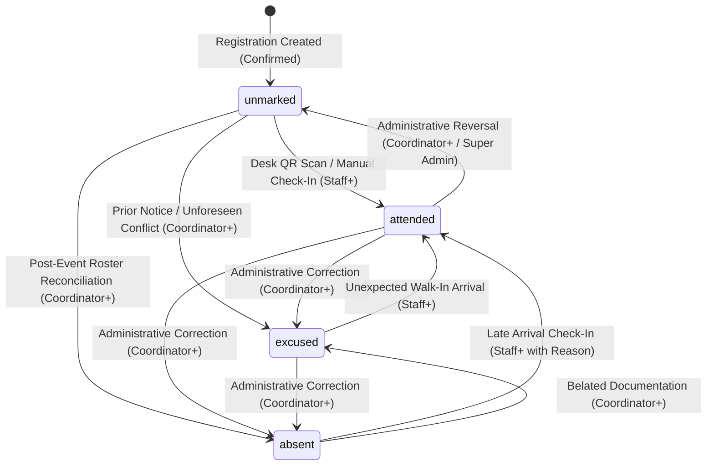
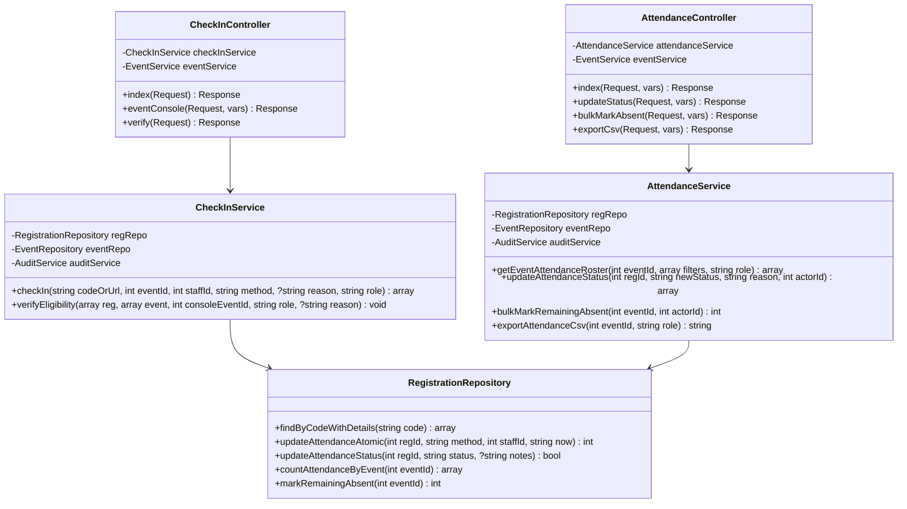

# Phase 1F — Attendance & Check-in System Architecture Specification

**Project**: Listening Community – Suicide Prevention Campaign (LC-SPC)  
**Production URL**: `https://teami.in/LC/`  
**Local Development**: `http://localhost:8000/`  
**Baseline Git Commit**: `bb3f314` (Phase 1E Closed & Verified; Production Login Hotfix Verified)  
**Database**: `u806388046_LC` (MySQL 8.0 / MariaDB InnoDB, `utf8mb4_unicode_ci`)  
**Status**: FINAL APPROVED ARCHITECTURE (LOCKED FOR IMPLEMENTATION)  
**Author**: Antigravity Systems Team & Lead Systems Architect  
**Date**: September 2026  

---

## Document Index & Table of Contents

1. [Executive Overview & Operational Context](#1-executive-overview--operational-context)
2. [Attendance Lifecycle & State Machine](#2-attendance-lifecycle--state-machine)
3. [Check-In Methods & Input Ingestion](#3-check-in-methods--input-ingestion)
4. [QR & Pass Security Architecture](#4-qr--pass-security-architecture)
5. [Role-Based Access Control (RBAC) Matrix](#5-role-based-access-control-rbac-matrix)
6. [Participant Privacy & Ethical Safeguards](#6-participant-privacy--ethical-safeguards)
7. [Event Eligibility & Operational Window Policy](#7-event-eligibility--operational-window-policy)
8. [Attendance vs Capacity Separation](#8-attendance-vs-capacity-separation)
9. [Transaction & Concurrency Safety](#9-transaction--concurrency-safety)
10. [Forensic Audit Logging & Traceability](#10-forensic-audit-logging--traceability)
11. [Administrative UI & Mobile Scanner Experience](#11-administrative-ui--mobile-scanner-experience)
12. [Offline & Network Resilience Evaluation](#12-offline--network-resilience-evaluation)
13. [Attendance Reporting & Analytical Metrics](#13-attendance-reporting--analytical-metrics)
14. [Database Impact & Schema Sufficiency](#14-database-impact--schema-sufficiency)
15. [Software Architecture: Routes, Controllers, Services & Repositories](#15-software-architecture-routes-controllers-services--repositories)
16. [Security Model & Attack Surface Hardening](#16-security-model--attack-surface-hardening)
17. [Automated Test Plan (Target: 50+ Assertions)](#17-automated-test-plan-target-50-assertions)
18. [Manual & Field-Event QA Plan](#18-manual--field-event-qa-plan)
19. [Implementation Boundary & Phased Roadmap](#19-implementation-boundary--phased-roadmap)
20. [Architectural Decision Records (ADR 1F-01 through 1F-06)](#20-architectural-decision-records-adr-1f-01-through-1f-06)
21. [Locked Architectural Decisions & Final Sign-Off](#21-locked-architectural-decisions--final-sign-off)

---

## 1. Executive Overview & Operational Context

The **Listening Community – Suicide Prevention Campaign (LC-SPC)** operates community listening circles, gatekeeper training sessions, and mental health awareness workshops. Following the successful deployment and verification of Phase 1E (Event Registration & Attendance Pass Generation), Phase 1F establishes the **operational Attendance & Check-in System**.

The application domain maps directly to:
$$\text{Campaign} \longrightarrow \text{Event} \longrightarrow \text{Participant} \longrightarrow \text{Registration} \longrightarrow \text{Attendance Pass} \longrightarrow \mathbf{\text{Check-In}} \longrightarrow \text{Certificate (Phase 1G)}$$

### Primary Operational Mission of Phase 1F:
1. Provide event volunteers and desk coordinators with an ultra-responsive, mobile-first **Check-In Console** operating over browser cameras (HTML5 QR scanning) and instant manual lookup.
2. Formally transition attendee records from `unmarked` to `attended`, `absent`, or `excused`.
3. Provide robust auditability of check-in times (`checked_in_at`), staff identity (`checked_in_by`), and intake mechanism (`check_in_method`).
4. Enforce strict data isolation, zero clinical data exposure, and server-side contact PII masking for field staff.
5. Guarantee complete transaction atomicity, eliminating race conditions from simultaneous door scans without creating schema bloat.

---

## 2. Attendance Lifecycle & State Machine

The attendance lifecycle is encapsulated within `event_registrations.attendance_status`. The state machine governs four valid states: `unmarked`, `attended`, `absent`, and `excused`.



### 2.1 State Definitions
- **`unmarked`** (Default): The registration is confirmed, but the event has either not yet commenced or the attendee has not yet arrived at the venue. All confirmed registrations initialize in `unmarked`.
- **`attended`**: The attendee has been physically or virtually verified at the venue intake desk. This state is the prerequisite gate for Phase 1G certificate issuance.
- **`absent`**: The event concluded and the attendee failed to check in without prior notice.
- **`excused`**: The participant formally notified the organizing team prior to or during the event regarding an emergency, illness, or academic/professional conflict, excusing their absence without penalty.

### 2.2 Valid State Transitions & Business Invariants

| From State | To State | Trigger / Action | Authorized Roles | Required Parameters | Audit Action Slug |
| :--- | :--- | :--- | :--- | :--- | :--- |
| `unmarked` | `attended` | Standard Check-in | `staff`, `coordinator`, `super_admin` | `method` (`qr_scan` or `admin_manual`), optional `override_reason` | `attendance.checkin` |
| `unmarked` | `absent` | No-show marking (single/bulk) | `coordinator`, `super_admin` | `reason` (optional); bulk requires $t > \text{end\_time} + 4\text{h}$ | `attendance.marked_absent` |
| `unmarked` | `excused` | Pre-event notice recorded | `coordinator`, `super_admin` | `reason` (mandatory, logistics only) | `attendance.marked_excused` |
| `attended` | `unmarked` | Administrative Reversal | `coordinator`, `super_admin` | `reason` (mandatory: why reversal occurred) | `attendance.reversed` |
| `attended` | `absent` | Correction (false check-in) | `coordinator`, `super_admin` | `reason` (mandatory) | `attendance.corrected` |
| `attended` | `excused` | Correction (post-checkin excuse)| `coordinator`, `super_admin` | `reason` (mandatory) | `attendance.corrected` |
| `absent` | `attended` | Late arrival intake | `staff`, `coordinator`, `super_admin` | `method`, `reason` (late arrival note) | `attendance.checkin` |
| `absent` | `excused` | Belated notice accepted | `coordinator`, `super_admin` | `reason` (mandatory) | `attendance.marked_excused` |
| `excused` | `attended` | Walk-in arrival | `staff`, `coordinator`, `super_admin` | `method` | `attendance.checkin` |

### 2.3 Correction & Reversal Invariants
1. **Staff Restriction**: Field staff (`staff` role) are authorized **only** to transition records into `attended` (intake). They cannot reverse an `attended` status back to `unmarked` or mark records as `absent`/`excused`. This eliminates accidental desk undoing, rogue tampering, and volunteer confusion.
2. **Mandatory Audit Rationale**: Any reversal (`attended` $\rightarrow$ `unmarked`) or post-event correction requires a mandatory explanatory string (max 255 chars, checked against the prohibited clinical keywords dictionary) recorded in `audit_logs.metadata`.
3. **Idempotent Check-In Invariant**: If a record is already `attended` and an identical check-in request is received (e.g. repeated QR scans), the operation must NOT fail, must NOT overwrite original `checked_in_at` timestamps, must NOT overwrite `checked_in_by`, and must NOT create duplicate audit log entries. It must return an idempotent confirmation indicating prior verification.
4. **Certificate Boundary (Phase 1G Readiness)**: If a certificate has already been issued for a registration (in Phase 1G), reversing `attended` $\rightarrow$ `unmarked` or `absent` will be strictly blocked or require certificate revocation. In Phase 1F, the architecture establishes the validation hook.

---

## 3. Check-In Methods & Input Ingestion

The database column `check_in_method` supports three values: `admin_manual`, `qr_scan`, and `self_verified`.

### 3.1 Method Evaluation & Authorization Matrix

```
+------------------+-----------------------+-------------------------+-----------------------------------------+
| Check-In Method  | Supported in Phase 1F | Authorized Roles        | Operational Ingestion Pipeline          |
+------------------+-----------------------+-------------------------+-----------------------------------------+
| qr_scan          | YES (Primary)         | staff, coordinator,     | Camera scan -> QR decode -> POST /admin/|
|                  |                       | super_admin             | checkin/verify                          |
+------------------+-----------------------+-------------------------+-----------------------------------------+
| admin_manual     | YES (Secondary/Backup)| staff, coordinator,     | Name/phone search -> Button click ->    |
|                  |                       | super_admin             | POST /admin/checkin/verify              |
+------------------+-----------------------+-------------------------+-----------------------------------------+
| self_verified    | NO (LOCKED: DISABLED) | None (Forbidden in 1F)  | Disallowed by policy; throws 403 / 422  |
+------------------+-----------------------+-------------------------+-----------------------------------------+
```

### 3.2 Detailed Method Specifications

#### A. QR / Pass-Based Check-In (`qr_scan`)
- **Operational Flow**: The volunteer opens `/admin/checkin` or `/admin/events/{id}/checkin` on a smartphone, tablet, or laptop. The front-facing or rear camera streams video via `navigator.mediaDevices.getUserMedia`. 
- **Scanning Engine**: A client-side canvas reader scans frames at 10–15 FPS. When a barcode is decoded, the video pauses, audio feedback sounds (synthesized Web Audio oscillator beep, enabled by default), haptic pulse activates (`navigator.vibrate(100)`), and an asynchronous JSON payload is dispatched to the verification endpoint.
- **Accepted Ingestion Payloads**:
  1. **Raw Code**: `REG-26-8A7D3` (direct alphanumeric registration code).
  2. **Pass URL**: `https://teami.in/LC/registration/pass/REG-26-8A7D3` (regex parses the path parameter).
- **Recorded Data**:
  - `attendance_status = 'attended'`
  - `checked_in_at = NOW()`
  - `checked_in_by = current_user.id`
  - `check_in_method = 'qr_scan'`

#### B. Administrative Manual Check-In (`admin_manual`)
- **Operational Flow**: If an attendee's phone battery died, their screen is cracked, or they do not have their pass readily available, the desk staff searches the attendee directory in the console by:
  - Participant full name
  - Masked email or masked phone number
  - Alphanumeric pass code
- **Execution**: Staff clicks the green "Check In" button next to the matching record. A confirmation modal displays the attendee name and event title before committing.
- **Recorded Data**:
  - `attendance_status = 'attended'`
  - `checked_in_at = NOW()`
  - `checked_in_by = current_user.id`
  - `check_in_method = 'admin_manual'`

#### C. Self-Verified Check-In (`self_verified`) — Locked Decision: Disabled
- **Context & Risk Assessment**: LC-SPC is an educational suicide prevention and peer-listening campaign. Workshops and circles require physical presence, interactive roleplay, and emotional safeguarding.
- **Integrity Risks**:
  - Unsupervised link sharing: Participants could share self-check-in links on social messaging channels, allowing non-attending individuals to falsely claim attendance for certificates.
  - Lack of Facilitator Safeguarding: Field staff and facilitators would lose real-time situational awareness of who is physically present in the room if participants self-verify from remote locations.
- **Architectural Decision (LOCKED)**: `self_verified` is **STRICTLY DISABLED** in Phase 1F. The enum value remains in the database schema to avoid DDL modifications, but any attempt to submit `check_in_method = 'self_verified'` will be rejected by `CheckInService` with a `ValidationException`.

---

## 4. QR & Pass Security Architecture

### 4.1 Threat Model & Attack Surface Analysis

```
+-------------------------+-----------------------------------+---------------------------------------------------+
| Threat Vector           | Target                            | Phase 1F Defensive Control                        |
+-------------------------+-----------------------------------+---------------------------------------------------+
| Replay / Double-Scan    | Check-In Console / Database       | Atomic conditional UPDATE WHERE status='unmarked';|
|                         |                                   | returns idempotent cached result                  |
+-------------------------+-----------------------------------+---------------------------------------------------+
| Cross-Event Pass Misuse | Check-In API (Event B vs Pass A)  | Explicit event ownership check; pass for Event A  |
|                         |                                   | is strictly rejected when checking in for Event B |
+-------------------------+-----------------------------------+---------------------------------------------------+
| Unapproved Pass Usage   | Cancelled / Waitlisted Pass       | Strict registration status gating; reject entry   |
+-------------------------+-----------------------------------+---------------------------------------------------+
| QR Code Enumeration     | Public / Admin Endpoints          | Crockford Base32 33M entropy + IP & user-based    |
|                         |                                   | rate limiting (sliding window cache)              |
+-------------------------+-----------------------------------+---------------------------------------------------+
| PII Snooping / Scraping | QR code optical payload           | QR payload contains ONLY pass code or public URL; |
|                         |                                   | zero participant contact PII in optical payload   |
+-------------------------+-----------------------------------+---------------------------------------------------+
| QR Tampering            | Check-In API                      | Strict regex pattern validation; rejects non-code |
|                         |                                   | garbage before SQL lookup                         |
+-------------------------+-----------------------------------+---------------------------------------------------+
| Bearer Code Exposure    | Audit Logs & Session Storage      | RegistrationService::maskCode() applied to all    |
|                         |                                   | audit payloads; never store raw bearer code       |
+-------------------------+-----------------------------------+---------------------------------------------------+
```

### 4.2 QR Code Payload Minimization
The QR code rendered on public passes (`/registration/pass/{code}`) and admin passes (`/admin/registrations/{id}/pass`) encodes strictly one of two clean strings:
1. **Clean Public Canonical URL**: `https://teami.in/LC/registration/pass/REG-YY-XXXXX`
2. **Standard Alphanumeric Code**: `REG-YY-XXXXX`

**Explicit Invariant**: The QR code NEVER contains JSON structures, participant names, phone numbers, email addresses, database surrogate IDs, or cryptographic private keys. Anyone photographing the QR code over an attendee's shoulder obtains zero personal data.

### 4.3 Mandatory QR Check-In Security Validation Order (LOCKED & FINAL)
Implementation must execute the security validation pipeline in this **exact ordered sequence**:

```
1. REGISTRATION EXISTS
   - Decodes pass code from raw code or URL via regex.
   - Queries database for registration record.
   - If not found -> REJECT HTTP 404 ("Pass Code Not Found").

2. REGISTRATION BELONGS TO INTENDED EVENT
   - Compares registration.event_id with the active console event_id.
   - If registration belongs to Event A and console is Event B:
     -> REJECT HTTP 422 ("Pass is for a different event: [Event A Title]").

3. REGISTRATION STATUS IS CONFIRMED
   - Checks registration.status === 'confirmed'.
   - If status === 'cancelled'  -> REJECT HTTP 403 ("Registration is Cancelled - Entry Denied").
   - If status === 'pending'    -> REJECT HTTP 403 ("Registration Pending Approval - Entry Denied").
   - If status === 'waitlisted' -> REJECT HTTP 403 ("Registration is Waitlisted - No Pass Issued").

4. EVENT IS ELIGIBLE
   - Checks event.status in ('published', 'ongoing', 'completed') and event.deleted_at IS NULL.
   - If draft or cancelled -> REJECT HTTP 403 ("Event is not eligible for attendance").

5. CHECK WHETHER ATTENDANCE STATUS IS ALREADY 'ATTENDED' (IDEMPOTENT SHORT-CIRCUIT)
   - Checks whether registration.attendance_status === 'attended'.
   - If YES:
     -> RETURN idempotent HTTP 200 "Already Verified" response with existing checked_in_at and checker information.
     -> DO NOT modify any data.
     -> DO NOT overwrite timestamps or checked_in_by.
     -> DO NOT create a duplicate audit entry.
     -> Short-circuits here before timing window evaluation or database mutation.
   - If NO: continue to step 6.

6. VALIDATE THE CHECK-IN TIMING WINDOW
   - Evaluates whether current time is within [event.start_time - 2 hours, event.end_time + 4 hours].

7. IF OUTSIDE THE WINDOW:
   - staff role: REJECT HTTP 403 ("Check-in desk is closed. Event is outside operational window.").
   - coordinator / super_admin: REQUIRE operational override reason; flag audit metadata with out_of_window: true and override_reason. If reason missing -> REJECT HTTP 422.

8. PERFORM ATOMIC CONDITIONAL ATTENDANCE UPDATE
   - Executes atomic conditional SQL UPDATE WHERE id = :id AND attendance_status = 'unmarked'.
   - Distinct PDO parameter names used throughout (:id, :checked_in_at, :checked_in_by, :check_in_method, :updated_at).

9. CREATE THE APPROPRIATE AUDIT LOG
   - Dispatches AuditService::log() with action 'attendance.checkin'.
   - Pass code masked via RegistrationService::maskCode() (e.g. REG-26-****3).
   - If out_of_window override was used, records operational reason in metadata.
```

### 4.4 Rate Limiting & Tamper Protection
- **Rate Limit Threshold**:
  - `/admin/checkin/verify`: Max 60 requests per minute per authenticated user ID. Max 120 requests per minute per IP.
  - Exceeding the threshold triggers HTTP 429 (`Too Many Requests`) with a `Retry-After: 60` response header.
- **Tamper Resistance**:
  - Input is validated against:
    ```php
    preg_match('/^(?:https?:\/\/[^\/]+\/(?:[^\/]+\/)*registration\/pass\/)?(REG-\d{2}-[23456789ABCDEFGHJKMNPQRSTVWXYZ]{5})$/i', $input, $matches)
    ```
  - Any payload failing regex validation is rejected instantly as HTTP 422 without triggering database queries.

---

## 5. Role-Based Access Control (RBAC) Matrix

LC-SPC enforces a strict single-role hierarchical model:
$$\text{super\_admin (40)} > \text{coordinator (30)} > \text{staff (20)} > \text{viewer (10)}$$

### 5.1 RBAC Permission Matrix for Attendance Domain

| Functional Capability | Viewer (10) | Staff (20) | Coordinator (30) | Super Admin (40) |
| :--- | :---: | :---: | :---: | :---: |
| View Check-In Console (`/admin/checkin`) | DENY (403) | **ALLOW** | **ALLOW** | **ALLOW** |
| Access HTML5 Camera Scanner | DENY (403) | **ALLOW** | **ALLOW** | **ALLOW** |
| Scan QR Code & Check In Attendee | DENY (403) | **ALLOW** | **ALLOW** | **ALLOW** |
| Manual Attendee Check-In | DENY (403) | **ALLOW** | **ALLOW** | **ALLOW** |
| View Event Attendance Roster (`/admin/events/{id}/attendance`) | **ALLOW** (Masked) | **ALLOW** (Masked) | **ALLOW** (Full) | **ALLOW** (Full) |
| Mark Single Attendee `absent` or `excused` | DENY (403) | DENY (403) | **ALLOW** | **ALLOW** |
| Bulk Mark Unmarked Attendees as `absent` (post end+4h) | DENY (403) | DENY (403) | **ALLOW** | **ALLOW** |
| Reverse Check-In (`attended` $\rightarrow$ `unmarked`) | DENY (403) | DENY (403) | **ALLOW** | **ALLOW** |
| Correct Attendance Status (`absent`/`excused` $\rightarrow$ `attended`) | DENY (403) | DENY (403) | **ALLOW** | **ALLOW** |
| Override Event Check-In Window (with Audit Reason) | DENY (403) | DENY (403) | **ALLOW** | **ALLOW** |
| Export Attendance Roster CSV | DENY (403) | **ALLOW** (Masked) | **ALLOW** (Full) | **ALLOW** (Full) |
| View Attendance Audit Trail Logs | DENY (403) | DENY (403) | **ALLOW** | **ALLOW** |

### 5.2 Architectural Rules Governing RBAC
1. **Zero Dynamic Permissions**: Permissions are statically bound to role rank thresholds via `RoleService::hasRole($userRole, $requiredRole)`.
2. **Staff Boundary**: Field staff are intake operators only. They cannot edit participant profiles, cannot approve pending registrations, cannot cancel attendees, and cannot alter past attendance records.
3. **Viewer Boundary**: Viewers are read-only auditors. They can inspect attendance counts and summary statistics, but cannot execute check-ins or export raw contact details.

---

## 6. Participant Privacy & Ethical Safeguards

### 6.1 Strict Prohibition of Clinical / Sensitive Health Data
LC-SPC is dedicated to suicide prevention awareness, destigmatization, and gatekeeper education. The platform is **not a telehealth, electronic medical record (EMR), or crisis intervention case-management system**.

**Hard Architectural Constraint**:
Under NO circumstances will attendance records, notes, or scanner metadata store:
- Psychological evaluations or diagnoses
- Suicide risk assessments, ideation notes, or self-harm history
- Medication schedules or therapy session notes
- Medical history or clinical records

Any check-in notes or reversal explanations are passed through `RegistrationService::validateAdminNotes()`. If prohibited terms (e.g. `suicide`, `depression`, `counselling`, `distress`, `therapy`, `medication`, `crisis`, `clinical`) are detected, the input is **REJECTED with a HTTP 422 ValidationException**.

### 6.2 Minimum Necessary Operational Disclosure
In accordance with GDPR and Digital Personal Data Protection principles, the Check-In Console limits displayed attendee information to the bare operational minimum necessary to confirm identity:
- **Attendee Full Name**: Displayed to confirm the pass matches the person at the desk.
- **Participant Category**: Displayed (e.g. "Student", "Educator", "Volunteer") to provide relevant event materials.
- **Organization / Institution**: Displayed (if provided) to help verify identity.
- **Masked Contact Information**:
  - For `staff` and `viewer`: Email is masked (`s***@gmail.com`) and phone is masked (`+91 *****4567`) via `ParticipantService::maskEmail()` and `ParticipantService::maskPhone()`.
  - For `coordinator` and `super_admin`: Unmasked contact data is visible for administrative troubleshooting.

---

## 7. Event Eligibility & Operational Window Policy

### 7.1 Event Status Matrix for Attendance

| Event Status | Check-In Permitted? | Operational Behavior |
| :--- | :---: | :--- |
| `draft` | **NO** | Throws 403: "Event is in draft status and not open for attendance." |
| `published` | **YES** | Active during the operational check-in window. |
| `ongoing` | **YES** | Active during the operational check-in window. |
| `completed` | **CONDITIONAL**| Closed for `staff`. `coordinator` and `super_admin` can reconcile/correct attendance with reason. |
| `cancelled` | **NO** | Throws 403: "Event has been cancelled. Check-in is prohibited." |

### 7.2 Event Operational Time Window (LOCKED)
To prevent unauthorized or premature check-in operations, desk intake is bounded by an operational time window:

$$\text{Window Start} = \text{event.start\_time} - 2\text{ hours}$$
$$\text{Window End} = \text{event.end\_time} + 4\text{ hours}$$

#### Policy Enforcement Rules:
1. **Standard Operational Window**: Field staff (`staff` role) can only check in attendees when $\text{Window Start} \le \text{Current Time} \le \text{Window End}$.
2. **Early Arrival Buffer (2 Hours)**: Allows desk volunteers to set up registration tables, test scanners, and check in early attendees before the formal program starts.
3. **Late Closure Buffer (4 Hours)**: Accommodates workshops that run overtime, network delays, or post-event desk reconciliation on the day of the event.
4. **Mandatory Audit of Administrative Overrides (LOCKED)**:
   - Users with role $\ge \text{coordinator}$ may override the timing restriction (e.g. entering attendance from physical paper sign-in sheets the next day).
   - **NO SILENT OVERRIDES**: Every out-of-window check-in requires a mandatory operational reason (max 255 chars, checked against the sensitive keyword dictionary).
   - The reason is recorded in `audit_logs.metadata` with:
     ```json
     {
       "out_of_window": true,
       "window_start": "2026-09-12 08:00:00",
       "window_end": "2026-09-12 18:00:00",
       "override_reason": "Reconciled from physical sign-in sheet at desk B"
     }
     ```
   - Requests without an override reason fail with HTTP 422.

---

## 8. Attendance vs Capacity Separation

A core tenet of the LC-SPC architecture is the strict separation between **Capacity Management** and **Attendance Tracking**.

```
+---------------------------------------------------------------------------------------------------+
|                                       DOMAIN SEPARATION                                           |
+-----------------------------------+---------------------------------------------------------------+
| Domain Dimension                  | Concrete Rule & Architectural Invariant                       |
+-----------------------------------+---------------------------------------------------------------+
| Event Capacity (`events.capacity`)| Maximum allowed confirmed attendees.                          |
|                                   | Evaluated ONLY during registration creation/promotion.        |
+-----------------------------------+---------------------------------------------------------------+
| Confirmed Registrations           | Enrolled attendees holding active attendance passes.          |
| (`status = 'confirmed'`)          | Decremented ONLY if an attendee cancels prior to the event.   |
+-----------------------------------+---------------------------------------------------------------+
| Day-of-Event Attendance           | Real-time physical/virtual verification of present attendees.  |
| (`attendance_status = 'attended'`)| Does NOT alter capacity; does NOT alter `status`.             |
+-----------------------------------+---------------------------------------------------------------+
| Absent / Excused Registrations    | Confirmed attendees who failed to attend or gave notice.      |
| (`absent` / `excused`)            | Does NOT free up event capacity on the day of the event.      |
+-----------------------------------+---------------------------------------------------------------+
```

### Critical Architectural Invariant:
- Marking an attendee as `attended`, `absent`, or `excused` **NEVER** mutates `events.capacity` or `event_registrations.status`.
- Waitlisted attendees are **NEVER** automatically promoted to confirmed during active check-in merely because a confirmed attendee is marked `absent`. Walk-in admissions of waitlisted attendees must be explicitly handled by coordinators via the approved Phase 1E promotion workflow (`/admin/registrations/{id}/promote`).

---

## 9. Transaction & Concurrency Safety

### 9.1 The Concurrent Check-In Race Condition
In large campaign events, multiple volunteer intake desks operate simultaneously. The primary concurrency hazard occurs when:
1. Attendee arrives at Door A; volunteer scans their pass.
2. Attendee simultaneously shows pass screenshot to volunteer at Door B.
3. Both devices transmit `POST /admin/checkin/verify` within milliseconds of each other.

### 9.2 Atomic Conditional Update Pattern
To guarantee transaction atomicity and prevent duplicate state corruption without relying on long-running row locks, the check-in mutation employs an **atomic conditional UPDATE**:

```sql
UPDATE `event_registrations`
SET `attendance_status` = 'attended',
    `checked_in_at` = :checked_in_at,
    `checked_in_by` = :checked_in_by,
    `check_in_method` = :check_in_method,
    `updated_at` = :updated_at
WHERE `id` = :id 
  AND `attendance_status` = 'unmarked';
```

### 9.3 Execution Logic & Row Count Evaluation
1. **Transaction Boundary**: The update runs within `Database::transaction()`.
2. **First Scan Wins (`rowCount === 1`)**:
   - The query successfully mutates the row from `unmarked` to `attended`.
   - The transaction commits.
   - An audit log event (`attendance.checkin`) is written.
   - Returns HTTP 200: `{ "success": true, "status": "verified", "attendee": "...", "checked_in_at": "..." }`.
3. **Subsequent Scan (`rowCount === 0`)**:
   - The query finds zero rows matching `attendance_status = 'unmarked'`.
   - `CheckInService` inspects the existing record:
     - If `attendance_status === 'attended'`: Returns HTTP 200 with idempotent alert:
       `{ "success": true, "already_checked_in": true, "attendee": "...", "checked_in_at": "10:14:22", "checked_in_by_name": "Rahul Sharma" }`.
       **No audit log mutation is written; no timestamp is updated.**
     - If `attendance_status === 'absent'` or `'excused'`: Handled according to role permissions (Coordinators can correct; staff receives notification).

### 9.4 MySQL Native Prepared Statements Parameter Integrity
**MANDATORY LESSON FROM PRODUCTION LOGIN HOTFIX (`bb3f314`)**:
Under PHP 8.3 with `PDO::ATTR_EMULATE_PREPARES => false`, MySQL native prepared statements strictly disallow reusing duplicate named parameters in a single SQL statement.
- **INCORRECT**: Reusing `:now` for both `checked_in_at` and `updated_at`.
- **CORRECT**: Strictly assigning distinct parameter names:
  ```php
  $params = [
      ':id'              => $registrationId,
      ':checked_in_at'   => $now,
      ':checked_in_by'   => $staffUserId,
      ':check_in_method' => $method,
      ':updated_at'      => $now,
  ];
  ```

---

## 10. Forensic Audit Logging & Traceability

All attendance modifications must generate tamper-evident audit records in `audit_logs`.

### 10.1 Audit Action Matrix

| Event Type | Action Slug | Entity Type | Entity ID | Sanitized Metadata Payload |
| :--- | :--- | :--- | :--- | :--- |
| First-Time Check-In | `attendance.checkin` | `event_registration` | `registration_id` | `event_id`, `masked_code`, `method`, `checked_in_at` |
| Window Override Check-In | `attendance.checkin` | `event_registration` | `registration_id` | `event_id`, `masked_code`, `method`, `out_of_window: true`, `override_reason` |
| Late Arrival Check-In| `attendance.checkin` | `event_registration` | `registration_id` | `event_id`, `masked_code`, `method`, `previous_status: absent`, `reason` |
| Mark Absent | `attendance.marked_absent` | `event_registration` | `registration_id` | `event_id`, `masked_code`, `reason` |
| Bulk Mark Absent | `attendance.bulk_absent` | `event` | `event_id` | `count_marked`, `event_id` |
| Mark Excused | `attendance.marked_excused`| `event_registration` | `registration_id` | `event_id`, `masked_code`, `reason` |
| Reversal to Unmarked | `attendance.reversed` | `event_registration` | `registration_id` | `event_id`, `masked_code`, `previous_method`, `reason` |
| Status Correction | `attendance.corrected` | `event_registration` | `registration_id` | `event_id`, `from_status`, `to_status`, `reason` |
| Failed Check-In Scan| `attendance.checkin_failed`| `event_registration` | `registration_id` or `0` | `event_id`, `masked_code`, `failure_reason` |

### 10.2 Strict Privacy Rules in Audit Payloads
1. **Pass Code Masking**: Full registration codes are **NEVER** stored in `audit_logs.metadata`. The code is masked via `RegistrationService::maskCode()` (e.g. `REG-26-****3`).
2. **Zero Contact PII in Metadata**: Participant email addresses, phone numbers, and home addresses are strictly excluded from audit payloads.
3. **Actor Snapshot**: `AuditService` automatically records the authenticated staff member's ID, name, email, and role in `_actor_snapshot` for historical integrity even if accounts are later soft-deleted.

---

## 11. Administrative UI & Mobile Scanner Experience

### 11.1 Check-In Console Architecture (`/admin/checkin`)
The Check-In Console is designed as a **mobile-first web application** optimized for volunteers operating in dynamic, noisy, and fast-paced event environments.

```
+-----------------------------------------------------------------------------------+
|  LC-SPC CHECK-IN CONSOLE          [🔊 Sound: ON]          [Event: Gatekeeper W1 v] |
+-----------------------------------------------------------------------------------+
|  [ Total: 120 ]   [ Attended: 84 ]   [ Remaining: 36 ]   [ Turnout: 70.0% ]       |
+-----------------------------------------------------------------------------------+
|  (•) QR CAMERA SCANNER               |   ( ) MANUAL ATTENDEE LOOKUP               |
+--------------------------------------+--------------------------------------------+
|                                                                                   |
|                   +-----------------------------------+                           |
|                   |  [   ]   TARGET VIEWFINDER   [   ]|                           |
|                   |                                   |                           |
|                   |        < Video Camera Stream >    |                           |
|                   |                                   |                           |
|                   |  [   ]                       [   ]|                           |
|                   +-----------------------------------+                           |
|                                                                                   |
|  Status: Scanner Active • Camera: Rear (Environment) • [Switch Camera]            |
|                                                                                   |
+-----------------------------------------------------------------------------------+
|  LAST SCANNED RESULT (Auto-clears in 4s):                                         |
|  +-----------------------------------------------------------------------------+  |
|  | [✓] VERIFIED: John Doe (Student)                          10:14:02 AM       |  |
|  | Pass: REG-26-****3 • Main Auditorium                                        |  |
|  +-----------------------------------------------------------------------------+  |
+-----------------------------------------------------------------------------------+
```

### 11.2 Key UI Features & Interaction Design (LOCKED DECISIONS)
1. **HTML5 Camera Scanner**:
   - Utilizes `navigator.mediaDevices.getUserMedia({ video: { facingMode: "environment" } })`.
   - Native toggle to switch between back camera and front camera.
   - Built with pure Vanilla JavaScript (zero bloated external frameworks).
2. **Audio & Haptic Feedback Policy (LOCKED)**:
   - **Sound Enabled by Default**: Web Audio API generates a clean 880Hz (A5) 120ms pleasant chime on verified check-in; a low 220Hz 300ms buzz on error or rejection.
   - **Visible Mute/Unmute Control**: A clear sound toggle button (`[🔊 Sound: ON / 🔇 MUTE]`) is displayed in the console header, persisting preference to `localStorage`.
   - **Haptic Vibration**: Calls `navigator.vibrate(100)` on supported devices.
   - **Non-Blocking Invariant**: Audio and haptic executions are wrapped in `try/catch` blocks. **Audio or haptic failure must NEVER prevent successful check-in or interrupt the UI response.**
3. **Manual Lookup Tab**:
   - Search-as-you-type input filtering the event roster instantly without page reload.
   - Large, finger-friendly touch targets for desk staff wearing lanyards or operating one-handed.
   - Displays masked attendee contact info for verification.
4. **Active Event Context Switcher**:
   - Dropdown at the top allows switching between active published/ongoing events scheduled for today.

---

## 12. Offline & Network Resilience Evaluation

### 12.1 Engineering Analysis: Offline Check-In vs Online-First
In community event venues (auditoriums, college halls, community centers), cellular data connectivity may fluctuate. We evaluated two architectural paradigms:

```
+------------------------------+---------------------------------------+---------------------------------------+
| Evaluation Factor            | Option A: Offline-First Client Sync   | Option B: Online-First Resilient HTTP |
+------------------------------+---------------------------------------+---------------------------------------+
| Concurrency & Split-Brain    | SEVERE: Multiple volunteer devices    | ZERO: Single source of truth in MySQL;|
|                              | scanning offline cannot detect duplicate| atomic conditional updates enforce    |
|                              | scans across doors until sync.        | instant deduplication.                |
+------------------------------+---------------------------------------+---------------------------------------+
| Local PII Exposure Risk      | HIGH: Requires caching full attendee  | ZERO: Attendee directory remains on   |
|                              | roster (names, phones) in volunteer   | server; only scanned card is returned.|
|                              | browser IndexedDB / LocalStorage.     |                                       |
+------------------------------+---------------------------------------+---------------------------------------+
| Architecture & Complexity    | EXTREME: Requires ServiceWorker, PWA  | CLEAN: Standard REST API, lightweight |
|                              | background sync, conflict resolution, | payloads (<2KB), progressive retry.   |
|                              | and local encryption keys.            |                                       |
+------------------------------+---------------------------------------+---------------------------------------+
| Recommendation               | REJECTED for Phase 1F MVP             | **APPROVED & ADOPTED**                |
+------------------------------+---------------------------------------+---------------------------------------+
```

### 12.2 Architectural Decision: Online-First with UI Resilience
LC-SPC adopts an **Online-First with Progressive UI Resilience** architecture:
1. **Ultra-Lightweight Verification API**: `POST /admin/checkin/verify` returns a compact JSON payload under 1.5 KB, achieving sub-100ms response times even over constrained 3G/4G connections.
2. **Client-Side Connectivity Monitor**: The console monitors `navigator.onLine` and `window.addEventListener('online'/'offline')`.
3. **Visual Network Badge**: If network connectivity drops, the scanner displays an orange warning badge: `"Network Paused — Reconnecting..."` and prevents queuing unverified entries.
4. **Ephemeral Request Timeout & Retry**: AJAX calls timeout after 5.0 seconds. If a timeout occurs, staff is presented with a non-destructive `"Retry Verification"` button.

---

## 13. Attendance Reporting & Analytical Metrics

### 13.1 Key Performance Indicators (KPIs)
The Event Attendance View (`/admin/events/{id}/attendance`) provides real-time operational indicators:

$$N_{\text{confirmed}} = \sum (\text{status} = \text{'confirmed'})$$
$$N_{\text{attended}} = \sum (\text{attendance\_status} = \text{'attended'})$$
$$N_{\text{absent}} = \sum (\text{attendance\_status} = \text{'absent'})$$
$$N_{\text{excused}} = \sum (\text{attendance\_status} = \text{'excused'})$$
$$N_{\text{unmarked}} = \sum (\text{attendance\_status} = \text{'unmarked'})$$
$$\text{Turnout Percentage} = \begin{cases} 
\left(\frac{N_{\text{attended}}}{N_{\text{confirmed}}}\right) \times 100\% & \text{if } N_{\text{confirmed}} > 0 \\ 
0\% & \text{if } N_{\text{confirmed}} = 0 
\end{cases}$$

### 13.2 Bulk Absent Action Policy (LOCKED)
- **Availability Gate**: The `"Mark Remaining as Absent"` button and API endpoint are strictly locked until:
  $$\text{Current Time} > \text{event.end\_time} + 4\text{ hours}$$
- **Rationale**: Prevents premature bulk marking while workshops are running overtime or while attendees are still checking in at late exits.
- **Enforcement**: Any attempt to invoke `POST /admin/events/{id}/attendance/bulk-absent` prior to $\text{event.end\_time} + 4\text{ hours}$ is rejected by `AttendanceService` with HTTP 422: `"Bulk absent reconciliation is only available after the event operational window closes (event.end_time + 4 hours)."`.
- **Individual Corrections Preserved**: Individual coordinator attendance corrections (`unmarked` $\rightarrow$ `absent` or `excused`) remain available at any time to coordinators with mandatory audit logging.

### 13.3 Attendance CSV Export Specification
- **Route**: `GET /admin/events/{id}/attendance/export`
- **Output Format**: UTF-8 CSV with RFC 4180 compliant escaping.
- **Export Columns**:
  1. `Registration Code` (masked for Staff/Viewer; raw for Coordinator/Super Admin)
  2. `Attendee Name`
  3. `Category`
  4. `Organization`
  5. `Registration Status`
  6. `Attendance Status`
  7. `Checked In At`
  8. `Checked In By` (Staff Name)
  9. `Check-In Method`
  10. `Contact Email` (Included ONLY for Coordinator/Super Admin; omitted for Staff/Viewer)
  11. `Contact Phone` (Included ONLY for Coordinator/Super Admin; omitted for Staff/Viewer)

---

## 14. Database Impact & Schema Sufficiency

### 14.1 Schema Evaluation of `event_registrations`
The existing migration `database/migrations/m0005_create_event_registrations_table.php` established the following columns:

```sql
`attendance_status` ENUM('unmarked', 'attended', 'absent', 'excused') NOT NULL DEFAULT 'unmarked',
`checked_in_at`     DATETIME NULL DEFAULT NULL,
`checked_in_by`     INT UNSIGNED NULL DEFAULT NULL,
`check_in_method`   ENUM('admin_manual', 'qr_scan', 'self_verified') NULL DEFAULT NULL,
...
INDEX `idx_event_reg_attendance` (`event_id`, `attendance_status`),
INDEX `idx_event_reg_checked_in_by` (`checked_in_by`),
CONSTRAINT `fk_event_reg_staff` FOREIGN KEY (`checked_in_by`) REFERENCES `users` (`id`) ON DELETE SET NULL
```

### 14.2 Authoritative Conclusion
- **100% Schema Sufficiency**: All required states, timestamps, user foreign keys, and intake methods are already fully supported by the database schema.
- **Index Optimization**: The composite index `idx_event_reg_attendance (event_id, attendance_status)` provides immediate high-performance indexing for KPI metric aggregation and attendance filtering.
- **NO MIGRATIONS REQUIRED**: Phase 1F introduces **ZERO database migrations, ZERO new tables, and ZERO column alterations**.

---

## 15. Software Architecture: Routes, Controllers, Services & Repositories

### 15.1 Route Registrations (`app/routes.php`)

```php
// -----------------------------------------------------------------------------
// Attendance & Check-In System Routes (Phase 1F)
// -----------------------------------------------------------------------------
$adminRouter->group(['prefix' => '/checkin', 'middleware' => [new RoleMiddleware(RoleService::ROLE_STAFF)]], function (Router $router): void {
    // Check-In Console (Scanner & Manual Lookup)
    $router->get('/', [CheckInController::class, 'index']);
    $router->get('/event/{id}', [CheckInController::class, 'eventConsole']);
    
    // Process Check-In (AJAX endpoint with CSRF verification)
    $router->post('/verify', [CheckInController::class, 'verify'], [CsrfMiddleware::class]);
});

// Event Attendance Management (Coordinator+)
$adminRouter->group(['prefix' => '/events/{id}/attendance'], function (Router $router): void {
    // Attendance Roster View (viewer+)
    $router->get('/', [AttendanceController::class, 'index'], [new RoleMiddleware(RoleService::ROLE_VIEWER)]);
    
    // Export Attendance CSV (staff+)
    $router->get('/export', [AttendanceController::class, 'exportCsv'], [new RoleMiddleware(RoleService::ROLE_STAFF)]);
    
    // Single Attendance Status Update / Reversal / Correction (coordinator+)
    $router->post('/update', [AttendanceController::class, 'updateStatus'], [new RoleMiddleware(RoleService::ROLE_COORDINATOR), CsrfMiddleware::class]);
    
    // Bulk Mark Remaining as Absent (coordinator+, available after end_time + 4h)
    $router->post('/bulk-absent', [AttendanceController::class, 'bulkMarkAbsent'], [new RoleMiddleware(RoleService::ROLE_COORDINATOR), CsrfMiddleware::class]);
});
```

### 15.2 Class Responsibilities & Boundaries



---

## 16. Security Model & Attack Surface Hardening

### 16.1 Defense-in-Depth Security Controls
1. **CSRF Protection**: All POST requests (`/admin/checkin/verify`, `/update`, `/bulk-absent`) enforce strict token validation via `CsrfMiddleware`. The scanner UI automatically includes the CSRF token in the `X-CSRF-TOKEN` HTTP header for seamless AJAX transactions.
2. **Session Security & Timeout**: Sessions use `HttpOnly`, `SameSite=Lax`, and `Secure` cookie attributes. Inactivity timeout terminates idle sessions after 30 minutes.
3. **SQL Injection Prevention**: All queries execute through PDO prepared statements with strict parameter type binding and distinct named parameters.
4. **Cross-Site Scripting (XSS)**: All data rendered into HTML views is escaped via `e()` (PHP `htmlspecialchars(..., ENT_QUOTES | ENT_SUBSTITUTE, 'UTF-8')`). JSON responses set `Content-Type: application/json; charset=utf-8`.
5. **Cross-Event Isolation Gate**: Pass validation strictly compares registration `event_id` against the console `event_id`. Passes from Event A can never be accepted at Event B desks.
6. **Brute-Force & Enumeration Defense**: Rate limits on pass verification (60/min/user, 120/min/IP) block automated code scanning. Invalid lookups trigger rate-limit tracking.
7. **Audit Trail Immutability**: All check-ins and reversals append records to `audit_logs`. The database grants no `UPDATE` or `DELETE` permissions on `audit_logs` during application execution.

---

## 17. Automated Test Plan (Target: 50+ Assertions)

A dedicated test suite `tests/Unit/AttendanceTest.php` and `tests/Feature/CheckInFlowTest.php` will be established.

### 17.1 Test Matrix & Assertions (35 Scenarios, 50+ Assertions)

```
+----+--------------------------------------------------+---------------+-----------------------------------------------+
| #  | Test Case Description                            | Type          | Expected Assertions & Outcomes                |
+----+--------------------------------------------------+---------------+-----------------------------------------------+
| 1  | Normal QR check-in transition (unmarked->attended)| Unit/Feature  | status='attended', method='qr_scan', 200 OK   |
| 2  | Normal manual check-in (unmarked->attended)      | Unit/Feature  | status='attended', method='admin_manual', 200 |
| 3  | Idempotent repeat scan of attended pass          | Concurrency   | returns alreadyCheckedIn=true; timestamp same |
| 4  | Cross-Event Isolation: Pass from Event A at Event B| Security      | REJECT HTTP 422 ("Pass is for Event A")       |
| 5  | Rejection of cancelled registration pass         | Feature       | HTTP 403 / "Registration Cancelled"           |
| 6  | Rejection of pending registration pass           | Feature       | HTTP 403 / "Registration Pending Approval"    |
| 7  | Rejection of waitlisted registration pass        | Feature       | HTTP 403 / "Registration is Waitlisted"       |
| 8  | Rejection of non-existent registration code      | Feature       | HTTP 404 / "Pass Code Not Found"              |
| 9  | Rejection of malformed registration code         | Validation    | HTTP 422 / Regex Validation Failure           |
| 10 | Full URL QR payload parsing                      | Parsing       | Correctly extracts REG-YY-XXXXX from URL      |
| 11 | Coordinator marks single record as 'absent'      | Lifecycle     | status='absent', audit logged                 |
| 12 | Coordinator marks single record as 'excused'     | Lifecycle     | status='excused', audit logged                |
| 13 | Belated excuse with prohibited clinical notes    | Privacy       | HTTP 422 / ValidationException thrown         |
| 14 | Coordinator reverses attended to unmarked        | Reversal      | status='unmarked', audit action='reversed'    |
| 15 | Staff role attempts reversal to unmarked         | RBAC          | HTTP 403 / Access Denied                      |
| 16 | Staff role attempts to mark absent/excused       | RBAC          | HTTP 403 / Access Denied                      |
| 17 | Viewer role attempts check-in verify             | RBAC          | HTTP 403 / Access Denied                      |
| 18 | Unauthenticated client attempts check-in         | Security      | HTTP 302 Redirect to /login                   |
| 19 | Missing or invalid CSRF token on verify          | Security      | HTTP 403 / Invalid CSRF Token                 |
| 20 | Event in draft status rejects check-in           | Eligibility   | HTTP 403 / Event Not Open                     |
| 21 | Event in cancelled status rejects check-in       | Eligibility   | HTTP 403 / Event Cancelled                    |
| 22 | Check-in attempted 3 hours prior to event start  | Timing        | Staff blocked (403); Coordinator allowed (200)|
| 23 | Check-in attempted 5 hours after event end       | Timing        | Staff blocked (403); Coordinator allowed (200)|
| 24 | Coordinator override requires operational reason | Audit/Timing  | HTTP 422 if reason missing; 200 with reason   |
| 25 | Override audit metadata contains reason & flag   | Audit         | audit_logs contains out_of_window: true       |
| 26 | Bulk absent attempted before end_time + 4 hours  | Timing/Policy | REJECT HTTP 422 ("Bulk absent unavailable yet")|
| 27 | Bulk absent attempted after end_time + 4 hours   | Bulk Action   | All remaining unmarked -> absent; count correct|
| 28 | Attendance does not alter event capacity         | Invariant     | events.capacity remains identical             |
| 29 | Attendance does not alter registration status    | Invariant     | event_registrations.status remains 'confirmed'|
| 30 | Concurrent double-scan race simulation           | Concurrency   | Exactly one rowCount=1; other rowCount=0      |
| 31 | Distinct PDO parameter names verification        | DB Driver     | Zero duplicate named parameters in SQL queries|
| 32 | Audit log records masked pass code               | Privacy/Audit | audit_logs metadata contains REG-26-****3      |
| 33 | Contact PII masked in roster for staff            | Privacy       | Email & phone masked (r***@..., +91 *****)     |
| 34 | Contact PII unmasked in roster for coordinator    | Privacy       | Email & phone complete in coordinator view     |
| 35 | CSV export PII masking for staff role            | Reporting     | Staff CSV export masks contact details         |
+----+--------------------------------------------------+---------------+-----------------------------------------------+
```

---

## 18. Manual & Field-Event QA Plan

### Real-World Field Test Scenarios (Venue Staging)

1. **Smartphone QR Scanner Usability**:
   - Volunteer logs in on an Android (Chrome) and iOS (Safari) phone over 4G/WiFi.
   - Points camera at a printed pass and a phone screen pass.
   - Verifies camera permissions prompt, viewfinder responsiveness, green confirmation banner, audio chime, and haptic pulse.
   - Verifies sound mute button silences audio chime without stopping scans.
2. **Accidental Double-Scan Test**:
   - Volunteer scans an attendee's pass twice within 3 seconds.
   - Verifies second scan produces a blue informational banner (`"Already Verified at 10:14 AM by Rahul"`) without error beep or duplicate audit entry.
3. **Cross-Event Pass Scan Test**:
   - Volunteer at Event B desk accidentally scans pass for Event A.
   - Scanner immediately flashes yellow/red with bold warning: `"Pass belongs to Event A: 'Gatekeeper Circle 1'. Not valid for current event."`.
4. **Manual Attendee Search under Load**:
   - Attendee arrives without phone/pass. Volunteer types attendee's last name in the search tab.
   - Record appears instantly; volunteer checks attendee in with one tap.
5. **Invalid / Cancelled Pass Rejection**:
   - Volunteer scans a cancelled pass and a waitlisted pass.
   - Red and amber warning cards display clearly with bold status message (`"Entry Denied — Cancelled Registration"`).
6. **Network Drop / Venue Reconnect**:
   - Volunteer device toggles to Airplane mode while scanning.
   - UI displays orange `"Network Paused — Reconnecting..."` banner without losing scanner state.
   - Re-enabling connectivity resumes scanning seamlessly.
7. **Post-Event Reconciliation & Bulk Absent Gate**:
   - Coordinator opens `/admin/events/{id}/attendance` 1 hour after event ends.
   - Confirms `"Mark Remaining as Absent"` button is disabled / locked with message `"Available after end_time + 4h"`.
   - After window expires (+4h), coordinator clicks `"Mark Remaining as Absent"` and verifies unmarked attendees convert to `absent`.
8. **Role Boundary Enforcement**:
   - Logged in as `staff`: confirms check-in works, but reversal buttons are not visible and direct POST requests return HTTP 403.
   - Logged in as `viewer`: confirms Check-In Console is inaccessible (HTTP 403); attendance view is read-only.

---

## 19. Implementation Boundary & Phased Roadmap

### 19.1 In Scope (Phase 1F)
- Mobile-first Check-In Console (`/admin/checkin` and `/admin/events/{id}/checkin`)
- HTML5 camera QR code reader (pure Vanilla JS)
- Real-time manual search and check-in
- Complete lifecycle transitions (`unmarked`, `attended`, `absent`, `excused`)
- Cross-event pass isolation validation
- Atomic conditional check-in updates with concurrency deduplication
- Role-based capabilities (`staff` intake vs `coordinator` reversal/bulk actions)
- Server-side contact PII masking for staff/viewers
- Event operational time window gating with coordinator override audit reason
- Sound enabled by default with visible mute control and non-blocking failure handling
- Forensic audit logging with masked bearer credentials
- Real-time attendance KPI calculation and CSV export

### 19.2 Out of Scope (Strictly Prohibited in Phase 1F)
- **Check-Out Tracking (`checked_out_at`)**: Intentionally excluded from architecture; zero business value for 1–3 hour community workshops.
- **Certificate Issuance & Verification**: Phase 1G exclusive domain.
- **Public Self-Check-In**: Prohibited for safeguarding and attendance integrity.
- **Automated Messaging**: WhatsApp, SMS, or Email check-in notifications.
- **Payment / Fee Collection**: Platform is 100% non-commercial.
- **Clinical or Mental Health Notes**: Strictly prohibited by data minimization architecture.

---

## 20. Architectural Decision Records (ADRs)

### ADR 1F-01: Zero Database Schema Modifications
- **Decision**: Utilize existing columns and indexes in `event_registrations` (`attendance_status`, `checked_in_at`, `checked_in_by`, `check_in_method`, and composite indexes).
- **Rationale**: The Phase 1 database design anticipated check-in requirements. Zero migrations prevent migration drift and guarantee production stability.
- **Impact**: Zero risk of table locks or migration failures on production Hostinger database.

### ADR 1F-02: Online-First Architecture with Graceful UI Resilience
- **Decision**: Adopt an online-first architecture with lightweight API payloads (<1.5 KB) and client-side retry, explicitly rejecting local IndexedDB roster caching.
- **Rationale**: Offline check-in across multiple volunteer smartphones leads to unsolvable split-brain duplicate scans and leaks attendee rosters to volunteer personal devices.
- **Impact**: High data security, immediate deduplication, and zero PII storage on client hardware.

### ADR 1F-03: Rejection of Self-Verified Check-In for Phase 1F MVP
- **Decision**: Enforce physical/virtual desk verification by staff or coordinators; reject `self_verified` intake.
- **Rationale**: Self-check-in in a suicide prevention campaign invites unverified pass sharing, compromises certificate integrity, and undermines attendee safeguarding.
- **Impact**: Guaranteed presence verification prior to Phase 1G certificate issuance.

### ADR 1F-04: Strict Separation of Attendance from Capacity
- **Decision**: Marking attendance never alters `events.capacity` or `event_registrations.status`.
- **Rationale**: Capacity governs enrollment; attendance governs presence. Conflating them causes race conditions with waitlists during live events.
- **Impact**: Predictable, rock-solid capacity integrity.

### ADR 1F-05: Time-Bound Event Check-In Window & Mandatory Override Audit
- **Decision**: Desk check-in is restricted to $t \in [\text{start} - 2\text{h}, \text{end} + 4\text{h}]$ for staff. Coordinators and Super Admins may override with a mandatory operational reason. Silent overrides are forbidden. Bulk absent is locked until $t > \text{end} + 4\text{h}$.
- **Rationale**: Prevents accidental premature/belated check-ins while guaranteeing complete audit accountability for administrative overrides.
- **Impact**: Complete operational transparency and data reliability.

### ADR 1F-06: Dual-Format QR Payload Ingestion & Cross-Event Isolation
- **Decision**: The check-in scanner accepts both raw registration codes (`REG-YY-XXXXX`) and public pass URLs (`.../registration/pass/REG-YY-XXXXX`), strictly enforcing event ownership matching.
- **Rationale**: Accommodates both printed and digital passes without volunteer friction while completely preventing cross-event pass misuse.
- **Impact**: Zero friction for volunteers; 100% event isolation security.

---

## 21. Locked Architectural Decisions & Final Sign-Off

All design decisions for Phase 1F are now **LOCKED and APPROVED**:

1. **Check-In Operational Window**:
   - Staff Window: `event.start_time - 2 hours` through `event.end_time + 4 hours`.
   - Coordinator / Super Admin Override: **Permitted ONLY with mandatory operational reason** recorded in `audit_logs.metadata`. Zero silent overrides.
2. **Audio & Haptic Feedback**:
   - Success sound enabled by default (synthetic 880Hz chime).
   - Prominent, visible mute/unmute control in console header.
   - Haptic vibration used where browser/device supports it.
   - Audio/haptic failure is non-blocking (wrapped in try/catch; check-in succeeds regardless).
3. **Bulk Absent Marking**:
   - Strictly locked until `event.end_time + 4 hours`.
   - Individual coordinator corrections remain available with audit logging.
4. **Cross-Event Pass Isolation**:
   - Pass for Event A scanned at Event B desk is rejected with HTTP 422.
   - Explicit automated test case added to suite.
5. **QR Validation Pipeline (FINAL)**:
   - 9-step ordered sequence strictly adhered to:
     1. Registration exists (HTTP 404 if missing)
     2. Registration belongs to intended event (HTTP 422 if cross-event mismatch)
     3. Registration status is confirmed (HTTP 403 if cancelled/pending/waitlisted)
     4. Event is eligible (HTTP 403 if draft or cancelled)
     5. Check whether attendance_status is already 'attended' (Idempotent short-circuit without modifying data or writing duplicate audit entry)
     6. Validate check-in timing window
     7. If outside window: staff rejected (HTTP 403); coordinator/super_admin require operational override reason (HTTP 422 if missing)
     8. Perform atomic conditional attendance update
     9. Create the appropriate audit log
6. **Zero Database Modifications**:
   - Zero migrations, zero schema changes, zero new tables.
   - 100% online-first architecture with zero local PII storage.

---
*End of Approved Phase 1F Architecture Specification.*
