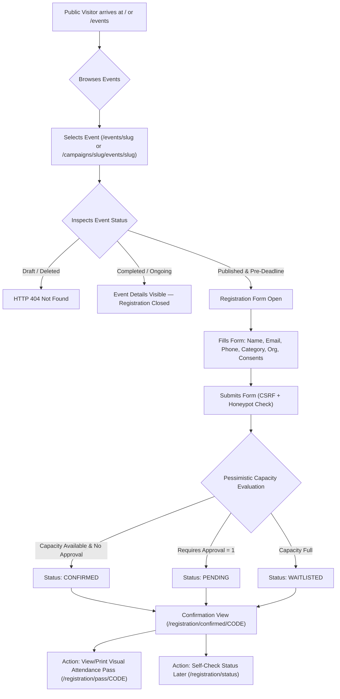
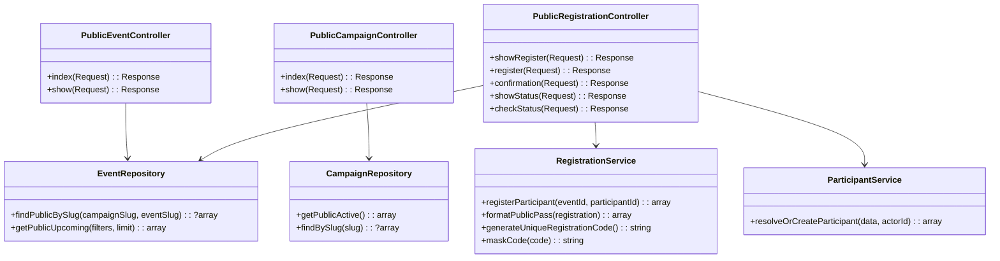

# PHASE 1H — PUBLIC CAMPAIGN, EVENT DISCOVERY & PUBLIC EVENT REGISTRATION
## Comprehensive Architectural Specification & Technical Design Document

---

## 1. Executive Summary

Phase 1H establishes the public-facing gateway for the **Listening Community – Suicide Prevention Campaign (LC-SPC)** web platform (`https://teami.in/LC/`). While Phases 1A through 1G established the administrative foundation, campaign management, event orchestration, participant records, administrative registrations, QR check-in desks, and digital credential issuance, Phase 1H completes the end-to-end lifecycle by enabling members of the public (students, mental health professionals, volunteers, and community members) to:

1. Discover active, multi-year suicide prevention campaigns.
2. Browse upcoming, publicly published events with rich filtering (by format, category, and campaign).
3. Inspect detailed event schedules, venue directions, online meeting parameters, and capacity/waitlist statuses.
4. Complete a mobile-first, low-friction, accessible public registration form.
5. Receive immediate confirmation with a non-sequential Crockford Base32 registration pass code (`REG-{YY}-{5_CHAR_CROCKFORD}`).
6. Access their secure, minimal-disclosure visual attendance pass (`/registration/pass/{code}`) for seamless on-site check-in.
7. Verify registration and waitlist status without account creation or exposing private data.

**Guiding Principles**:
- **Zero New Database Tables**: Phase 1H leverages the relational database architecture designed in Phases 1B, 1C, 1D, and 1E. No schema migrations are required.
- **Strict Separation of Concerns**: Event registration is strictly non-clinical. No psychological assessments, intake questionnaires, distress disclosures, or medical histories are collected.
- **Pessimistic Concurrency & Capacity Integrity**: Public registrations utilize the existing transactional locking (`SELECT ... FOR UPDATE`) in `RegistrationService` to prevent capacity race conditions and over-allocation.
- **Privacy by Design**: Public interfaces expose zero internal database primary keys, zero contact PII of other attendees, zero staff identity data, and zero administrative notes.
- **Non-Destructive Participant Deduplication**: Multiple attendees sharing an email address (e.g., family members or institutional students) are never silently merged into a single entity.

---

## 2. Current Architecture Findings

A comprehensive review of the active production baseline (`eaf6778`) reveals strong foundational infrastructure that Phase 1H will directly extend:

1. **Routing & Subdirectory Isolation**:
   - `App\Core\Router` normalizes paths across local root (`/`) and Hostinger production (`/LC/`).
   - Route parameters support regex constraints (e.g., `{code}`, `{slug}`, `{token}`).
2. **Campaign Schema (`m0002_create_campaigns_table.php`)**:
   - Fields: `id`, `title`, `slug` (UNIQUE), `theme`, `description`, `start_date`, `end_date`, `status` (`draft`, `active`, `completed`, `archived`), `deleted_at`.
   - Repositories: `CampaignRepository::findBySlug()`, `CampaignRepository::all()`.
3. **Event Schema (`m0003_create_events_table.php`)**:
   - Fields: `id`, `campaign_id`, `coordinator_id`, `title`, `slug`, `category` (`workshop`, `listening_circle`, `training`, `seminar`, `pledge_drive`), `description`, `format` (`in_person`, `online`, `hybrid`), `venue_name`, `venue_address`, `online_meeting_url`, `start_time`, `end_time`, `capacity`, `registration_deadline`, `requires_approval`, `status` (`draft`, `published`, `ongoing`, `completed`, `cancelled`), `deleted_at`.
   - Unique Key: `uk_events_campaign_slug (campaign_id, slug)`.
   - Repositories: `EventRepository::findByCampaignAndSlug()`, `EventRepository::all()`.
4. **Participant Schema (`m0004_create_participants_table.php`)**:
   - Fields: `id`, `full_name`, `email` (non-unique, indexed), `phone`, `category` (`student`, `professional`, `community`, `other`), `organization_name`, `agreed_guidelines_at`, `privacy_consent_at`, `status` (`active`, `flagged`, `blocked`).
   - Repositories: `ParticipantRepository::findPotentialDuplicate()`, `ParticipantRepository::create()`.
5. **Registration & Pass Schema (`m0005_create_event_registrations_table.php`)**:
   - Fields: `id`, `registration_code` (UNIQUE Crockford Base32), `event_id`, `participant_id`, `status` (`pending`, `confirmed`, `waitlisted`, `cancelled`), `attendance_status` (`unmarked`, `attended`, `absent`, `excused`), `checked_in_at`, `checked_in_by`, `check_in_method`, `admin_notes`.
   - Unique Enrollment: `uk_event_reg_unique_enrollment (event_id, participant_id)`.
   - Services: `RegistrationService::registerParticipant()` handles row-locking (`SELECT ... FOR UPDATE`), capacity evaluation, waitlisting, and unique pass code generation.
   - Public Pass: `/registration/pass/{code}` (`RegistrationPassController`) delivers minimal-disclosure attendance passes.
6. **Security & Session Layer**:
   - `CsrfMiddleware` enforces cryptographic token validation on `POST` requests.
   - `RateLimiter` enforces IP-based rate limiting via atomic filesystem cache.
   - `SecurityHeadersMiddleware` enforces HSTS, CSP, nosniff, DENY, and permissions policy.

---

## 3. Phase 1H Objectives

1. Transform the public landing page (`/`) from a technical readiness card into an engaging, accessible public portal highlighting active campaigns and upcoming events.
2. Provide public campaign and event discovery interfaces with clean, human-readable URLs.
3. Deliver a friction-free public registration flow with client and server-side validation.
4. Seamlessly connect the public submission to `RegistrationService::registerParticipant()`.
5. Provide instant post-registration confirmation with immediate links to the public attendance pass (`/registration/pass/{code}`).
6. Deliver a secure, rate-limited public registration status lookup interface (`/registration/status`).
7. Maintain 100% backward compatibility with administrative registrations, check-in consoles, and certificate issuance.

---

## 4. In-Scope Functionality

- **Public Landing Page**: Dynamic showcase of the primary active campaign, upcoming public events, and quick navigation.
- **Campaign Directory & Detail**:
  - Global listing of active and completed campaigns (`/campaigns`).
  - Campaign detail page (`/campaigns/{campaign_slug}`) showing theme, initiative goals, and affiliated public events.
- **Event Directory & Filtering**:
  - Global listing of upcoming published events (`/events`).
  - Real-time client/server filters by Category (`workshop`, `listening_circle`, etc.), Format (`in_person`, `online`, `hybrid`), and Campaign.
- **Event Detail & Registration Portal**:
  - Event schedule, format, venue details, capacity indicator, and registration deadline.
  - Interactive registration form with honeypot anti-spam and CSRF protection.
- **Participant Identity & Enrollment**:
  - Safe participant resolution: matching exact `(email, normalized_name)` or creating new records.
  - Transparent support for shared emails without cross-user data contamination.
  - Automatic handling of `confirmed`, `pending`, and `waitlisted` lifecycle states based on event capacity and approval settings.
- **Confirmation & Pass Delivery**:
  - Instant confirmation view with printable pass access, calendar download, and registration tracking code.
- **Status Lookup Interface**:
  - Self-service portal (`/registration/status`) to check registration state by pass code.

---

## 5. Explicit Out-of-Scope Functionality

To maintain strict boundaries and privacy integrity, the following are explicitly excluded from Phase 1H:
- **No Payment Gateways or Fee Collection**: All LC-SPC public events are free community initiatives.
- **No User Account Creation or Passwords**: Public attendees register as guest participants without login credentials.
- **No Clinical or Mental Health Intake**: Strictly prohibited from soliciting medical history, therapy records, psychiatric status, crisis details, or suicide disclosures.
- **No Direct Email/SMS Delivery Integration**: Phase 1H provides on-screen pass viewing, direct URL bookmarking, and local printing. Automated messaging services remain isolated in dedicated future phases.
- **No Public Roster or Attendee Listings**: Attendees cannot see who else is registered for an event.
- **No Public Modification of Past Records**: Public users cannot update historical demographic data once submitted; clerical corrections remain coordinator-managed.

---

## 6. Public User Journey



---

## 7. Campaign Discovery Architecture

### 7.1 Visibility Rules
- **Active Campaigns** (`status = 'active'` AND `deleted_at IS NULL`): Publicly listed as primary campaigns.
- **Completed Campaigns** (`status = 'completed'` AND `deleted_at IS NULL`): Listed in the public campaign archive.
- **Draft & Archived Campaigns** (`status IN ('draft', 'archived')` OR `deleted_at IS NOT NULL`): Strictly inaccessible (HTTP 404).

### 7.2 Data Presentation
- Campaign Title & Theme.
- Initiative Description (rendered with safe HTML/markdown escaping).
- Timeline (Start Date & End Date).
- Affiliated Published Events count and direct links.

---

## 8. Event Discovery Architecture

### 8.1 Event Eligibility Matrix

| Event Status | Registration Deadline | Event Start Time | Public Listing Visibility | Registration Form Availability | Display Badge |
|---|---|---|---|---|---|
| `draft` | Any | Any | **Hidden (404)** | None | N/A |
| `published` | Future / Null | Future | **Visible** | **Open** | `Registration Open` |
| `published` | Past | Future | **Visible** | **Closed (Deadline Passed)** | `Registration Closed` |
| `published` | Any | Past | **Visible (Archive)** | **Closed (Event Concluded)** | `Completed` |
| `ongoing` | Any | Past / Current | **Visible** | **Closed (Event In Progress)** | `In Progress` |
| `completed` | Any | Past | **Visible (Archive)** | **Closed** | `Concluded` |
| `cancelled` | Any | Any | **Visible (Notice)** | **Closed** | `Cancelled` |
| *soft-deleted*| Any | Any | **Hidden (404)** | None | N/A |

### 8.2 Filtering & Query Optimization
The global event listing (`/events`) supports query parameters:
- `campaign`: Filter by campaign slug.
- `category`: Filter by event category (`workshop`, `listening_circle`, `training`, `seminar`, `pledge_drive`).
- `format`: Filter by event format (`in_person`, `online`, `hybrid`).
- `time`: `upcoming` (default, `start_time >= NOW()`) vs `past` (`start_time < NOW()`).

---

## 9. Event Detail Architecture

The public event detail page provides complete logistical clarity without exposing private metadata:
1. **Header Banner**: Event title, category badge, format badge (`In-Person` / `Online` / `Hybrid`), campaign link.
2. **Schedule**: Human-readable start and end date/time in `Asia/Kolkata` timezone with calendar duration.
3. **Location & Logistics**:
   - **In-Person / Hybrid**: Venue name and physical address with external link to Google Maps (safely sanitized).
   - **Online**: Notification that meeting link will be available on the verified pass upon confirmation.
4. **Capacity & Availability Indicator**:
   - If capacity is limited: "Limited Seats (X remaining)" or "Waitlist Active".
   - If approval is required: "Coordinator Review Required".
5. **Registration CTA / Form Section**:
   - Embedded directly on the event page or accessed via `#register` anchor to ensure single-page mobile fluidity.

---

## 10. Public Registration Architecture

### 10.1 Form Specification & Validation Rules

| Field Name | Type | Requirement | Validation Rules | Purpose |
|---|---|---|---|---|
| `full_name` | Text | **Mandatory** | 2 to 150 chars, trimmed, standard characters | Legal name printed on attendance pass and certificate snapshot |
| `email` | Email | **Mandatory** | Valid RFC email, max 191 chars, lowercased | Primary communication anchor and pass retrieval identifier |
| `phone` | Tel | **Optional** | 7 to 20 chars, regex `^(\+?[0-9\s\-()]{7,20})?$` | Emergency contact & SMS pass notifications |
| `category` | Select | **Mandatory** | `in:student,professional,community,other` | Statistical reporting and audience grouping |
| `organization_name` | Text | **Optional** | Max 191 chars, non-sensitive | School, college, hospital, or community organization |
| `agreed_guidelines`| Checkbox | **Mandatory** | Must be checked (`1`) | Commitment to community code of conduct & safe space |
| `privacy_consent` | Checkbox | **Mandatory** | Must be checked (`1`) | Acknowledgment of non-sensitive data handling |
| `website` | Hidden | **Anti-Spam** | Must be empty (honeypot) | Traps automated bots |
| `_csrf_token` | Hidden | **Security** | Valid session CSRF token | Prevents cross-site request forgery |

### 10.2 Exclusion of Sensitive Information
The form contains **zero** fields for:
- Reason for attending or personal crisis disclosures.
- Mental health history, suicidal ideation, depression, or medical diagnoses.
- Prescribed medications, therapist notes, or clinical background.
Any attempt to submit sensitive keywords in the `organization_name` field will trigger immediate rejection via existing regex filters.

---

## 11. Participant Deduplication Strategy

### 11.1 Problem Definition
In community campaigns, two distinct hazards exist:
1. **Accidental Duplicate Records**: The same attendee registers for multiple events or re-registers, creating fragmented profiles.
2. **Harmful Silent Merging**: Two distinct individuals (e.g., parent/child or classmates sharing a school/family email) are merged, overwriting legal names on certificates and attendance rosters.

### 11.2 Public Deduplication Algorithm

```text
Input: Submitted (full_name, email, phone, category, organization_name)

1. Normalize submitted full_name:
   $normName = preg_replace('/\s+/', ' ', trim(mb_strtolower($full_name)));
   $normEmail = trim(mb_strtolower($email));

2. Query candidates by email:
   SELECT * FROM participants WHERE email = :email;

3. IF candidates list is empty:
   -> CREATE new participant record.
   -> Return new participant_id.

4. IF candidates exist:
   Iterate through candidates:
     Compare candidate normalized full_name with $normName:
     IF match is EXACT:
       -> Candidate is the SAME INDIVIDUAL.
       -> Check candidate.status:
            IF status == 'blocked':
              THROW Exception: "Registration cannot be processed. Please contact the coordinator."
       -> (Optional) Update phone or organization if candidate record had them empty.
       -> Return candidate['id'].

5. IF no candidate matches the submitted full_name:
   -> DO NOT MERGE.
   -> The submitted person has a distinct name sharing an email.
   -> CREATE a new distinct participant record with submitted name and shared email.
   -> Return new participant_id.
```

**Key Invariant**: A participant record is **never** overwritten or hijacked by a different person sharing an email address.

---

## 12. Capacity & Waitlist Integration

Public registration connects directly to `RegistrationService::registerParticipant($eventId, $participantId)`:

1. **Atomic Transaction & Locking**:
   - `RegistrationRepository::lockEventForRegistration($eventId)` executes `SELECT * FROM events WHERE id = :id FOR UPDATE`.
   - Ensures two simultaneous registrants evaluating the last seat cannot both be confirmed.
2. **Evaluation Hierarchy**:
   - If `event.requires_approval == 1` &rarr; Status assigned: `pending` (does not decrement capacity).
   - Else if `event.capacity == 0` (unlimited) &rarr; Status assigned: `confirmed`.
   - Else if `confirmed_count < event.capacity` &rarr; Status assigned: `confirmed`.
   - Else (`confirmed_count >= event.capacity`) &rarr; Status assigned: `waitlisted`.
3. **Duplicate Registration on Same Event**:
   - `SELECT * FROM event_registrations WHERE event_id = :e AND participant_id = :p FOR UPDATE`.
   - If attendee is already `confirmed`, `pending`, or `waitlisted`, the existing registration code is returned with an idempotent, user-friendly message.
   - If attendee was previously `cancelled`, the record is reactivated in-place, assigned a brand-new Crockford Base32 pass code (invalidating the old pass), and audited.

---

## 13. Registration Success Flow

Following successful submission, the attendee is redirected via `303 See Other` to:
```text
GET /registration/confirmed/{registration_code}
```
*Note: Using the unguessable registration code in the URL ensures the attendee can bookmark or reload their confirmation without form re-submission.*

### 13.1 Confirmation Screen Presentation
- **Confirmed Registration**:
  - Green Success Banner: "Registration Confirmed!"
  - Attendee Name & Registration Code.
  - Event Schedule & Venue summary.
  - Prominent Action Button: **"View / Print Attendance Pass"** (`/registration/pass/{code}`).
  - Recommendation: Bookmark the URL or screenshot the pass.
- **Pending Registration**:
  - Yellow Attention Banner: "Registration Received — Awaiting Coordinator Approval".
  - Explanation: This event requires manual coordinator verification. The pass will activate once approved.
  - Self-check instructions via `/registration/status`.
- **Waitlisted Registration**:
  - Blue Information Banner: "Placed on Event Waitlist".
  - Explanation: The event is currently at capacity. If confirmed attendees cancel, waitlisted attendees may be admitted.

---

## 14. Public Pass Integration

Phase 1E already implemented the verified public attendance pass (`/registration/pass/{code}`) in `RegistrationPassController`:
- Minimal disclosure: Attendee name, event title, campaign, schedule, venue, pass code, and QR code.
- Zero contact PII: Email, phone, address, and participant database IDs are completely omitted.
- Verified QR Payload: Resolves to `REG-{YY}-{5_CHAR_CROCKFORD}` for scanning at check-in desks.
- Dynamic Certificate Link: In Phase 1G, an active certificate link is automatically appended if the attendee attended and received a credential.

**Phase 1H Integration**:
Phase 1H requires **zero changes** to `RegistrationPassController`. The post-registration flow seamlessly directs confirmed attendees to this existing, secure pass endpoint.

---

## 15. Registration Status Decision

### 15.1 Architectural Evaluation
Should Phase 1H provide a dedicated `/registration/status` search page?

| Approach | Mechanics | Advantages | Security & Privacy Risks |
|---|---|---|---|
| **Option A: Dedicated Status Lookup Form** | Form at `/registration/status` where attendee enters `registration_code` + `email` | Self-service lookup for attendees who forgot their pass link or want to check waitlist/pending status | Potential enumeration if code alone is used; requires dual-factor `(code + email)` matching |
| **Option B: Reuse Pass URL (`/registration/pass/{code}`)** | Update `RegistrationPassController` to render a status card for `pending` and `waitlisted` states instead of 404 | Zero new routes; single URL per registration; no form required | Attendees holding a pass code can check status directly |
| **Option C: Hybrid (Recommended)** | Keep `/registration/pass/{code}` for direct confirmed pass + pending/waitlist status notices, AND provide a simple `/registration/status` lookup form | Complete user convenience for lost links; attendees can search by code + email | Must be rate-limited (10 attempts / 15 min) with generic error responses |

### 15.2 Decision: Hybrid Implementation
1. **Direct Access**: `/registration/pass/{code}` will gracefully render a "Pending Approval" or "Waitlisted" status screen rather than an abrupt 404 if a valid code is pending or waitlisted.
2. **Lookup Portal**: A clean, accessible form at `/registration/status` allowing an attendee to enter their `Registration Code` (e.g., `REG-26-4K9TZ`) and `Email Address` to immediately retrieve their pass link.

---

## 16. Security Architecture

1. **CSRF Protection**:
   - `CsrfMiddleware` strictly verified on `POST /events/{campaign_slug}/{event_slug}/register` and `POST /registration/status`.
2. **Honeypot Anti-Bot Field**:
   - Hidden input `website` rendered via CSS `display:none; position:absolute; left:-9999px;`.
   - If submitted with any value, the request is rejected as an automated bot without touching the database.
3. **Strict Input Sanitization**:
   - `full_name`: Sanitized with `strip_tags()`, trimmed, regex validated.
   - `email`: Validated via `filter_var(..., FILTER_VALIDATE_EMAIL)`.
   - `phone`: Scrubbed of non-digit characters except leading `+`.
   - Prohibited clinical keywords rejected via existing `RegistrationService::validateAdminNotes()` patterns.
4. **SQL Injection Defense**:
   - 100% prepared PDO statements with bound parameters (`Database::fetch`, `Database::fetchAll`, `Database::insert`).
5. **IDOR & Parameter Tampering**:
   - Public URLs rely entirely on alphanumeric slugs (`campaign_slug`, `event_slug`) and CSPRNG Crockford codes (`registration_code`).
   - Internal auto-increment IDs (`participants.id`, `event_registrations.id`) are never accepted as route parameters or exposed in HTML.

---

## 17. Privacy Architecture

1. **Zero Attendee Enumeration**:
   - The public interface provides zero attendee directories, headcount names, or search-by-name endpoints.
2. **Status Lookup Discretion**:
   - `/registration/status` requires **both** `registration_code` AND matching `email`.
   - If either is incorrect, a generic error is returned: *"No registration found matching this code and email combination."*
3. **Pass PII Scrubbing**:
   - Verified passes render only attendee name and event logistics. Email and phone are absent from DOM and HTML source.

---

## 18. Rate-Limiting Strategy

Phase 1H establishes rate limiting using the existing atomic filesystem cache pattern (`/storage/cache/rate_limits/`):

1. **Public Registration Submissions**:
   - **Route**: `POST /events/{campaign_slug}/{event_slug}/register`
   - **Limit**: **5 submissions per IP per 15-minute window**.
   - **Response on Exceeded**: HTTP 429 Too Many Requests (`Retry-After: 900`).
2. **Public Status / Pass Lookups**:
   - **Route**: `POST /registration/status` and `GET /registration/pass/{code}`
   - **Limit**: **10 failed lookup attempts per IP per 15-minute window**.
   - **Response on Exceeded**: HTTP 429 Too Many Requests.

---

## 19. Audit Logging Strategy

Public operations trigger append-only audit log entries in `audit_logs` without storing sensitive PII:

| Event Action | Entity | Entity ID | Actor ID | Audit Metadata |
|---|---|---|---|---|
| `registration.public_create` | `registration` | `$regId` | `0` (Public Guest) | `['event_id' => $eId, 'status' => $status, 'masked_code' => 'REG-26-****3', 'category' => $cat, 'is_waitlist' => bool]` |
| `registration.public_reactivate` | `registration` | `$regId` | `0` (Public Guest) | `['event_id' => $eId, 'previous_status' => 'cancelled', 'new_status' => $status, 'new_masked_code' => 'REG-26-****9']` |
| `participant.public_create` | `participant` | `$partId`| `0` (Public Guest) | `['category' => $cat, 'has_email' => true, 'has_phone' => bool, 'is_public' => true]` |
| `registration.status_lookup_fail`| `security` | `0` | `0` (Public Guest) | `['ip' => $clientIp, 'attempted_masked_code' => $maskedCode]` |

---

## 20. Routing Proposal

```php
// -----------------------------------------------------------------------------
// Phase 1H: Public Campaign & Event Discovery Routes
// -----------------------------------------------------------------------------
// Public Landing Page (Featured Campaigns & Upcoming Events)
$router->get('/', [HomeController::class, 'index']);

// Public Campaign Directory & Profile
$router->get('/campaigns', [PublicCampaignController::class, 'index']);
$router->get('/campaigns/{slug}', [PublicCampaignController::class, 'show']);

// Public Event Directory & Profile
$router->get('/events', [PublicEventController::class, 'index']);
$router->get('/events/{campaign_slug}/{event_slug}', [PublicEventController::class, 'show']);

// Public Event Registration Form & Submission
$router->get('/events/{campaign_slug}/{event_slug}/register', [PublicRegistrationController::class, 'showRegister']);
$router->post('/events/{campaign_slug}/{event_slug}/register', [PublicRegistrationController::class, 'register'], [CsrfMiddleware::class]);

// Public Post-Registration Confirmation View
$router->get('/registration/confirmed/{code}', [PublicRegistrationController::class, 'confirmation']);

// Public Registration Self-Service Status Lookup
$router->get('/registration/status', [PublicRegistrationController::class, 'showStatus']);
$router->post('/registration/status', [PublicRegistrationController::class, 'checkStatus'], [CsrfMiddleware::class]);

// Existing Verified Public Attendance Pass (Phase 1E Baseline)
$router->get('/registration/pass/{code}', [RegistrationPassController::class, 'show']);
```

---

## 21. Controller, Service & Repository Responsibilities



1. **`PublicCampaignController`**:
   - Queries `CampaignRepository` for active/completed campaigns.
   - Renders `public/campaigns/index` and `public/campaigns/show`.
2. **`PublicEventController`**:
   - Queries `EventRepository` for published upcoming events with category and format filters.
   - Renders `public/events/index` and `public/events/show`.
3. **`PublicRegistrationController`**:
   - Renders accessible registration form.
   - Validates input, checks honeypot, executes rate limiting.
   - Invokes `ParticipantService::resolveOrCreateParticipant()`.
   - Invokes `RegistrationService::registerParticipant()`.
   - Redirects to confirmation view.
4. **`EventRepository` (Extensions)**:
   - Adds helper `findPublicByCampaignAndSlug(string $campaignSlug, string $eventSlug)` restricting query to `status IN ('published', 'ongoing', 'completed', 'cancelled')` and `deleted_at IS NULL`.
   - Adds helper `getUpcomingPublicEvents(array $filters = [])` ordering by `start_time ASC`.

---

## 22. Database Impact Analysis

- **New Tables**: **0 (Zero)**.
- **Modified Tables**: **0 (Zero)**.
- **New Migrations**: **0 (Zero)**.
- **Rationale**:
  - `campaigns.slug` is already unique and indexed.
  - `events.slug` is unique per campaign (`uk_events_campaign_slug`).
  - `participants` already accommodates guest participants with non-unique emails, phone numbers, and immutable consent timestamps.
  - `event_registrations` already supports `registration_code`, status enums (`pending`, `confirmed`, `waitlisted`, `cancelled`), and attendance status enums.
  - Complete relational alignment is achieved with zero database churn.

---

## 23. RBAC Impact

- **Public Role**: Completely unauthenticated guest operations. No session user required.
- **Administrative Roles (`viewer`, `staff`, `coordinator`, `super_admin`)**:
  - 100% unaffected.
  - Administrative event management (`/admin/events`), registration management (`/admin/registrations`), and attendance consoles (`/admin/checkin`) remain protected by `AuthMiddleware` and `RoleMiddleware`.

---

## 24. UX/UI Architecture & Design System Integration

Following the official LC-SPC design tokens established in Phase 0:
- **Color Palette**:
  - Primary Accent: `#BF1E2E` (Listening Community Crimson)
  - Dark Slate Text: `#0F172A` & `#1E293B`
  - Subtle Neutral Muted: `#64748B`
  - Surface Background: `#FBFBFB` (Canvas) & `#FFFFFF` (Cards)
  - Success Green: `#10B981` (Confirmed Badge)
  - Attention Amber: `#F59E0B` (Pending Badge)
  - Neutral Blue: `#3B82F6` (Waitlist Badge)
- **Typography**: Google Sans Flex loaded with fallbacks (`system-ui, sans-serif`).
- **Mobile-First Layout**:
  - Single-column linear form layout on small screens.
  - Touch target size: Minimum $44 \times 44\text{ px}$ for all buttons and checkboxes.
  - Accessible focus rings: `outline: 2px solid #BF1E2E; outline-offset: 2px;`.
  - Accessible color contrast exceeding WCAG 2.1 AA ($4.5:1$ ratio).

---

## 25. Error-Handling Strategy

1. **Validation Failures**:
   - HTTP 422 Unprocessable Entity.
   - Form re-renders with preserving valid inputs (excluding honeypot and CSRF) and displaying inline field-specific error messages.
2. **Event Capacity / Deadline Races**:
   - If an event fills up between form rendering and submission, `RegistrationService` safely transitions the attendee to `waitlisted` and clearly explains this on the confirmation view without a crash.
   - If the deadline passed while filling the form, a controlled friendly message is displayed: *"Registration for this event closed moments ago."*
3. **Blocked Participants**:
   - Generic message: *"Your registration could not be processed at this time. Please contact the event coordinator."* (Does not disclose internal administrative blocking flags).
4. **Missing / Malformed URLs**:
   - Clean, branded HTTP 404 page with direct link back to upcoming events (`/events`).

---

## 26. Abuse & Spam Prevention

1. **Honeypot Trap**: Invisible field `website` silently traps generic form-spammer bots.
2. **IP Rate Limiting**: Stored in `/storage/cache/rate_limits/` preventing automated batch registrations.
3. **Session CSRF Token**: Prevents off-site POST injection attacks.
4. **No Public Capacity Counts**: The exact number of seats is hidden or expressed qualitatively ("Seats Available", "Limited Seats", "Waitlist Active") to prevent scrapers from tracking attendance numbers.

---

## 27. Backward Compatibility Analysis

- **Phase 0 Foundation**: Fully preserved.
- **Phase 1A Authentication & RBAC**: Fully preserved.
- **Phase 1B Campaigns**: Existing campaign admin routes and data unchanged.
- **Phase 1C Events**: Existing event admin routes and data unchanged.
- **Phase 1D Participants**: Existing admin participant directory and masking rules unchanged.
- **Phase 1E Event Registrations & Passes**: Existing `RegistrationService` methods reused without structural changes. Public pass (`/registration/pass/{code}`) preserved intact.
- **Phase 1F Attendance & Check-In**: Check-in console and attendance rosters consume registrations generated by Phase 1H identically to admin registrations.
- **Phase 1G Certificates**: Public registrants who attend events will receive certificates through the exact same issuance and verification pipeline.

---

## 28. Testing Strategy

A dedicated test suite (`tests/test_phase1h_public_registration.php`) will execute comprehensive automated scenarios:
1. **Discovery Scenarios**:
   - Active campaigns appear in `/campaigns`; draft and archived campaigns return 404.
   - Published events appear in `/events`; draft and soft-deleted events return 404.
   - Category and format filters return accurate subsets.
2. **Registration Eligibility Scenarios**:
   - Successful registration on open published event &rarr; status `confirmed`.
   - Registration after deadline rejected with friendly message.
   - Registration on full event &rarr; status `waitlisted`.
   - Registration on `requires_approval = 1` event &rarr; status `pending`.
3. **Deduplication Scenarios**:
   - Re-registering with identical name & email reuses existing participant ID.
   - Registering with same email but different name creates a new distinct participant ID.
   - Blocked participant registration safely rejected.
4. **Pass & Confirmation Scenarios**:
   - Post-registration redirect loads confirmation view with valid code.
   - Generated code successfully unlocks `/registration/pass/{code}`.
5. **Security Scenarios**:
   - POST without CSRF rejected with HTTP 403.
   - POST with filled honeypot rejected.
   - 6th registration attempt in 15 minutes rejected with HTTP 429.
   - Clinical keywords in organization name rejected.

---

## 29. Deployment Considerations

1. **Zero Database Migrations**: No schema updates or table alterations needed.
2. **Zero Breaking Configuration Changes**: Standard `.env` variables (`APP_URL`, `APP_BASE_PATH`) remain unchanged.
3. **Assets**: Leverages pre-existing `public/assets/css/app.css` and `public/assets/js/app.js` with semantic CSS component additions.

---

## 30. Risks and Mitigations

| Risk | Severity | Mitigation |
|---|---|---|
| Concurrent registrations on last seat | High | Pessimistic locking (`SELECT ... FOR UPDATE`) in `RegistrationService` ensures atomic seat allocation. |
| Automated bot submissions | Medium | Honeypot field + session CSRF validation + IP-based rate limiting. |
| Email typos causing lost pass codes | Medium | Confirmation view displays pass immediately with printable view; status lookup allows re-finding code with email. |
| Non-clinical boundary drift | High | Zero medical/distress fields; regex pattern validation strictly prevents clinical note submission. |
| Shared email confusion | Low | Strict deduplication rule: identical name + email reuses profile; different name + email creates distinct profile. |

---

## 31. Recommended Implementation Sequence

1. **Repository Additions**:
   - Add public query methods to `CampaignRepository` (`getActivePublicCampaigns()`).
   - Add public query methods to `EventRepository` (`getUpcomingPublicEvents()`, `findPublicByCampaignAndSlug()`).
2. **Controllers**:
   - Implement `PublicCampaignController` (`index`, `show`).
   - Implement `PublicEventController` (`index`, `show`).
   - Implement `PublicRegistrationController` (`showRegister`, `register`, `confirmation`, `showStatus`, `checkStatus`).
3. **Views**:
   - Update `home/index.php` (Public Landing Page with Featured Campaigns/Events).
   - Create `public/campaigns/index.php` and `public/campaigns/show.php`.
   - Create `public/events/index.php` and `public/events/show.php`.
   - Create `public/registration/form.php`, `public/registration/confirmation.php`, and `public/registration/status.php`.
4. **Routes**:
   - Register public routes in `app/routes.php`.
5. **Testing & Verification**:
   - Develop and execute `tests/test_phase1h_public_registration.php` (targeting 40+ assertions).
   - Execute full regression suite (Phases 0 through 1H, expecting 380+ assertions).
   - Perform full PHP lint and Composer validation.

---

## PHASE 1H ARCHITECTURE STATUS
```text
================================================================================
PHASE 1H ARCHITECTURE STATUS: READY FOR REVIEW
================================================================================
```

### Decisions Requiring Explicit Approval Before Implementation:
1. **Public URL Structure**:
   - Primary proposed structure:
     - `/campaigns` & `/campaigns/{slug}`
     - `/events` & `/events/{campaign_slug}/{event_slug}`
     - `/events/{campaign_slug}/{event_slug}/register`
     - `/registration/confirmed/{code}`
     - `/registration/status`
   - *Confirmation required: Is this hierarchical slug structure approved?*
2. **Phone Number Requirement**:
   - Recommended: `phone` is **optional** (with min 7 / max 20 digit regex validation when provided), ensuring students or attendees without personal mobile numbers can still register with email.
   - *Confirmation required: Should phone be optional or mandatory?*
3. **Status Lookup Mechanism**:
   - Recommended: A dedicated `/registration/status` page requiring **both** `registration_code` and matching `email` to view registration state.
   - *Confirmation required: Is this hybrid status lookup approach approved?*

---
*Awaiting your review and explicit approval before any code or implementation begins.*
